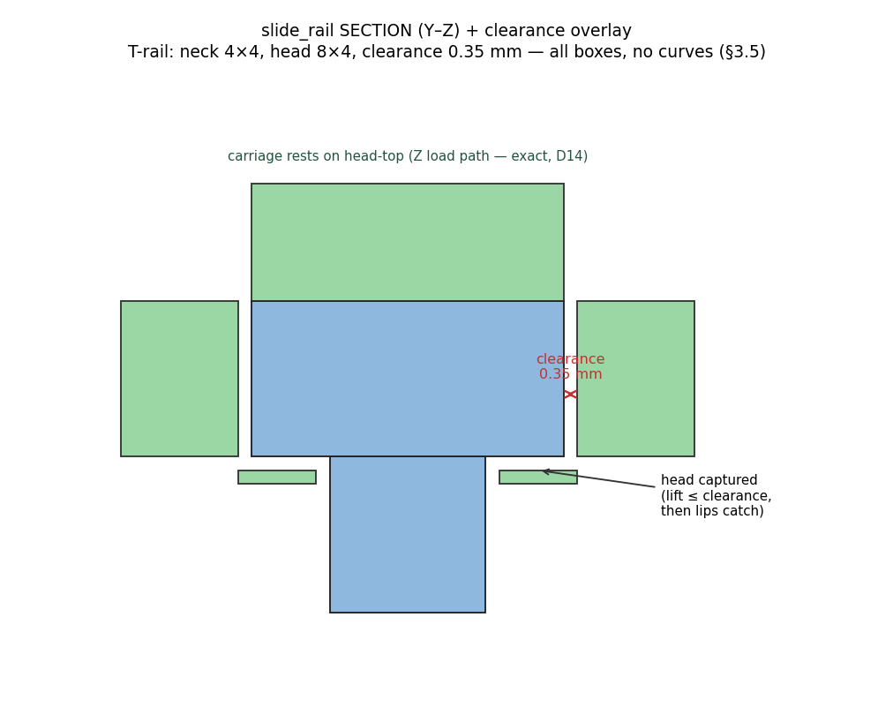
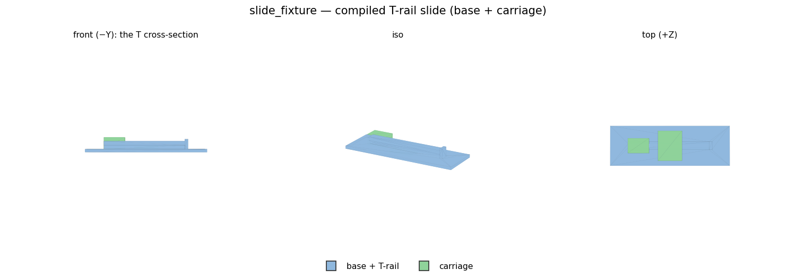
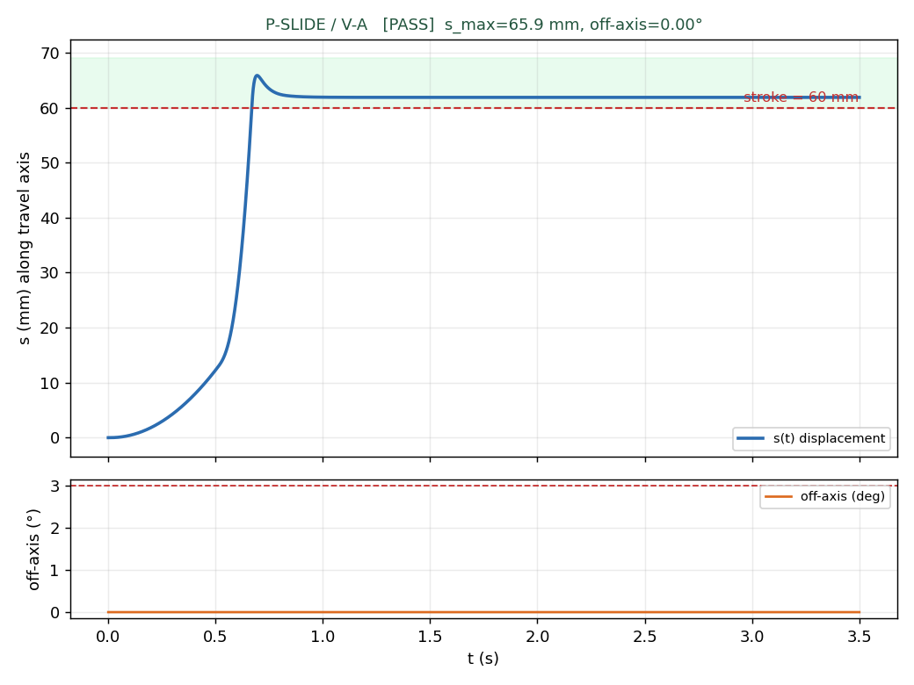
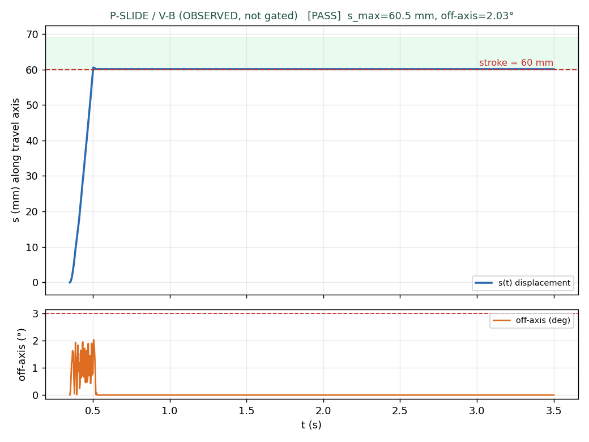

# M10 · slide_rail — REVIEW (G-H entry point)

**Outcome: the card is built and BOTH modes pass.** `slide_rail` (§3.5) — a rectangular **T-rail**
retaining slide — is a full card (ports, bounds, the §3.5 rule chain, imposes, carve, collision_hint,
resolve_params, verification). The minimal two-piece fixture compiles and runs P-SLIDE:
**V-A 5/5 PASS** (required) and **V-B 5/5 PASS** (target — the geometry alone produces AND retains the
slide DoF, contact-only).

> ### Correction (G-H review caught this)
> The first pass shipped a **fixture geometry bug the reviewer spotted from the videos**: two yellow
> bodies, one riding the rail and one tumbling. There were not two bodies — the single carriage body
> P2 held **two disjoint solids**: the carve's groove block (rides the rail) and the `slide_carriage`
> template's placeholder plate, `+`-added at a *different* X (a floating, disconnected chunk). It
> offset P2's centre of mass off the rail, which is exactly what made V-B's carriage pitch and trip
> G-CONV — so what I had recorded as a "frozen-preset settling transient, deferred" was **my own
> geometry error**. Fix: the carve now REPLACES the carriage placeholder with the single connected
> groove-block solid (the carriage shape is card knowledge — the D-ONT-11 principle). With the COM
> back over the rail, **V-B settles cleanly and passes 5/5.** No preset was touched; the earlier
> "R2b-style" deferral is withdrawn.

## The card (§3.5)

A drawer slide must run free on one axis and be captured on the other two. A plain tongue-in-groove
runs free but isn't captured against lift; a dovetail captures but has angled faces. The **T-rail**
does both and stays **all-boxes** (no curves — §3.5's "groove as box primitives, cheap"): a narrow
neck carries a wide head, and the carriage's lips tuck under the head shoulders.

- **ports** `rail_mount` / `carriage_mount` / `travel_axis` · **param_bounds** rail_h/w [4,10],
  clearance [0.25,0.45], engagement_len, stroke.
- **§3.5 rule chain, reproduced numerically by the fixture** (build_review prints it):
  `engagement_len 21 ≥ 0.35·stroke 21` ✓ · `rail_len 84 = stroke 60 + engagement 21 + stop-tab` ·
  `drawer_w(body_inner 100) = 100 − 2·(8+0.35) = 83.3` ← ⑤ **derives** geometry from this equality (D6).
- **imposes** an assembly-phase axial insertion path + a use-phase travel keep-out (V-08).
- **collision_hint** = 3 rail boxes (neck, head, stop-tab) + 5 carriage boxes (top, 2 sides, 2 lips),
  every prim `source`-stamped (D-M8-4).
- **verification** = P-SLIDE V-A + V-B, plus PR-KEEPOUT for the imposed keep-out (so no use behaviour
  is left unverified — V-01 clean). Protocols are **card knowledge** (D5), never LLM-authored.



The section shows the retention design: the carriage **rests on the head-top** (Z load path, kept
**exact** — the M0 lid-on-box lesson, one tied plane only), the sides hold Y with clearance `c`, and
the lips sit `c` below the head shoulders so the carriage lifts at most `c` before they catch.
Retention verified by boolean at build time: lift > 0.35 mm → the lips capture the head (0→45 mm³).



## P-SLIDE (§6.3) — [`out/t2_slide_verdict.json`](out/t2_slide_verdict.json) (guard trio)

| mode | result | s_max | off-axis | derail | all-parts-retained | back-drift |
|---|---|---|---|---|---|---|
| **V-A** (declared prismatic joint) | **5/5 PASS** | 65.9 mm | 0.00° | no | ✓ | 3.98 mm |
| **V-B** (contact-only) | **5/5 PASS** | 60.5 mm | 1.34° | no | ✓ | 2.75 mm |

 

**V-A** (required): an axial force ramp drives the carriage past the 60 mm stroke; the joint's travel
range models the physical stop; **joint frictionloss** (a slide's real Coulomb friction — a physical
property, not a preset knob) holds it after release, so back-drift is 3.98 mm ≤ 5. Tracks dead
straight (off-axis 0°). Video: [`out/t2_slide_V-A.mp4`](out/t2_slide_V-A.mp4).

**V-B** (target): the base is welded (D23), the carriage is a free body, and the **T-rail geometry
alone** produces and retains the slide. It reaches the 60 mm stroke, tracks to 1.34° off-axis (< 3°),
never derails, and keeps all parts retained — **5/5**. This works *because* the carriage is now one
connected solid with its COM over the rail; the earlier failure was the disjoint-plate bug above, not
the preset. Video: [`out/t2_slide_V-B.mp4`](out/t2_slide_V-B.mp4) (bodies labelled on-screen — one
carriage). Diagnostic pass with the labels: [`out/diag_labeled_V-B.png`](out/diag_labeled_V-B.png).

**Coverage fix (G-H point 2).** The reviewer noted no gate fired when a part appeared to fall. Two
responses: (a) G-CONV's at-rest check already watches *every* body's qpos/qvel — the disjoint plate
did not trip it only because it was rigidly attached to P2, not a separate body; (b) regardless,
P-SLIDE now carries an **`all_parts_retained`** criterion that watches EVERY non-base body (not just
the actuated one) — a body that drops or strays off the travel axis fails the gate. So a genuinely
lost part now fires, and the criterion passes here (one carriage, retained).

## D-E-10 — the alignment ontology gap: RULED (Option A) and IMPLEMENTED

The Hard anchor's drawer runs on **two** slide_rail instances that must be **parallel and level**.
That is an **instance↔instance** constraint (E_left ∥ E_right, same height) — a relationship between
two *elements*, which the current ontology has no first-class way to state. AssemblyRule (D-ONT-12)
is the natural home, but its two kinds don't obviously fit:

- `exclusion` = a sweep non-interference (latch ∉ lid-sweep) — a *negative* volume constraint.
- `resource` = a scalar budget (Σ contributors ≤ budget) — a *scalar* constraint.

Parallel-and-level is neither: it is a **pose relation** between two elements' travel axes (their
directions must be equal, their mount planes coplanar). Three options:

| # | option | what it is | cost |
|---|---|---|---|
| **A** | **third AssemblyRule kind: `alignment`** | predicate `{axes:[E1.travel_axis, E2.travel_axis], relation:"parallel", level:true}`, checked at t0 by comparing the two bound anchor frames. First-class, symmetric, provenance-tagged like the others. | one new `kind` + one validator arm + one t0 checker. Keeps all instance↔instance constraints under AssemblyRule (the D-ONT-12 home). |
| B | **a shared datum both rails bind to** | introduce a `datum`/reference feature; both rails' `travel_axis` bind to it, so parallelism is *by construction* (they reference the same axis) rather than checked. | new ontology entity (datum) + binding semantics; parallelism becomes unfalsifiable (can't be violated → can't be a graded requirement). Loses the "physics discovers the requirement" property. |
| C | **`resource` with an angle/offset budget** | encode as Σ|axis-angle-difference| ≤ ε and Σ|height-difference| ≤ ε, reusing the existing `resource` kind. | no new kind, but abuses `resource` (it's a *pose* relation, not a shared budget) — the predicate would misname what it checks, the m8-class error of a label that lies about its content. |

**Ruled: Option A, and implemented.** `AssemblyRule.kind` gains **`alignment`**; **V-16** validates
its predicate (≥2 axis referents, relation ∈ {parallel, collinear}, each referent a D13 subject); a
t0 checker **`check_alignment`** resolves each `E.travel_axis` to its bound anchor frame and compares
directions (parallel within tol) + heights (level within tol). It is falsifiable, which was the whole
argument for A over B: `tests/test_alignment_rule.py` (4/4) shows two parallel/level rails PASS, a **5°
skewed pair FAILS** (the negative test), a stepped pair FAILS when `level` is required, and V-16
rejects a one-axis predicate. Both IR renderers show the alignment kind (parity guard holds). A
`slide_base_dual` template (two axis anchors, `skew_deg`/`step_mm`) is the test host. The Hard anchor
can now state "the drawer's two rails must be parallel and level" as a first-class, checkable rule.

## Decisions

**D-E-9** (API economy — logged separately) · **D-D-1** slide_rail card built (T-rail, all-boxes,
§3.5 chain; V-A 5/5, V-B 5/5 after the disjoint-carriage fix) · **D-E-10 CONFIRMED (Option A)** the `alignment` AssemblyRule kind — implemented (V-16 + t0 check_alignment + skew/step negative tests).

Suite **54/54**.

## Reproduce

```
./bin/py tasks/build_goldens.py                       # writes slide_fixture.json (CLEAN)
./bin/py tasks/run_m10_slide.py verify/t2_physics/out_slide   # P-SLIDE V-A + V-B
./bin/py m10_slide_rail/build_review.py               # section + 3-view renders
```
