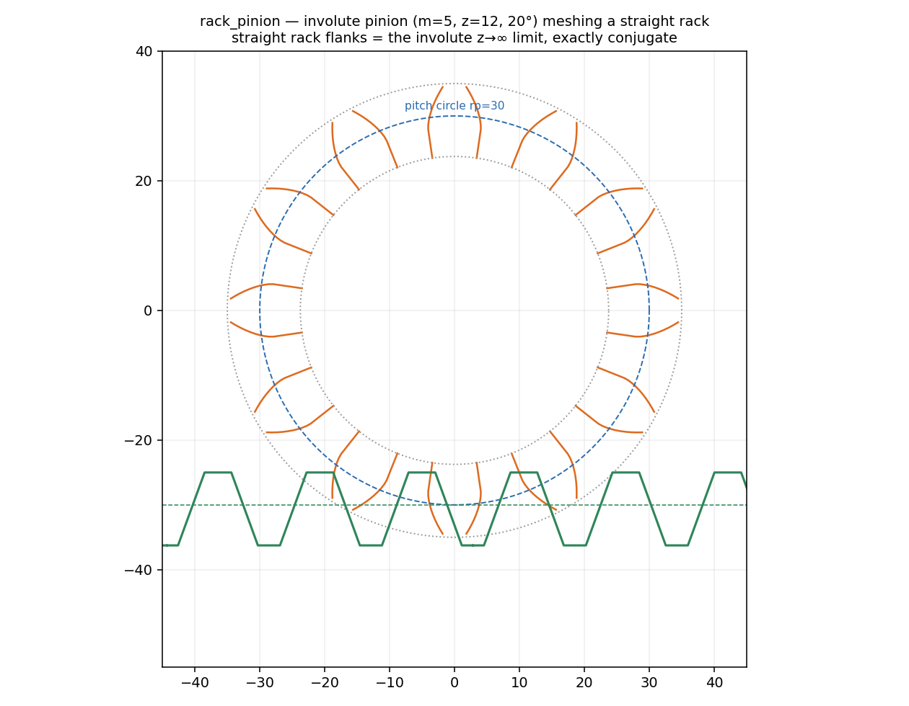
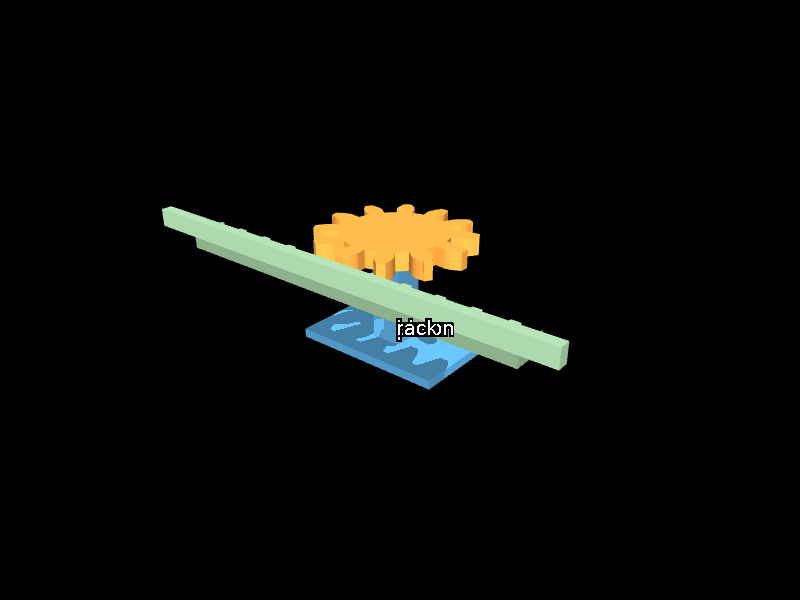
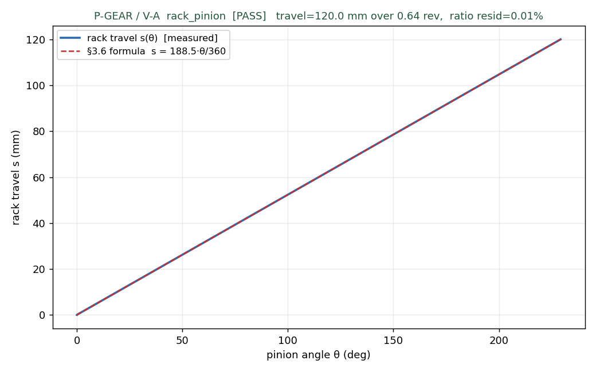

# M11 · rack_pinion — REVIEW

**Outcome: the card is built and P-GEAR passes V-A 5/5.** `rack_pinion` (§3.6, amended) — an
**involute** pinion driving a straight rack — is a full Element Card (ports, param_bounds, imposes,
carve, collision_hint, resolve_params, verification). The minimal two-piece fixture compiles
validator-CLEAN and runs P-GEAR: **V-A 5/5 PASS** (the standing requirement). **V-B is
NAMED-DEFERRED**, not silently dropped — the standing R2b-open flag (D-M1-5/-7).

## The card (§3.6, amended)

A rack & pinion converts rotation to translation at a fixed ratio (a knob that drives a drawer). Two
design commitments, both inherited from M1's gear work rather than re-derived:

- **The pinion is M1's INVOLUTE**, not a trapezoid. R2a killed the trapezoid (D-M1-1): the involute
  is the true conjugate profile, so the card reuses `m1_gear/gear_geom.build_gear` verbatim with
  `profile="involute"`.
- **The rack teeth are STRAIGHT flanks at the pressure angle** — the involute's z→∞ limit. This is
  the one case where straight flanks are exactly conjugate to an involute pinion, not an
  approximation. So only the rack is new geometry (`knowledge/cards/rack_pinion.py::_rack_outline`).

**§3.6 formulas, reproduced by the golden's worked arithmetic** (m=5, z=12, stroke=120):

| quantity | formula | value |
|---|---|---|
| pitch radius | rp = m·z/2 | 30.0 mm |
| pitch diameter | d = m·z | 60.0 mm |
| travel per rev | tpr = π·m·z | 188.496 mm |
| rack length | L = stroke + tpr/4 | 167.124 mm |
| axis→rack | a = rp | 30.0 mm |
| rack circular pitch | p = π·m | 15.708 mm |
| rack tooth thickness | t = p/2 − bl/2 | 7.754 mm |

Pinned in [`tests/test_rack_pinion_geometry.py`](../tests/test_rack_pinion_geometry.py) — 6/6, the
self-derived golden (no external handbook example exists for this card, so the arithmetic is worked
in the test's docstring and the code must reproduce it: *"if this fails the CODE is wrong, not the
arithmetic"*).

### Why the module bounds are LARGE {5,6} — and why the card says so

The amended bounds `module ∈ [5, 6]` are **not mechanical**. Mechanically a fine-module rack meshes
perfectly. The bound is a **contact-simulation-stability requirement** (D-M1-2/-4): the rigid
convex-facet contact rig is dt-unstable below the large-module range at the frozen preset (R5) —
larger teeth give gentler contact geometry and a larger stable timestep. The card mandates the large
module so *the geometry it produces is the geometry the verifier can actually simulate*, and
`selection_notes` states this explicitly (a physics-of-verification constraint, not a mechanics one).
`resolve_params` snaps the module **up** into the band, never below.

- **ports** `pinion_axis` (axis) / `rack_mount` (face) / `mesh_line` (edge).
- **imposes** an assembly-phase mesh-insertion path (V-08) — registered in the IR.
- **carve** anchor-driven / host-agnostic: places the involute pinion on its shaft and the straight
  rack `rp` below and parallel, so the teeth engage at the pitch line. Returns the pinion's world
  axis for the physics layer.
- **collision_hint** = the **L3 flank-wedge decomposition** (§3.6, D18): one convex prism per
  involute flank segment — the tooth-profile analog of M0's ring-of-wedges, source-stamped
  (D-M8-4). `mujoco.sdf.gear` is **FORBIDDEN** (D21): it would simulate an ideal analytic gear, not
  our compiled geometry. Deferred with V-B this session (V-A uses no tooth contact) but supplied so
  the card is D18-complete.
- **verification** = P-GEAR **V-A only**, with the V-B reversal gap NAMED in the protocol.

The tooth geometry at the card's own scale (m=5, z=12, 20° pressure angle): the **involute** pinion
flanks (orange) with the pitch circle rp=30 and addendum/root circles, meshing the **straight-flanked
rack** (green) whose pitch line coincides with the pinion's at y=−rp. The straight rack flank is the
involute's z→∞ limit — exactly conjugate, not an approximation.

The compiled fixture: the orange involute pinion (rotating body) meshing with the green rack bar (the
sliding mover, teeth up) over the blue bearing-post carrier (welded base).

## P-GEAR (§6.3) — V-A · [`out/t2_rack_pinion_verdict.json`](out/t2_rack_pinion_verdict.json) (guard trio)

| mode | result | rack travel | over | ratio residual | §3.6-formula residual |
|---|---|---|---|---|---|
| **V-A** (declared kinematic pair) | **5/5 PASS** | 120.0 mm (= design stroke) | 0.637 rev | 0.01% | 0.01% |
| **V-B** (emergent contact) | **DEFERRED** | — | — | — | *pending preset_v2 (R2b/D-M1-7)* |

**V-A wires the transmission as a DECLARED kinematic pair** — a hinge on the pinion, a slide on the
rack, coupled by a near-rigid MuJoCo equality constraint whose polycoef is `rp` **in metres**
(= m·z/2, from the card). Driving the pinion until the rack reaches its **design stroke** (θ = 229° =
0.637 rev — the rack physically travels `stroke` and no further) and measuring the travel end-to-end
is **not a tautology**: it exercises the card's rp formula, the mm→m unit path, the joint axes, and
model stability. The measured travel (120.0 mm) matches the **independent** §3.6 prediction
`travel_per_rev · rev = 188.496 · 0.637 = 120.0 mm` to **0.01%** — well inside the 5% gate, 5/5 seeds.
This also demonstrates the **rack_len sizing rule**: `rack_len = stroke + tpr/4 = 167.1 mm` covers the
120 mm travel with margin, so the pinion never runs off the toothed span. Video:
[`out/t2_rack_pinion_VA.mp4`](out/t2_rack_pinion_VA.mp4).

The frozen contact preset (R5) is imported for provenance, but V-A declares **no contact geoms**
(contype/conaffinity = 0) — the joints are the mechanism — so the contact solver never runs here; dt
is set to the frozen 5e-4 only to keep every experiment on the same clock.

## Why V-A only — the V-B gap is named, not hidden

rack_pinion carries a **standing R2b-open flag** (D-M1-5/-7). From M1: the involute IS conjugate and
**forward** meshing is demonstrable (ratio −0.50), but **bidirectional** contact meshing diverges at
the frozen preset — the reversal backlash-crossing impact blows up, and no module size or preset
parameter fixes it (a contact-**formulation** limit, not a tuning one). So contact-level (V-B)
verification is deferred to a versioned `preset_v2` or a pitch-cylinder proxy.

That deferral is **carried in the artifacts**, so no design can silently claim contact-level meshing
it cannot show:

- the card's `verification()` emits the V-A protocol with an `actuation.v_b_gap` string naming the
  gap;
- the fixture golden carries it through to `plan.protocols`;
- the verdict JSON records `verdict_VB: "DEFERRED — pending preset_v2 (R2b/D-M1-7)"` and a
  `shape_assert` that checks V-A is present, the V-B gap is named, and **no V-B pass is claimed**.

**"Forward-only V-B smoke as an observable if cheap"** (the brief's option): declined, and here is
why — it is **not cheap**. A forward V-B rig needs contact between the rack teeth and the pinion
flanks using the L3 wedge hulls, i.e. the same rigid-facet contact machinery R2b showed to be
dt-unstable in this module range. Standing it up is new mesh-collision work that walks straight into
the R2b instability, so per the m8 lesson (an invented pass is a fabrication) it is recorded as
deferred rather than faked. The L3 decomposition IS built and unit-tested — it is simply not run
through the physics this session.

## Guard trio (D-M8-4 / m8 discipline)

The verdict JSON carries all three: `decision_row` (D-D-2), `compile_hash` (git short SHA), and
`shape_assert` (V-A present ∧ V-B gap named ∧ no V-B pass claimed). G9 G-CONV passes — the compiled
model is physically coherent before the protocol runs.

## Status

- Card: `knowledge/cards/base.py::RackPinionCard` + geometry `knowledge/cards/rack_pinion.py`.
- Golden: `tasks/build_goldens.py::rack_pinion_fixture` → `tasks/rack_pinion_fixture.json`
  (validator-CLEAN).
- Physics: `m11_rack_pinion/p_gear_va.py` → `out/` (verdict, s(θ) plot, mp4, static render).
- Suite: 65/65 (adds `test_rack_pinion_geometry.py` 6/6).
- **Open:** V-B (bidirectional contact meshing) — pending `preset_v2` (R2b/D-M1-7).
