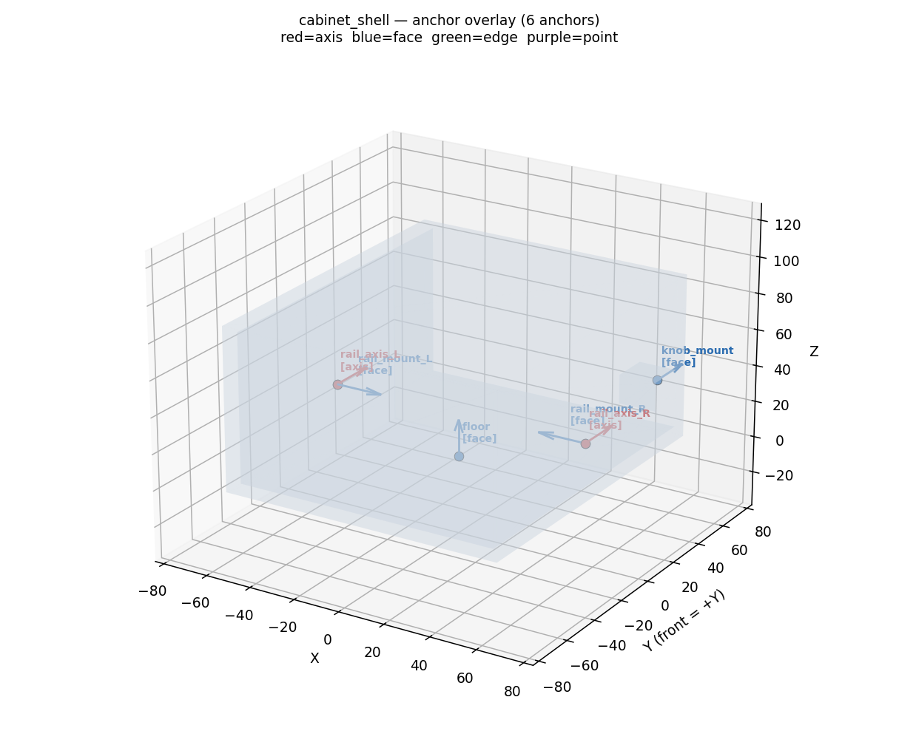
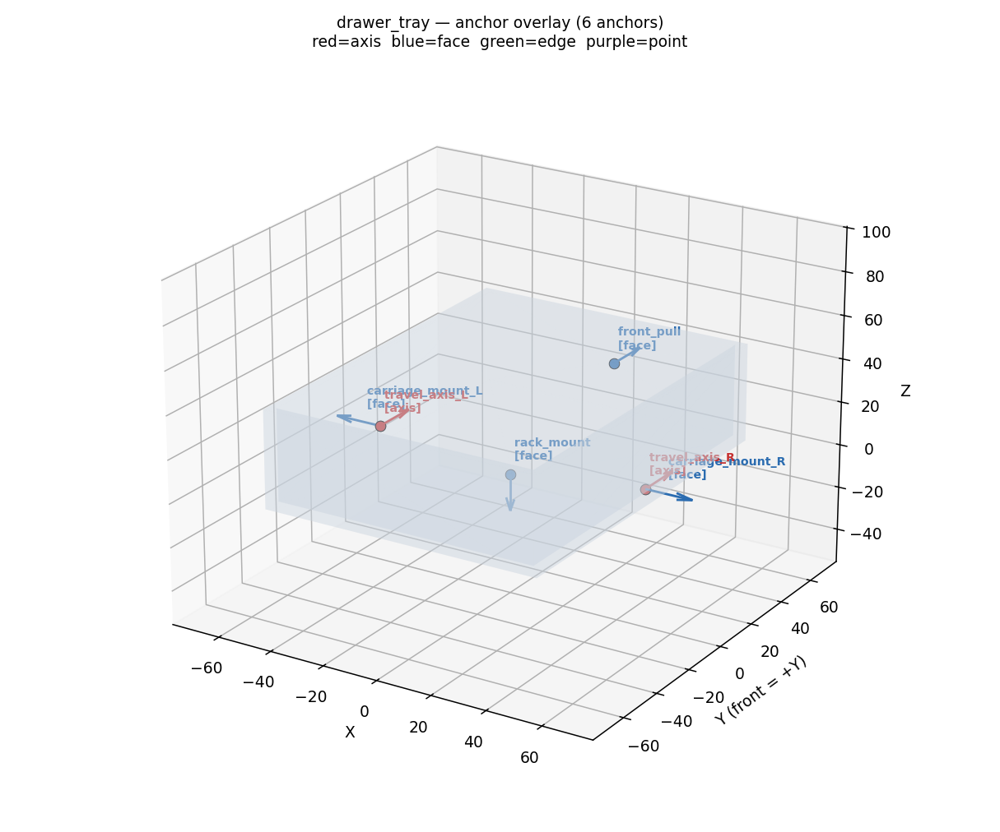
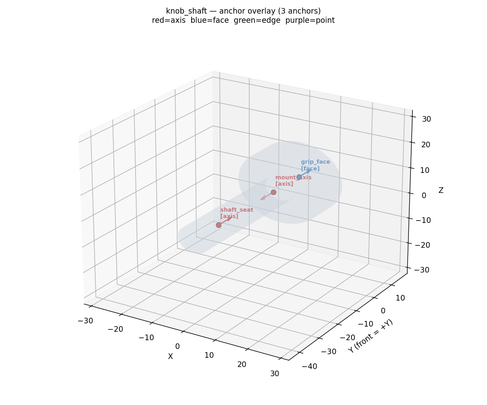
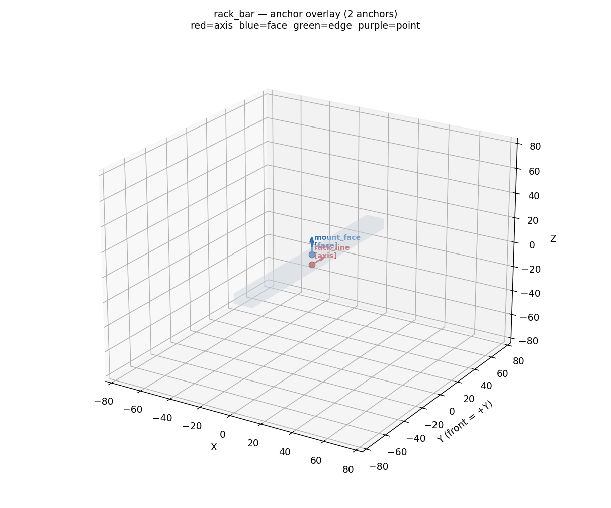

# M12 · Hard-anchor host templates — REVIEW (D-track 3)

**Outcome: the four Hard-anchor host templates are built, and every anchor the m13 assembly will
bind to is declared and labelled.** This milestone is **templates only — NO assembly** (that is m13,
by design). The pass-look, stated up front: on the four anchor-overlay renders below, *every* anchor
m13 needs is visible and named now, so a later binding failure cannot be blamed on a missing anchor.

## The mechanism (what m13 will assemble)

A hand-cranked drawer: a **cabinet** with **two parallel rails**, a **drawer tray** riding them, a
**knob-shaft** carrying the rack_pinion pinion, and a **rack bar** fixed under the drawer. Turning
the knob drives the pinion, which drives the rack, which pushes the drawer out and back on its rails.
It exercises three cards at once — `slide_rail` ×2 (the rails), the **alignment** AssemblyRule
(D-E-10, the two rails parallel + level), and `rack_pinion` (the knob→drawer transmission).

**Shared frame (all four templates):** origin at the cabinet floor centre, **+Z up, +Y = FRONT**
(the drawer pulls out toward +Y; −Y is the rear wall). The drawer travels along Y; the two rails run
front-to-back at matched height `rail_z`. Units mm.

## The four templates

### `cabinet_shell` — the base (is_base)

An open-**front** box (floor + rear wall + two side walls + top; open at +Y for the drawer). The two
inner side walls carry the **rail-mount anchors as a matched L/R pair at the SAME height `rail_z`** —
these are exactly the subjects of the **alignment** AssemblyRule (two travel axes that must be
*parallel* and *level*). A front bearing boss carries the knob mount.

- `rail_mount_L/R` (face, inner ±X, inward) + `rail_axis_L/R` (the +Y travel axes — **the alignment
  subjects**) · `knob_mount` (front boss face, +Y) · `floor` (base seat, +Z).
- Regression: `rail_axis_L/R` are asserted **level (equal z), mirrored in X, both +Y** — if they ever
  disagree, the alignment rule could never pass, so the test catches it at the template.

### `drawer_tray` — the mover

An open-**top** tray riding the rails. Its outer side faces carry the **carriage anchors as a matched
L/R pair** (mating the cabinet rails); the underside carries the rack mount; the front face carries
the pull site.

- `carriage_mount_L/R` + `travel_axis_L/R` (matched level pair, pairs with the cabinet rails under
  the alignment rule) · `rack_mount` (underside, **−Z** — the rack bar bolts along the drawer
  bottom) · `front_pull` (front, **+Y**).

### `knob_shaft` — the hand crank

A shaft (axis along Y) with a grip disc at the +Y (outside) end, built as **one connected solid**
(shaft + grip overlap — the two-yellow-bodies lesson, D-D-1, caught one milestone before the
assembly). `mount_axis` seats into the cabinet's `knob_mount` bearing (−Y into the cabinet);
`shaft_seat` is where the **rack_pinion card's `pinion_axis` port binds** (the pinion mounts on the
shaft); `grip_face` is the outer hand grip.

### `rack_bar` — the rack's host strip

The bar running along Y (the drawer travel) into which the rack_pinion card carves the rack teeth.
`mount_face` (+Z) bolts to the drawer underside (`drawer_tray.rack_mount`); `rack_line` marks the +Y
tooth line the card lays teeth along (teeth carve into the bottom, facing the pinion).

## Anchor contract (what m13 binds)

| template | anchors | m13 role |
|---|---|---|
| cabinet_shell | rail_mount_L/R, rail_axis_L/R, knob_mount, floor | base; rails (alignment subjects); knob bearing |
| drawer_tray | carriage_mount_L/R, travel_axis_L/R, rack_mount, front_pull | mover; carriages; rack seat; pull |
| knob_shaft | mount_axis, shaft_seat, grip_face | knob bearing; pinion seat; grip |
| rack_bar | mount_face, rack_line | bolts under the drawer; tooth line |

Every template also declares **seating/support collision hints**, each source-stamped to itself
(`template:<name>`, D-M8-4) — the m8 lesson: declare every intended contact, and let nothing be
unsourced.

## Verification

`tests/test_hard_templates.py` — **7/7**: all four instantiate valid (watertight, volume>0); every
required anchor exists; the knob is one connected solid; the cabinet rails AND the drawer carriage
anchors are each matched, level, mirrored, +Y pairs (the alignment subjects); collision hints present
and self-sourced. Suite overall: 72/72.

## Status

- Templates: `knowledge/templates/host_templates.py` (`cabinet_shell`, `drawer_tray`, `knob_shaft`,
  `rack_bar`) + collision fns in `TEMPLATE_COLLISION`.
- Renders: `m12_templates/out/*_anchors.png` (one labelled anchor overlay per template).
- **NOT done here (by design):** the assembly. m13 wires the two `slide_rail` instances + the
  alignment rule + the `rack_pinion`, binds them to these anchors, compiles, and verifies. This
  milestone exists so that step starts from a complete, labelled anchor set.
