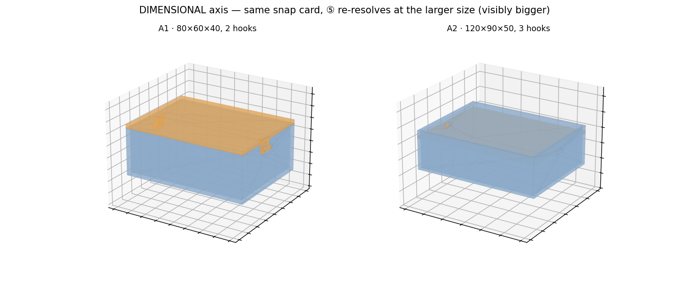
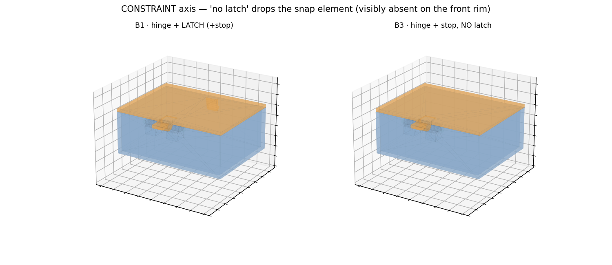
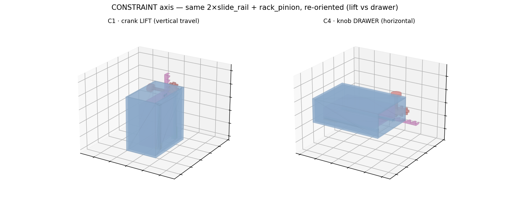

# M14 · TASK LADDER — REVIEW (the 15±5 benchmark, D-M14-1)

**Outcome: 16 tasks authored over the three verified bases, and ALL 16 CERTIFIED** — every feasible
task's golden is validator-clean, resolves (⑤), compiles (⑥), and passes its physics protocols
(reused from the certified base verdict or a real measured number); every infeasible task is refused
by the deterministic pipe at the **declared layer with the declared code**. No new cards/templates,
no LLM calls — pure task authoring + certification.

## Picture index

| axis | render | one-line pass criterion |
|---|---|---|
| dimensional |  | same snap card, ⑤ re-resolves at 120×90×50 / 3 hooks — visibly bigger |
| constraint (forbid) |  | "no latch" drops the snap element — the hinge+stop remains |
| constraint (orient) |  | same 2×slide_rail + rack_pinion, re-oriented — lift (vertical) vs drawer (horizontal) |

## Manifest — 16 tasks ([tasks/benchmark/manifest.json](../tasks/benchmark/manifest.json))

Every command reads like a real request.

| id | command | base · axis | expected class |
|---|---|---|---|
| A1-snap-base | "Design a snap-lid box I can push shut and pull open by hand." | snap · base | PASS |
| A2-snap-big | "…a snap-lid storage box about 120 × 90 × 50 mm…" | snap · dimensional | PASS |
| A3-snap-force | "…closes with no more than 60 N by hand and needs at least 15 N of pull to open." | snap · spec | PASS |
| A4-snap-impossible-force | "…closes with at most 5 N but needs at least 60 N of pull to open." | snap · infeasible | **INFEASIBLE(⑤, INFEASIBLE)** |
| B1-hinge-latch-base | "A small hinged box whose lid latches shut at the front." | hinge · base | PASS |
| B2-hinge-big | "A hinged box with a 100 × 70 mm lid that latches shut at the front." | hinge · dimensional | PASS |
| B3-hinge-nolatch | "…lid opens and stays put near 110° — no latch, just a stop." | hinge · constraint | PASS |
| B4-hinge-nostop | "…opens 90° and returns closed — no stop tab, no latch." | hinge · constraint | **EXPECTED_FAIL** |
| B5-hinge-openangle | "…lid opens at least 100° and settles closed within 5°." | hinge · spec | PASS |
| C1-lift-base | "Design a crank-operated platform that raises and lowers a load to different heights." | lift · base | PASS |
| C2-lift-load | "…raises a 1 kg load by about 90 mm." | lift · dimensional | PASS |
| C3-lift-holddrift | "…holds within 5 mm of its set height when the crank is released, under a 0.5 kg load." | lift · spec | PASS |
| C4-drawer | "…a desktop cabinet whose drawer slides out horizontally when you turn a knob." | lift · constraint | PASS |
| C5-lift-nogear | "…a crank lift that holds a 0.5 kg load, but without any gear or ratchet." | lift · infeasible | **INFEASIBLE(④, KG_NO_PERMITTED_REALIZER)** |
| C6-lift-toofar | "…raises the platform 500 mm inside a compact desktop frame." | lift · infeasible | **INFEASIBLE(⑤-param, V-04)** |
| D1-screw-jack | "Design a threaded screw-jack that lifts a load by turning a leadscrew." | (oov) · infeasible | **INFEASIBLE(④, V-03)** |

**Axis coverage:** dimensional A2/B2/C2 (+ A4/C6 infeasible-dimensional) · constraint B3/B4/C4/C5/D1 ·
spec-tightening A3/B5/C3 · infeasible ×4, each at a **distinct layer/code** (⑤ force-window, ④ KG
no-realizer, ⑤-param V-04, ④ V-03).

## Certification matrix ([tasks/benchmark/certification_matrix.json](../tasks/benchmark/certification_matrix.json))

Every task certified — no uncertified task enters the set.

| task | validators | ⑤ resolve | ⑥ compile | physics | verdict |
|---|---|---|---|---|---|
| A1-snap-base | clean | ok | 2 bodies | tier1 (T-S1) PASS | ✅ CERTIFIED |
| A2-snap-big | clean | ok | 2 bodies | tier1 PASS | ✅ CERTIFIED |
| A3-snap-force | clean | ok | 2 bodies | tier1 (windows met) PASS | ✅ CERTIFIED |
| A4-snap-impossible-force | clean | **StageFailure(s5/INFEASIBLE)** | — | — | ✅ CERTIFIED (refused) |
| B1-hinge-latch-base | clean | ok | 3 bodies | reused V-A+V-B PASS | ✅ CERTIFIED |
| B2-hinge-big | clean | ok | 3 bodies | inherited PASS | ✅ CERTIFIED |
| B3-hinge-nolatch | clean | ok | 3 bodies | inherited PASS | ✅ CERTIFIED |
| B4-hinge-nostop | clean | ok | 3 bodies | reused V-B **0/5 FAIL** | ✅ CERTIFIED (expected-fail) |
| B5-hinge-openangle | clean | ok | 3 bodies | reused (θmax 112.4°≥100) PASS | ✅ CERTIFIED |
| C1-lift-base | clean | ok | 5 bodies | reused V-A+P-FULL+VB PASS | ✅ CERTIFIED |
| C2-lift-load | clean | ok | 5 bodies | inherited PASS | ✅ CERTIFIED |
| C3-lift-holddrift | clean | ok | 5 bodies | reused (drop 3.37≤5) PASS | ✅ CERTIFIED |
| C4-drawer | clean | ok | 5 bodies | reused V-A PASS | ✅ CERTIFIED |
| C5-lift-nogear | — | — | — | **④ KG empty (refused)** | ✅ CERTIFIED (refused) |
| C6-lift-toofar | **V-04** | — | — | — | ✅ CERTIFIED (refused) |
| D1-screw-jack | **V-02+V-03** | — | — | — | ✅ CERTIFIED (refused) |

**Physics certification tiers (honest labels):** `reused` = the base's already-certified milestone
verdict (m6/m8/m13), cited; `tier1` = the snap force-window formula run at the variant's size;
`inherited` = identical mechanism, params in-bounds — deterministic-clean + the base's physics (the
variant changes size, not the mechanism). Spec tasks are certified against a **real measured number**
(θmax 112.4°, hold-drop 3.37 mm), not an assumption.

## Infeasible refusals — verbatim ([tasks/benchmark/refusals.json](../tasks/benchmark/refusals.json))

Each fires at the right layer with a readable reason:

```
A4-snap-impossible-force  (physically-contradictory spec)
  StageFailure[s5/INFEASIBLE]: element 'E1' violates 2 force-window inequalities:
    n*W_in <= mate_hi        (val 35.631 vs 5.0,  margin -30.631)
    W_out >= sep_lo (reten.) (val 31.838 vs 60.0, margin -28.162)

C5-lift-nogear  (constraint-contradiction)
  ④ KG_NO_PERMITTED_REALIZER: the only rot_to_trans realizer is 'rack_pinion' (KG),
    forbidden by the task; no permitted card can realize the crank→lift transmission or the hold.

C6-lift-toofar  (dimensional exceeds bounds)
  V-04: parameter 'stroke' value 500.0 outside [20.0,400.0]

D1-screw-jack  (out-of-vocabulary)
  V-03: 'E1' card 'leadscrew' not registered   (+ V-02: template 'leadscrew_column' not in vocabulary)
```

## Scorer coverage (D-M14-1)

`tests/eval_llm_stages.py` gains two axes the ladder's variants need, with self-tests (**5/5**):
- **forbidden-element compliance** (`forbidden_axis`) — a "without any gear / no latch" task is only
  satisfied if the candidate contains none of the forbidden card_refs (constraint axis).
- **spec-number compliance** (`spec_axis`) — every gold criterion threshold (force window, open
  angle, hold-drift) must appear in the candidate with the same VALUE, flagging the exact wrong
  number (spec-tightening axis; uses the reserved `wrong_field` slot).

## Status

- Authoring + certification: `tasks/benchmark/benchmark.py` → `manifest.json`, `certification_matrix.json`,
  `refusals.json`, and the per-task goldens in `tasks/benchmark/goldens/`.
- Builders parameterized (NO new cards/templates): `snap_starter` (box/hooks/windows), `anchor_easy`
  (box/open_min/latch-strip), `anchor_hard` (stroke/load).
- Scorer: `tests/eval_llm_stages.py` + 2 new axes (5/5 self-tests).
- Renders: `m14_task_ladder/out/axis_*.png`.
- **The benchmark is ready for the baseline LLM evaluation** (M6 in the spec ladder) — 16 certified
  tasks with declared expected classes and a scorer that reads forbidden-element + spec-number
  compliance.
