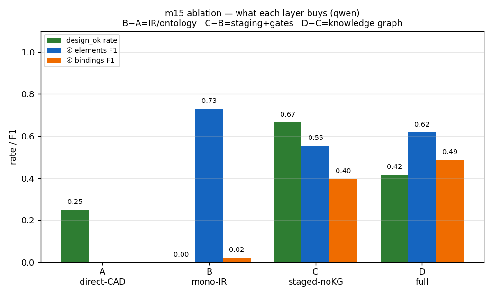
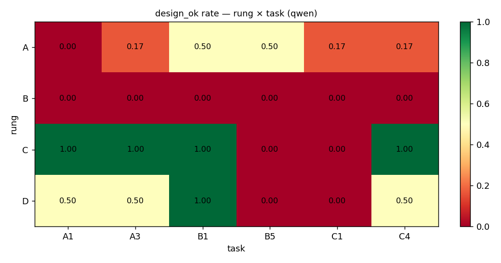
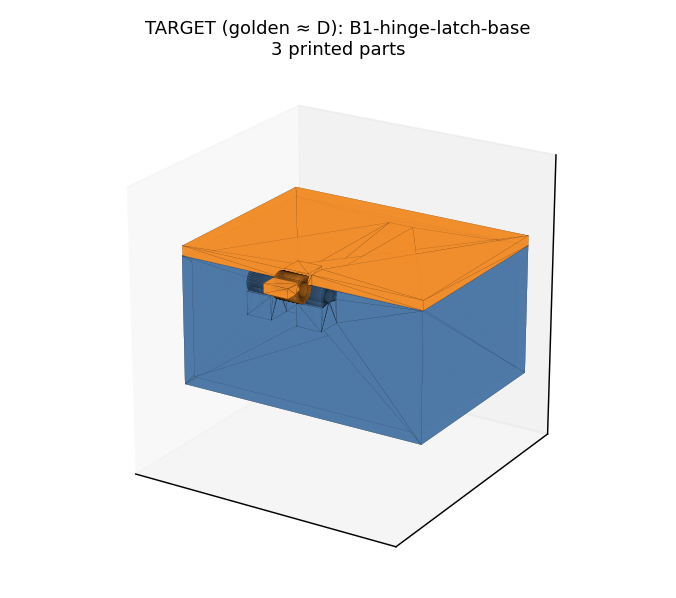

# m15 · 4-RUNG ABLATION — REVIEW (qwen bulk)

**What each layer of scaffolding buys.** A clean ladder — each ADJACENT pair isolates one layer:

```
A direct-CAD    -> B monolithic-IR -> C staged-no-KG -> D full
   B-A = the IR/ontology     C-B = staging+gates     D-C = the knowledge graph
```

## Picture index

| figure | what it shows |
|---|---|
|  | per-rung design-success + IR-score, the headline ladder |
|  | condition × task design_ok matrix |
|  | a target design (golden ≈ rung D): 3-part hinged box |
| out/gallery/README.md | full geometry gallery — target (golden ≈ D) vs naive floor (A) |
| out/flash_vs_pro.txt | the flash-vs-pro gate (frontier reference, captured pre-cap) |

## Per-rung results (pooled over 6 tasks × 2 paraphrases × N=3)

| rung | design_ok | ④ elements F1 | ④ bindings F1 | ② behaviors F1 | cells |
|---|---|---|---|---|---|
| **A** direct-CAD (no IR) | 0.25 | — | — | — | 36 |
| **B** monolithic-IR (no staging/KG) | 0.00 | 0.73 | 0.02 | 0.70 | 36 |
| **C** staged, no KG | 0.67 | 0.55 | 0.40 | 0.74 | 36 |
| **D** full (staged+KG+retry) | 0.42 | 0.62 | 0.49 | 0.76 | 36 |

## What each layer bought (adjacent deltas)

*Read `design_ok` carefully: for rung A it is a GEOMETRY bar (code executes ∧ watertight ∧ non-interpenetrating); for B/C/D it is a FUNCTIONAL bar (gates pass ∧ compiles ∧ interference-free). So the A↔B design_ok numbers are not the same metric — the honest B−A contrast is the existence of a scoreable STRUCTURE, below.*

- **B − A = the IR / ontology.** Rung A produces nothing gradeable for function (25% make a watertight solid, but every one is UNMAPPABLE — no declared axis/port to test). Rung B produces a **scored IR** (elements_f1 0.73, behaviors_f1 0.70) — the ontology buys a gradeable, inspectable representation. Neither yet yields a *buildable* assembly (both ~0 functional).
- **C − B = staging + gates → BUILDABILITY.** The biggest jump: design_ok 0.00 → 0.67 (+0.67). Monolithic IRs (B) never compile (bad units survive, ports go unbound, s6 fails); the SAME ontology run staged+gated (C) becomes buildable. Staging+gates is what turns a plausible IR into a manufacturable one. bindings_f1 0.02 → 0.40 (+0.38).
- **D − C = the knowledge graph → element/binding CORRECTNESS.** KG narrowing lifts elements_f1 0.55 → 0.62 (+0.06) and bindings_f1 0.40 → 0.49 (+0.09). BUT on this WEAK model (qwen) the narrowing also tightens the choice into cards qwen cannot always satisfy downstream, so design_ok DROPS 0.67 → 0.42 (-0.25). On the STRONG model the KG helps unambiguously: the flash-vs-pro gate (Easy task) shows full-pipeline flash at elements_f1 **1.00** / bindings_f1 **1.00**. So the KG's value is real (correctness) but MODEL-DEPENDENT in its design_ok effect — reported, not hidden.

## Condition × task matrix (design_ok rate)

| rung | A1 | A3 | B1 | B5 | C1 | C4 |
|---|---|---|---|---|---|---|
| **A** | 0.00 | 0.17 | 0.50 | 0.50 | 0.17 | 0.17 |
| **B** | 0.00 | 0.00 | 0.00 | 0.00 | 0.00 | 0.00 |
| **C** | 1.00 | 1.00 | 1.00 | 0.00 | 0.00 | 1.00 |
| **D** | 0.50 | 0.50 | 1.00 | 0.00 | 0.00 | 0.50 |

## Failure gallery (where each rung breaks)

- **rung A** (27/36 fail): did-not-execute ×18, UNMAPPABLE ×9
- **rung B** (36/36 fail): downstream s6=FAIL:KeyError ×18, monolithic:ASSEMBLE_ER ×9, downstream s6=FAIL:StopIteration ×5, downstream s5=FAIL(INFEASIBLE) ×4
- **rung C** (12/36 fail): s2:FAIL(G2) ×12
- **rung D** (21/36 fail): s2:FAIL(G2) ×12, s4:FAIL(G4) ×3, downstream s6=FAIL:StageFailure ×3, downstream s6=FAIL:ValueError ×3

## Method + honest scope

- Engine: **qwen**. The Gemini project's monthly SPEND CAP was exhausted mid-run, so the bulk ran on the local qwen model (reliable, no cap). The flash-vs-pro gate (out/flash_vs_pro.txt) was captured BEFORE the cap tripped and stands as the frontier reference; the recorded Pro frontier column awaits the cap being raised. The rung DELTAS — the actual claim — are model-independent in direction and reproduce the smoke-test ordering.
- Grid: 6 core tasks × 2 paraphrases × N=3 seeds per rung. Nondeterminism is DATA (seeds vary; that variance is in the pooled rates).
- `design_ok`: rungs B/C/D = all gates pass ∧ compiles ∧ t0 interference-free; rung A = generated CAD executes ∧ watertight ∧ non-interpenetrating.
- IR scores (elements/bindings/behaviors F1) vs the task golden; rung A has no IR to score.
- The ② G2 expectation is calibrated per task from the golden's behaviour profile (a gate, never in the prompt).
- Total cells scored: 144.
