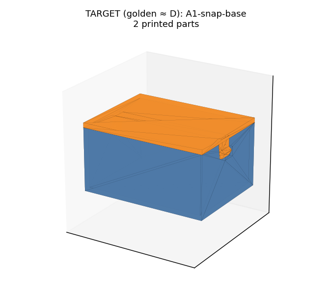
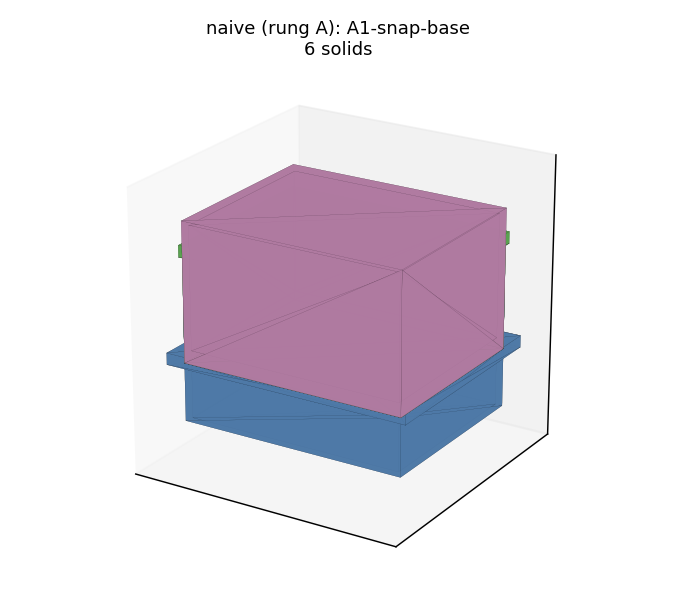
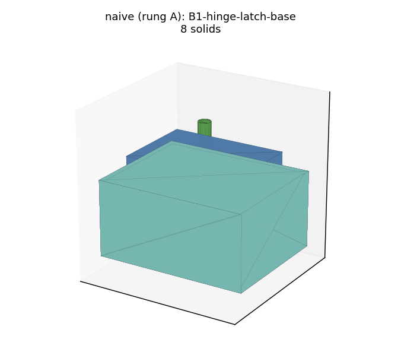
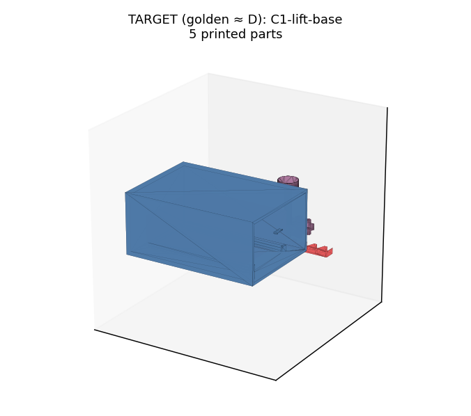
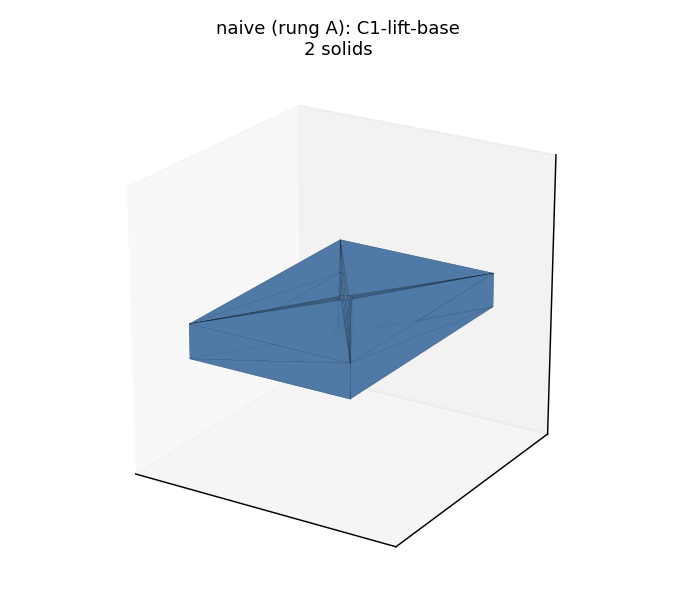
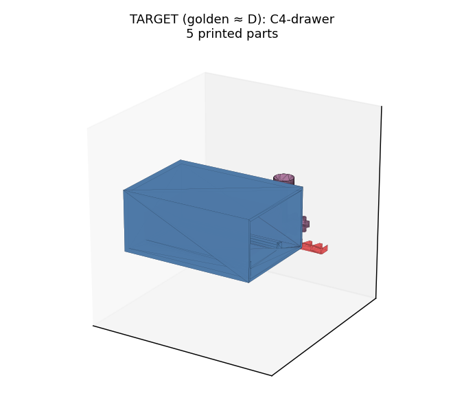
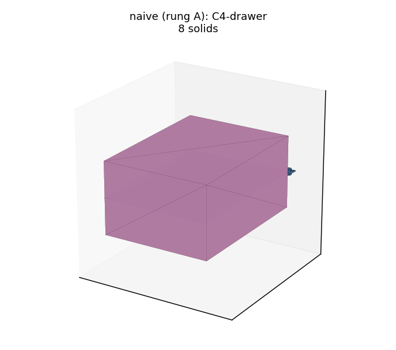

# m15 geometry gallery — target (golden ≈ rung D) vs naive floor (rung A)

## A1-snap-base

| target (golden ≈ rung D) | naive (rung A) |
|---|---|
|  |  |

## B1-hinge-latch-base

| target (golden ≈ rung D) | naive (rung A) |
|---|---|
|  |  |

## C1-lift-base

| target (golden ≈ rung D) | naive (rung A) |
|---|---|
|  |  |

## C4-drawer

| target (golden ≈ rung D) | naive (rung A) |
|---|---|
|  |  |
