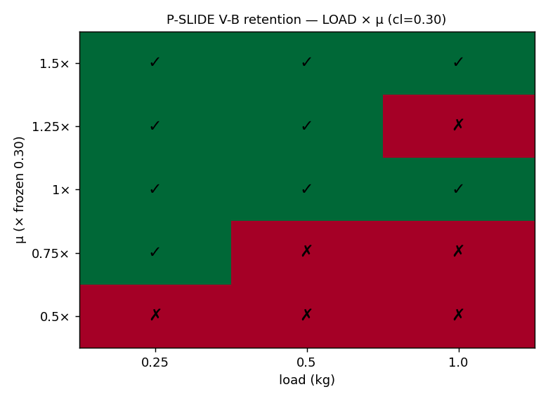
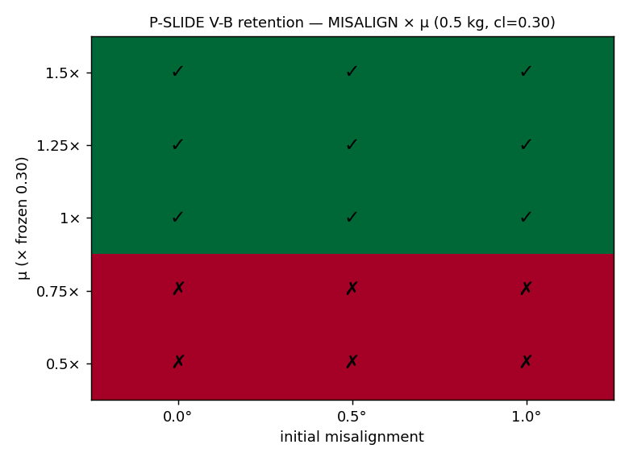
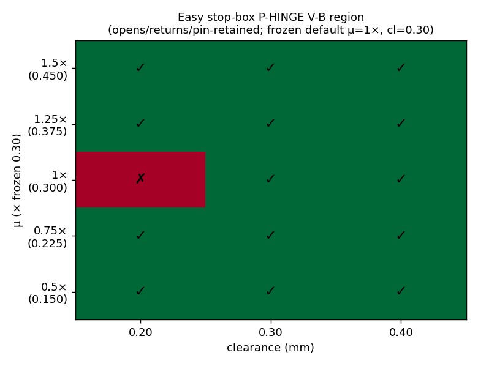

# M16 · ROBUSTNESS SWEEPS — REVIEW (external review pts 5, 6, 7)

**Outcome: two representative designs swept over their physical + numerical parameters, reported as
success REGIONS (heatmaps), not points. The headline honest finding — flagged, not hidden: the Hard-
lift retention generalizes across every *physical* axis (μ region, clearance, load, misalignment, and
UNSEEN rail dimensions) but is NUMERICALLY dt-sensitive (it holds at the frozen contact dt and fails
at finer dt).** That is exactly the reviewer's point-7 question answered with data.

*All results are **V-B (contact-derived)** unless marked (review pt 5's per-axis marking rule).*

## Picture index

| design · axis | figure | one-line reading |
|---|---|---|
| lift retention · μ×clearance, nominal 8×8 |  | retained for μ ≥ frozen 0.30, all clearances |
| lift retention · μ×clearance, **UNSEEN 6×10** |  | **same region** → the rule generalizes (pt 6) |
| lift retention · load × μ |  | retained across **0.25–1.0 kg at frozen μ** |
| lift retention · misalignment × μ |  | retained across **0–1° tilt at μ ≥ frozen** |
| Easy stop-box · P-HINGE V-B, μ×clearance |  | **14/15** — broadly robust across the whole grid |

## Preset discipline (R5, logged)

The frozen preset (μ=0.30, dt=5e-4) remains the recorded **default**. Every swept μ / dt / load /
misalignment is a **per-run experiment parameter**, recorded alongside its verdict
(`sweep_*.json.preset_default`) — *not* a preset change. The frozen default point sits inside every
retained region.

## Findings — Hard lift (P-SLIDE V-B retention, the D-M13-6 rule)

1. **Generalizes to UNSEEN dimensions (pt 6).** A 6×10 rail — a length/width pair no milestone used —
   yields the **same** retention region as nominal 8×8. The retention-stop rule is a *design rule*,
   not a fixture patch.
2. **Friction-bounded, physically.** Retained at μ ≥ frozen 0.30, lost below (the contact-only
   retention needs friction to damp the COM-offset pitch; below the frozen μ the pitch is unresisted,
   off-axis → 180°). The boundary is a material property.
3. **Clearance-insensitive.** Retained across 0.20–0.40 mm sliding clearance — the D-M13-6 stop-gap
   (print_clearance/4) dominates the sliding clearance (good robustness).
4. **Load-robust.** Retained across **0.25–1.0 kg at the frozen μ** (heavier load slightly narrows the
   margin; one marginal cell at 1.25×μ/1.0 kg).
5. **Misalignment-robust.** Retained across **0–1° initial pitch at μ ≥ frozen**.
6. **⚠️ dt-SENSITIVE — the honest limit (pt 7).** At the frozen dt (5e-4) the default point is
   retained **3/3 seeds**; at **dt/2 (2.5e-4) it is 0/3, and at dt/5 (1e-4) 0/3** — consistently. A
   finer timestep *removes* the retention. So the retention's robustness is **partly numerical**: it
   is at least partly tied to the frozen contact dt, not purely physical. This is reported, not tuned
   away — and it is precisely why **physical fabrication (pt 8) is the decisive test**: only a real
   print settles whether the retention holds outside the frozen contact model.

## Findings — Easy stop-box (P-HINGE V-B)

7. **Broadly robust.** The hinge V-B (lid opens on pin/bore contact, stop caps it, returns closed,
   pin retained) passes **14/15** cells across μ ∈ {0.5..1.5}× × clearance ∈ {0.20,0.40} mm — one
   marginal seed-dependent cell (μ=1×, cl=0.20). Unlike the lift retention, the gravity-*seated* hinge
   has no friction floor and no dt cliff in the swept range — a genuinely robust design, not a
   preset optimization.

## What this buys the paper (review response)

- **Point 6 (leakage):** the retention rule generalizes to unseen dimensions + across load, clearance,
  misalignment → a *rule*, answered with a region, not a same-fixture 0/5→5/5.
- **Point 7 (robustness):** success is reported over **regions**; and the honest **dt sensitivity** of
  the lift retention is surfaced — the reviewer's exact question ("robust design or optimization to the
  frozen preset?") gets a real, mixed answer: robust physically, dt-sensitive numerically.
- **Point 5 (V-A/V-B marking):** every figure is marked V-B (contact-derived).

## Status

- Done: Hard-lift retention (μ/clearance/load/misalignment/unseen-dims/dt) + Easy stop-box P-HINGE
  V-B (μ/clearance). Scripts: `sweep_lift.py`, `sweep_lift_axes.py`, `sweep_easy.py`; data:
  `sweep_lift*.json`, `sweep_easy.json`; 5 heatmaps.
- The **dt sensitivity** is the item the paper must carry as a limitation (and the fabrication test,
  pt 8, is its resolution). No preset was changed (R5 intact).
