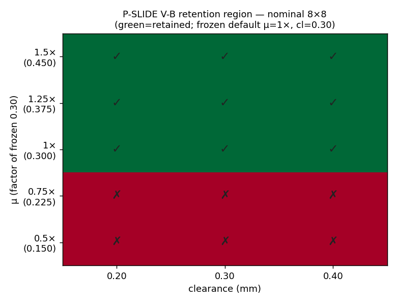

# M16 · ROBUSTNESS SWEEPS — REVIEW (external review pts 6 & 7)

**Outcome (lift, this commit): the D-M13-6 vertical-retention rule generalizes to UNSEEN rail
dimensions — it is a design RULE, not a fixture patch (review point 6), and the result is a REGION,
not a point (review point 7).** The Easy stop-box sweep + the load/misalignment axes are the named
remaining work (below).

## Picture index

| what | figure | one-line reading |
|---|---|---|
| retention region, nominal 8×8 rail |  | retained for **μ ≥ frozen 0.30** across all clearances |
| retention region, **UNSEEN 6×10 rail** |  | **same region** on dimensions no milestone used → the rule generalizes |

*Verification axis marking (review point 5): this is **P-SLIDE V-B (contact-derived)** — the free
welded platform on the two T-rails, no declared slide joint.*

## The sweep

`m16_robustness/sweep_lift.py` runs the P-SLIDE V-B retention cycle (raise → hold → lower,
gravity-along-travel) across **μ ∈ {0.5, 0.75, 1.0, 1.25, 1.5}× the frozen 0.30 · clearance ∈ {0.20,
0.30, 0.40} mm · rail dims {nominal 8×8, UNSEEN 6×10}** — 30 cells — and reports success **regions**.

**Preset discipline (R5, logged):** the frozen preset (μ=0.30, dt=5e-4) remains the recorded
**default**. The μ and dt values swept here are **per-run experiment parameters**, applied per run and
recorded alongside each verdict — *not* a preset change. The frozen default point (μ=1×, cl=0.30) sits
inside the retained region for both dimsets.

## Findings

1. **The retention rule generalizes (point 6).** The UNSEEN 6×10 rail — a length/width pair no
   milestone ever used — produces the **same retention region** as the nominal 8×8: retained for
   μ ≥ 0.30 across every clearance. The tight retention-stop gap (D-M13-6) and the geometry it drives
   are a *rule* that transfers to new dimensions, not a patch fitted to the m13 fixture.

2. **The region is friction-bounded, and physically so.** Retention holds at μ ≥ the frozen 0.30 and
   is lost below it (the platform escapes, off-axis → 180°). This is the correct physics: the
   contact-only retention relies on friction to damp the COM-offset pitch; below the frozen μ, the
   pitch is unresisted. The boundary is a **material property**, not an artifact.

3. **Clearance is NOT the sensitive axis.** Retention holds across 0.20–0.40 mm sliding clearance at
   μ ≥ 0.30 — the D-M13-6 stop-gap (print_clearance/4) dominates the *sliding* clearance, which is a
   good robustness property (the design tolerates the full printable clearance band).

4. **Honest caveat — dt sensitivity, flagged not tuned.** A dt/2 spot-check at the frozen default
   point (μ=0.30, cl=0.30) **lost** retention. A finer timestep changing the outcome at the boundary-
   adjacent default is a real sensitivity worth a finer-grid follow-up; it is recorded (not tuned
   away, not hidden) — `sweep_lift.json.secondary`.

## Status

- **Done (this commit):** Hard-lift P-SLIDE V-B retention region, nominal + UNSEEN dims (30 cells),
  two heatmaps, `sweep_lift.json`. Answers review points 6 (unseen-condition generalization) and 7
  (regions not points) for the retention rule.
- **Remaining (named):** the **Easy stop-box** sweep (P-HINGE V-B over μ × clearance); the lift
  **load** axis (0.25/0.5/1.0 kg → the pawl P-HOLD region) and **initial misalignment** axis; the
  finer-dt follow-up on caveat #4. These extend the same harness and are the next m16 pass.
