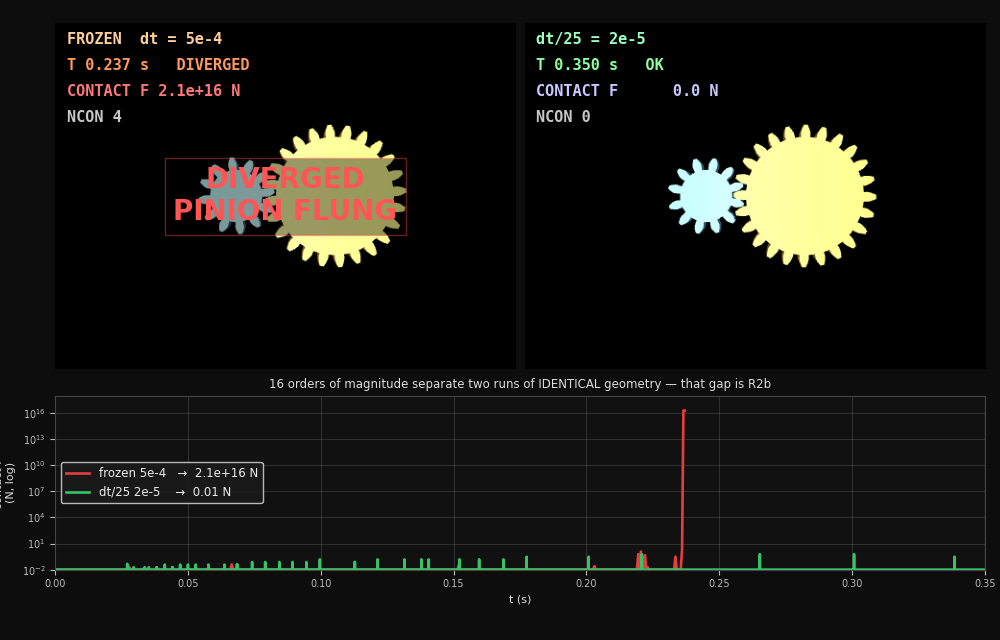
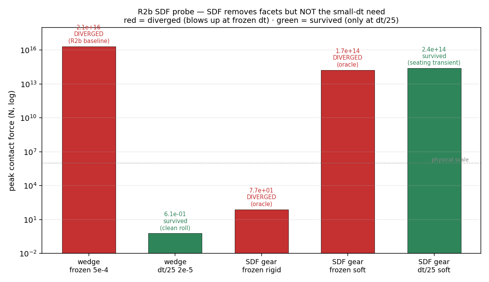

# M17 · GEAR-MESH SDF PROBE — REVIEW (risk-retirement probe for R2b)

**Question.** Does an SDF (signed-distance-field) contact formulation retire **R2b** — the frozen-preset
(R5) gear-mesh blow-up, where the SAME conjugate involute pair (z=12/z=24) diverges to ~10¹⁶ N at
dt=5e-4 but rolls calmly at dt/25 (m1_gear/out/r2b_note.md)?

**Answer: NO — not on its own.** This probe claims **NO `preset_v2`** and **NO V-B pass**. It
reproduces the known R2b numbers first, then shows an SDF collider — even the zero-facet analytic
best case — still blows up at the frozen dt. SDF removes the facet make/break; it does **not** remove
the small-dt requirement. R2b is two coupled limits, and SDF addresses only one.

## Picture index

| figure | reading |
|---|---|
|  · [`r2b_frozen_vs_fine_hud.mp4`](out/r2b_frozen_vs_fine_hud.mp4) | **the R2b money shot** — same conjugate pair, only dt differs; LEFT flings (**DIVERGED**, 2.1e16 N, "pinion flung"), RIGHT rolls calmly (0.6 N), with a **live log-scale contact-force trace** so the 16-order gap is visible as it happens. Reuses `m1_gear/r2b_viz.capture()` (m1_gear untouched). |
|  | peak contact force across all 5 conditions — RED diverged / GREEN survived. Red (blow-up) at **frozen dt for both wedge AND SDF**; green (survived) **only at dt/25**. |

Raw numbers: `out/sdf_probe_verdict.json` (FILE 1), `out/sdf_formulation_verdict.json` (FILE 2).

## Reproduction check — R2b reproduced before any SDF claim

The wedge baseline (`sdf_probe.py`, the validated m1_gear collider) reproduces R2b **to the digit**:

| condition | peak force | verdict | ratio | vs m1_gear reference |
|---|---|---|---|---|
| wedge @ frozen 5e-4 | **2.09e16 N** | DIVERGED t=0.237 | — | 2.09e16, DIVERGED t~0.237 ✓ |
| wedge @ dt/25 2e-5 | **0.605 N** | survived | −0.482 | 0.61 N, clean roll ratio ~−0.5 ✓ |

Sixteen orders of magnitude between two runs of identical geometry — R2b, intact.

## F1 — the D21-legal SDF is not shippable with the pip wheel

`build_sdf_mjcf()` emits the pair as an SDF collider over our **OWN carved mesh** (the exact
phase-baked mesh from `gear_mjcf._prep`, reusing `_inertial` for mass) — the **only** form D21 allows
(our compiled geometry, not a library primitive). It **fails to compile**:

> `XML Error: plugin mujoco.sdf.sdflib not found`

The mujoco pip wheel (3.10.0) ships **only analytic SDF plugins** — `mujoco.sdf.{bolt,bowl,gear,nut,torus}`
(`libsdf_plugin.so`). There is **no `mujoco.sdf.sdflib`** (the import-a-mesh-and-voxelize plugin).
So putting an SDF over our own mesh — the D21-legal option — needs a **source build of MuJoCo** with
the `sdflib` plugin (external SDFLib dependency). We keep FILE 1(B) as *executable documentation* of
this; we do not try to make it pass. **Updates the D-M1-8 mitigation cost** (D-M17-1).

## F2 — SDF is NOT a drop-in R2b fix at the frozen dt

Because F1 blocks the own-mesh path, `sdf_formulation_probe.py` uses the analytic `mujoco.sdf.gear`
primitive as an **ORACLE ONLY** — it is **D21-forbidden as a MechSynth collider** (no card, no
compile path, no preset touches it; it exists here solely to answer "if the collider were a perfect
zero-facet SDF, would R2b go away?"). Seated at its fewest-contact proper mesh (α_gear=3.9°, ncon0=2):

| condition | peak force | verdict | vs task reference |
|---|---|---|---|
| SDF gear @ frozen **rigid** (R5) | 7.7e1 N | **DIVERGED** t=0.002 | DIVERGED ✓ (flag); peak lower — see caveat |
| SDF gear @ frozen **soft** | 1.7e14 N | **DIVERGED** t=0.094 | DIVERGED ✓; ~10¹⁴–10¹⁶ transient |
| SDF gear @ **dt/25** soft | 2.4e14 N | **survived** t=0.35 | survived, peak 2.7e14 ✓ (ratio −1.76 = NOT a clean roll) |

The **exact analytic SDF gear — zero facets, SDF's best case — STILL diverges at dt=5e-4 under BOTH
rigid and soft contact.** Only dt/25 avoids divergence. Facet make/break is therefore *not the whole
story*: the small-dt requirement persists with **no facets at all** (D-M17-2).

## F3 — R2b is TWO coupled limits; SDF is necessary-not-sufficient

1. **Convex-facet make/break** (a *formulation* limit) — SDF removes this: the analytic gear has a
   smooth signed-distance surface, no facets to chatter between.
2. **Stiff-contact-at-small-scale time integration** (a *dt* limit) — SDF does **NOT** remove this:
   the zero-facet oracle still needs dt/25 to stay bounded.

So an SDF contact is **necessary-not-sufficient** for R2b: it would remove one limit while leaving the
other. Retiring R2b needs the **timestep** addressed, not just the collider (D-M17-2/-3).

## Caveats (honest scope)

- **Analytic oracle only.** `mujoco.sdf.gear` is D21-FORBIDDEN as a deliverable — used here purely as
  a formulation oracle. Nothing in the ontology/cards/compile/preset references it.
- **Seat is transient-dominated.** The analytic pair has residual t=0 penetration + hand-set inertia;
  its frozen-dt peak is a **seating transient**, and its magnitude is **seat-sensitive** — at our
  fewest-contact proper seat the rigid case diverges via *velocity blow-up* (t=0.002, ~10² N) rather
  than the ~10¹⁶ N force-spike the reference seat showed. **The divergence itself is robust across
  seats; the exact peak force at a frozen-dt divergence is not** (it swings orders of magnitude with a
  0.1° seat change). The dt/25 "survival" is likewise fragile (ratio −1.76 ≠ the clean −0.5) — only
  the wedge@dt/25 is a truly clean roll.
- **Scale vs stiffness not yet isolated** — a small module and a stiff preset are confounded here.
- **`sdf_iterations`/`sdf_initpoints`/`ccd_iterations`** left at defaults for the oracle.
- **The soft-contact test softens contact ONLY inside this probe** (solref `0.01 1`, solimp
  `.95 .99 .0001`, μ 0.2). R5 is untouched everywhere else.

## Open decisions

- **D-M17-1** — F1: no shippable `sdflib`; the D21-legal own-mesh SDF needs a MuJoCo source build
  (external SDFLib dep). Amends the D-M1-8 cost.
- **D-M17-2** — F2/F3: SDF is necessary-not-sufficient; the small-dt requirement survives a zero-facet
  collider, so R2b is a dt limit as much as a formulation one.
- **D-M17-3 (DRAFT)** — should V-B admit a **versioned per-element dt** — i.e. `preset_v2` as a
  *timestep* amendment, not a contact-parameter one? The honest deliverable may be "**V-B requires
  dt ≤ dt\*** (a versioned preset_v2 timestep)" rather than "swap the collider". `dt*` is not yet
  measured (see the recommended follow-up, `dt_scale_ladder.py`); this decision stays a DRAFT until it
  is, and any preset versioning requires the FULL R5 regression set + G-H sign-off on the D21
  own-mesh-vs-analytic tension.

## Follow-up result — dt* measured (`dt_scale_ladder.py`)

With a settle phase (drive off 0.05 s to shed the seating transient), dt* = the largest dt giving a
bounded **clean** roll (|ratio + 0.5| < 0.15):

| collider · scale | dt* | reading |
|---|---|---|
| **wedge · 2 mm** (R2b scale) | **2e-5** | only the finest dt reaches a clean roll (ratio −0.44); the R2b number, consistent with m1_gear |
| SDF oracle · 2 mm | **none** | survives at 2e-5 but never rolls cleanly (ratio ~0 — poor transmission); no dt* |
| SDF oracle · 4 mm (2× scale) | **none** | diverges across the ladder; scale did not rescue it |

**The wedge has a real dt\* (2e-5); the analytic SDF oracle has none — it never produces a clean roll
at any dt in the ladder.** So on this evidence SDF buys **no larger stable dt** than the wedge at equal
scale — it does not demonstrably relax dt*. This **reinforces F3** (SDF necessary-not-sufficient) and
means the `sdflib` source build (D-M17-1) is **not justified** by a dt payoff here. Caveat: the
analytic oracle's poor transmission (ratio ~0) is itself the seat/inertia fragility flagged above —
it is a weak transmission test, so this bounds SDF's dt payoff at "not demonstrably positive", not at
a proven zero. `dt_scale_ladder.png` shows the dt* per collider/scale.

The honest R2b deliverable is therefore **"V-B requires dt ≤ 2e-5 at the m=2 mm gear scale"** (a
versioned `preset_v2` *timestep*, D-M17-3), NOT a collider swap — and that amendment still needs the
full R5 regression + G-H sign-off before it is anything but a DRAFT.

## Status

Probe complete: R2b reproduced (wedge), F1 (no sdflib) documented as an executable compile-failure,
F2/F3 (SDF blows up at frozen dt, only dt/25 survives) shown via the analytic oracle. **No preset_v2
proposed. No V-B pass claimed.** Follow-up `dt_scale_ladder.py` (isolate dt* with a settle phase, no
source build) is the next honest step before any preset amendment.
