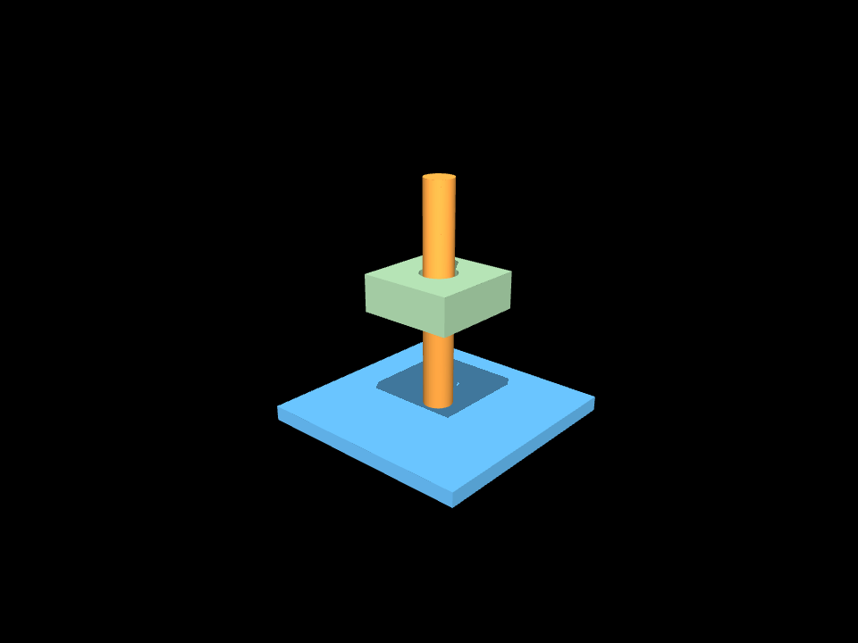
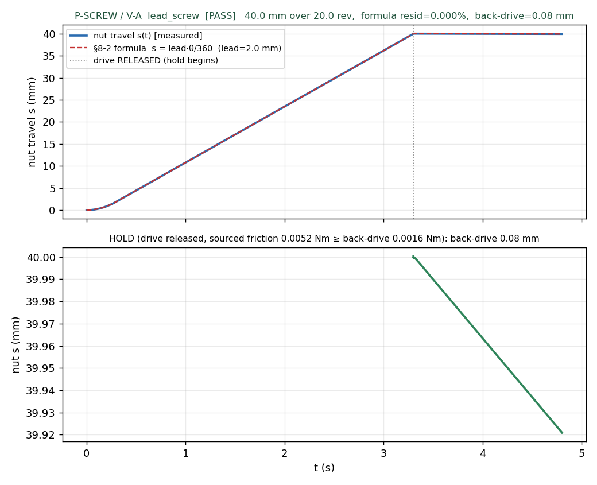

# M19 · lead_screw — REVIEW

**Outcome: the `lead_screw` element is complete through the FULL D-track, and P-SCREW passes V-A 5/5
with a SOURCED, NON-TAUTOLOGICAL self-lock hold.** The power screw — a rotating threaded shaft driving
a nut in translation, self-locking when the lead angle ≤ the friction angle — is now a physics-verified
element, not a schema stub. Following m10 (`slide_rail`, D-D-1) and m11 (`rack_pinion`, D-D-2): the
transmission is verified as a **declared kinematic pair** (hinge ⊕ slide, equality polycoef = lead/2π
in **metres**), and the emergent helical-thread contact (V-B, curved R2b class) is **NAMED-DEFERRED**,
never silently claimed. The new thing this milestone adds over m11 is a **self-lock HOLD that is
physics-verified from sourced friction and proven non-tautological by a discrimination probe** —
directly honouring the D-D-1 lesson (friction must be `µ·N`, never invented) and the m18 audit finding
that a "verified" tag needs real evidence.



The compiled screw-jack fixture: the blue base plate (welded), the orange screw post (the rotating
body, +Z), and the green nut carriage (the sliding mover) riding a clearance bore on the screw. Two
one-solid pieces + the carved screw — validator-CLEAN, compiles to 2 parts.

## The card (Shigley §8-2 / P&B §7.4.3)

A power screw converts rotation to translation at a fixed ratio and — uniquely among the transmission
cards — **holds a released axial load with no added brake** when it self-locks (a screw-jack, a vise, a
clamp). This resolves the ontology thread from m13: "holds under load" is the axis-4 `self_locking`
field (D-M18-4), and lead_screw is the element that earns it by physics.

**§8-2 rule chain, reproduced by the hand-worked golden** (d_major=8, pitch=2, starts=1; µ=0.30 = the
R5 PETG preset):

| quantity | formula | value |
|---|---|---|
| lead | starts · pitch | 2.0 mm |
| travel / rev | = lead | 2.0 mm |
| d_mean | d_major − pitch/2 | 7.0 mm |
| lead angle λ | atan(lead / (π·d_mean)) | 5.197° |
| tan λ | tan(λ) | 0.09095 |
| friction angle φ | atan(µ) | 16.699° |
| **self-lock** | **tan λ ≤ µ  ⇔  λ ≤ φ** | **0.0909 ≤ 0.30 ⇒ SELF-LOCKS** |
| efficiency η | tan λ / tan(λ+φ) | 0.226 |
| polycoef | lead / 2π (m/rad) | 3.183e-4 |

Pinned in [`tests/test_lead_screw.py`](../tests/test_lead_screw.py) — 6/6, the arithmetic worked in the
test's docstring so *"if this fails the CODE is wrong, not the arithmetic"*. The test also pins the
**coarse counter-example** (pitch=4, starts=2 → lead=8, tan λ=0.42 > 0.30 → does **not** self-lock, it
back-drives) — the self-lock criterion is a real discriminator, not always-true.

- **ports** `screw_axis` (axis) / `nut_mount` (face) / `travel_axis` (axis).
- **param_bounds** add `pitch ∈ [0.5,4.0]`, `starts ∈ [1,2]`, `lead ∈ [0.5,8.0]`; `lead` is **DERIVED**
  (lead = starts·pitch), not free. `resolve_params` zero-Nones every param (the m18-audit gap: it used
  to leave `starts=None`) and, when a behaviour demands `self_locking=True`, **shrinks the pitch until
  tan λ ≤ µ** — guaranteeing the axis-4 property the card advertises.
- **imposes** an assembly-phase threading (translation) path (V-08).
- **carve** anchor-driven, one solid: the screw post on its axis; the nut carriage bore is a clearance
  fit (`d_major/2 + gap`) so the screw threads through.
- **collision_hint** source-stamped (D-M8-4); curved thread-flank contact is a coarse-cylinder proxy →
  V-B deferred, `mujoco.sdf` FORBIDDEN as a collider (D21).
- **verification** = P-SCREW **V-A** with the V-B thread-contact gap NAMED in the protocol.

## P-SCREW (§6.3) — V-A · [`out/t2_lead_screw_verdict.json`](out/t2_lead_screw_verdict.json)

| criterion | result | value | gate |
|---|---|---|---|
| reaches design stroke | ✅ | 40.0 mm | = design stroke |
| **matches lead formula** (non-tautology) | ✅ | **0.000%** | ≤ 0.1% |
| **self-locks / holds** (sourced friction) | ✅ | **0.079 mm** back-drive | ≤ 1 mm |
| converged (no blow-up) | ✅ | — | — |
| all parts retained | ✅ | 3 bodies | — |
| **V-A overall** | **5/5 PASS** | G-CONV ok | ≥ 4/5 |
| **V-B** (emergent thread contact) | **DEFERRED** | — | *R2b/m17, pending preset_v2* |



**(a) The ratio (non-tautology).** V-A wires the transmission as a **declared kinematic pair** — a
hinge on the screw, a slide on the nut, coupled by a rigid MuJoCo equality whose polycoef is
`lead/2π` **in metres**. Driving the screw 20 revolutions and measuring the nut travel end-to-end is
**not a tautology**: it exercises the lead formula (lead = starts·pitch), the mm→m unit path, the
polycoef, and model stability. The measured travel (40.00 mm) overlays the **independent** §8-2
prediction `lead · rev = 2.0 · 20.0 = 40.0 mm` to **0.000%** — well inside the 0.1% gate, 5/5 seeds.
Video: [`out/t2_lead_screw_VA.mp4`](out/t2_lead_screw_VA.mp4).

**(b) The self-lock hold (SOURCED, and PROVEN non-tautological).** At the design stroke the drive is
RELEASED (actuator torque → 0) and the design axial load applied; only the **sourced thread friction**
resists back-drive:

> `T_friction = µ · W · d_mean/2 = 0.30 · 4.905 N · 0.0035 m = 0.00515 N·m`  (the D-D-1 form — µ from
> the R5 PETG preset, d_mean from the card; **not an invented value**)

and self-lock **emerges** iff `T_friction ≥ T_backdrive = W·lead/2π = 0.00156 N·m`, i.e. iff
`µ·d_mean/2 ≥ lead/2π ⇔ tan λ ≤ µ`. The released load holds to **0.079 mm** back-drive over 1.5 s
(margin 3.30× = µ/tan λ). **Non-tautology probe:** re-running the hold with a friction *below* the
back-drive torque (0.5·T_backdrive) lets the load **slip 18.4 mm** — 233× more. So the hold is the
sourced friction winning, not a solver artifact, and the SAME rule would let a coarse (tan λ > µ) screw
back-drive. `verdict.discrimination_probe.discriminates = true`.

### Physics-of-verification notes (why the rig is built the way it is)

The declared pair looks trivial but the self-lock hold is delicate; each choice below was forced by a
*measured* failure, and all are documented in [`p_screw_va.py`](p_screw_va.py):

- **dt = 1e-4, not the R5 5e-4.** The hold is resolved by JOINT frictionloss, which **leaks per-step**
  for the small plastic-screw inertia at 5e-4 (measured: a 0.00515 N·m frictionloss failed to hold a
  0.00156 N·m sub-cap torque; holds to <0.1 mm at 1e-4). This rig declares **no contact geoms**
  (contype/conaffinity=0 — the joints are the mechanism), so the R5 FROZEN preset (a *contact* preset:
  SOLIMP/SOLREF/µ) does not constrain the clock here. Contact-bearing rigs keep the R5 clock; a
  contact-free joint rig does not.
- **Rigid coupling** (`solref="-1e8 -1e4"`, direct stiffness, not timeconst). A soft/positive-timeconst
  equality is a **spring the load stretches** (>12 mm) while the screw never rotates — so the hinge
  friction never engages. Direct high stiffness makes the nut's weight transmit to a screw torque the
  frictionloss holds, and keeps `s = polycoef·θ` to <0.1%.
- **`armature = 1e-5`** (driven-train rotor inertia). Static-equilibrium-neutral (self-lock is a rest
  question) but required for the frictionloss constraint to be numerically rigid.
- **joint damping = 1e-5** (tiny). High viscous damping would hold **any** load transiently and MASK
  self-lock — the Coulomb frictionloss must govern the hold. (With the original 0.002/0.01 damping the
  discrimination probe *failed*: weak friction "held" at 0.19 mm because damping, not friction, was
  doing the work. Lowering it exposed the true 18.4 mm slip.)
- **per-seed model-state restore.** `run_va` mutates the actuator gain, nut mass, and gravity at
  release; without restoring them each seed, seed > 0 inherited seed 0's released model and never drove
  (travel 0). Fixed — 5/5 seeds now drive-ready.

## Why V-A only — the V-B gap is named, not hidden

The helical thread flank is **curved contact**, the same rigid-body R2b class m17 showed metastable
(D-M1-7) — exactly why rack_pinion defers its tooth contact. So the emergent thread-flank contact
(V-B) is deferred behind a versioned `preset_v2`, and the deferral is **carried in the artifacts** so
no design can silently claim contact-level threading it cannot show:

- the card's `verification()` emits the V-A protocol with an `actuation.v_b_gap` string naming the gap;
- the fixture golden carries it to `plan.protocols`;
- the verdict records `verdict_VB: "DEFERRED …"` and a `shape_assert` checking V-A present ∧ V-B gap
  named ∧ **no V-B pass claimed** — all three true.

The card's axis-5 `emergent_check` is `deferred` with the risk text **narrowed** by this milestone: the
self-lock *criterion* (tan λ ≤ µ) and the sourced holding torque ARE now physics-backed; what remains
unverified are the thread-flank effects the declared pair cannot see (flank-normal load distribution,
backlash, wear, off-axis binding). This is strictly narrower than the pre-m19 "self-lock verified by
formula only" — and honest about the boundary.

## Numeric reproduction chain (Stage 5) · [`out/reproduce.txt`](out/reproduce.txt)

[`reproduce.py`](reproduce.py) (free/local, no billed calls) reproduces every number from independent
arithmetic and checks it against the card, the verdict, and the compiled geometry:

```
[1] rule chain: lead=2.0, d_mean=7.0, λ=5.197°, tanλ=0.09095   (cross-checked vs card)
[2] self-lock:  tanλ=0.09095 ≤ µ=0.30 ⇒ SELF-LOCKS; T_f=0.00515 ≥ T_bd=0.00156 Nm (3.30×)
[3] travel:     predicted lead·rev_drive = 40.000 mm vs V-A measured 40.000 mm = 0.0000% (≤0.1%)
                HOLD non-tautology: sourced holds 0.079 mm vs weak(0.5·T_bd) slips 18.430 mm
[4] t1 COMPILE_DRIFT: base 60×60, screw_len 60, nut 26×26×10 vs intent — all drift 0.0000 mm (≤0.05)
========== reproduction CLEAN — every number checks out ==========
```

## Stage-by-stage (D-track, no stage skipped)

| stage | done | evidence |
|---|---|---|
| **P1** cards refactor landed | ✅ | one-file-per-element `knowledge/cards/` (prior commit) |
| **P2** canonical goldens fixed | ✅ | `tasks/*.json` regenerated; `tests/test_roundtrip.py` 4/4 (commit 3df2162) |
| **P3** coupling/ujoint honest-deferred | ✅ | `knowledge/cards/{coupling,universal_joint}.py`; D-M19-0 (commit 1800ec3) |
| **1** card completion (rule chain, resolve, self-lock) | ✅ | `knowledge/cards/lead_screw.py`; `tests/test_lead_screw.py` 6/6 (commit 3112333) |
| **2** fixture templates | ✅ | `screw_base` + `nut_carriage`; `tests/test_screw_templates.py` 4/4 (commit be425d9) |
| **3** golden IR (ontology-first) | ✅ | `tasks/lead_screw_fixture.json` validates CLEAN, compiles 2 parts (commit 8075064) |
| **4** P-SCREW V-A + sourced hold + V-B deferral | ✅ | `p_screw_va.py`; verdict 5/5; VA.png/mp4; discrimination probe (commit 691cd04) |
| **5** numeric reproduction chain | ✅ | `reproduce.py` → `out/reproduce.txt` CLEAN (commit 12e5947) |
| **6** REVIEW + D-M19-1 + STATUS | ✅ | this file; `DECISIONS_LOG.md` D-M19-1; `STATUS.md` M19 row |

**Still HELD (user release required):** the lite admission gate (1 billed run) and the m15 Pro/flash
frontier column — untouched this milestone (all m19 work was free/local: geometry, formula arithmetic,
and MuJoCo joint physics, no LLM/API calls).
