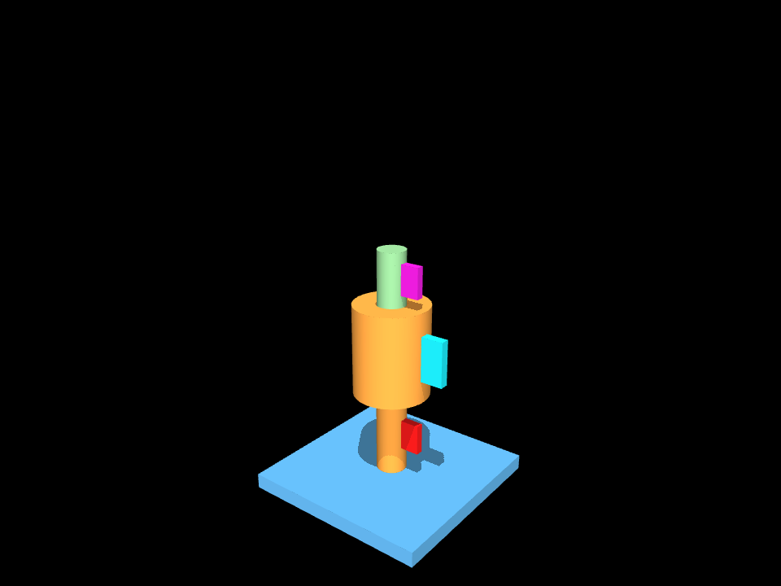
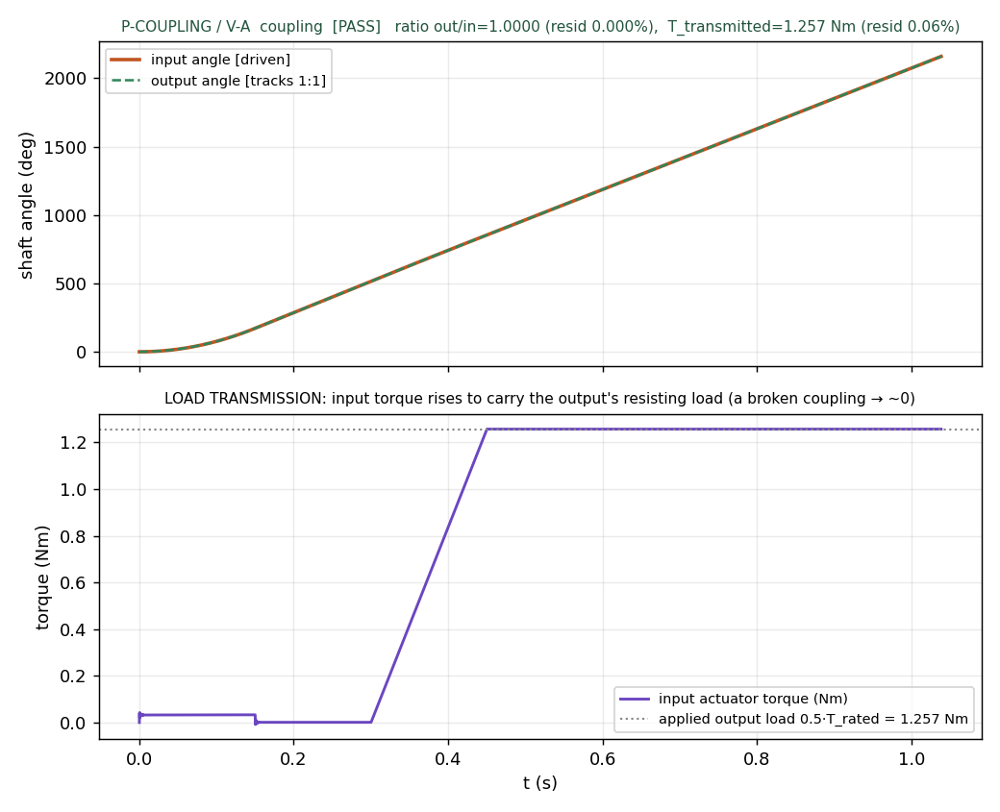

# M20 · coupling — REVIEW

**Outcome: the `coupling` element is complete through the FULL D-track, and P-COUPLING passes V-A 5/5
with the torque-transmission NON-TAUTOLOGY handled explicitly.** A rigid sleeve/clamp coupling — a
stiff hub that grips two coaxial shaft ends and transmits rotation 1:1 — is now a physics-verified
element, not the m18 schema stub whose "verified" tag D-M19-0 had to retract for lack of a rig.
Following m19 (`lead_screw`, D-M19-1) it inherits the **dt=1e-4 declared-joint clock (D-M19-2)** and the
**discrimination-probe discipline**. Its `emergent_check` is now honestly **verified** (not deferred): a
rigid coupling has no curved conjugate contact, so there is no V-B gap of the m17/R2b class.



The compiled fixture: the blue base plate (welded), the orange input shaft with the coupling **hub fused
onto it** (a rigid coupling grips the input rigidly), and the green output shaft inserting into the hub's
blind clearance bore from above. Two one-solid pieces (P1 base+stub+hub, P2 output shaft).

## The card (Shigley §3-12 / P&B §8.1) — and WHICH coupling

This models a **RIGID sleeve/clamp coupling**. Being rigid it transmits torque but absorbs **no**
misalignment (angular / parallel / axial); a train that must tolerate misalignment wants a **flexible**
coupling, which is a different future card (it adds a compliance axis and a misalignment-capacity
protocol this card does not carry — the card-vs-parameter rule, **D-M20-0b**).

**Rule chain, reproduced by the hand-worked golden** (bore_d=8, τ=25 MPa, body_d=20, length=24):

| quantity | formula | value |
|---|---|---|
| rated torque | τ · π · bore³ / 16 | 2513.27 N·mm |
| hub OD (min) | 2 · bore | 16.0 mm |
| hub length (min) | 1.5 · bore | 12.0 mm |
| ratio | 1 (a coupling adds no ratio) | 1.0 |

Pinned in [`tests/test_coupling.py`](../tests/test_coupling.py) — 6/6, arithmetic worked in the
docstring (*"if this fails the CODE is wrong, not the arithmetic"*), including that the torque scales
with bore³ (16 mm bore → 8× the torque of an 8 mm bore).

- **ports** `shaft_in` / `shaft_out` (both axis). **axis_relationship = parallel** (axis-2) — the
  discriminator vs `universal_joint`, which joins *intersecting* axes.
- **param_bounds** `bore_d`, `body_d`, `length`, `tau_allow`; `resolve_params` zero-Nones every param and
  **DERIVES + ENFORCES** the hub proportions (body_d ≥ 2·bore, length ≥ 1.5·bore) so the advertised
  capacity geometry actually holds — verified for a large bore too.
- **imposes** an assembly shaft-insertion path (V-08). **carve** one solid: the hub fused to the input
  stub with a blind clearance bore (the D-D-1 one-solid fix — see below). **collision_hint**
  source-stamped (D-M8-4), noting the fit is concentric, not curved.
- **verification** = P-COUPLING **V-A** with criteria `transmits_ratio` **and** `transmits_rated_torque`.

## P-COUPLING (§6.3) — V-A · [`out/t2_coupling_verdict.json`](out/t2_coupling_verdict.json)

| criterion | result | value | gate |
|---|---|---|---|
| reaches drive (input ≥ 6 rev) | ✅ | 6.001 rev | ≥ 6 |
| **transmits_ratio** (necessary, weak) | ✅ | **0.000%** | ≤ 0.1% |
| **transmits_rated_torque** (the real content) | ✅ | **0.06%** | ≤ 5% |
| converged (no blow-up) | ✅ | — | — |
| all parts retained | ✅ | 3 bodies | — |
| **V-A overall** | **5/5 PASS** | G-CONV ok | ≥ 4/5 |
| **V-B** (emergent contact) | **VERIFIED** | — | *no curved-contact gap (not a defer)* |



**The design question of m20 — why 1:1 is not the point.** Declaring a 1:1 coupling and measuring 1:1
verifies **nothing**: a polycoef=1.0 equality reproduces 1:1 trivially (unlike m19, where polycoef came
from the card's lead formula and the ratio exercised real arithmetic). So P-COUPLING has three parts,
and the REVIEW is explicit that (a) alone is weak:

- **(a) Ratio** — driving the input 6 rev, the output tracks to **0.000%** (top plot: the two angle
  traces are indistinguishable). Necessary, but weak alone — said so.
- **(b) Load transmission (the non-tautology)** — a resisting torque on the **output**, **sourced** from
  the card's rated torque (`T_load = 0.5·T_rated = 1.257 N·m`, `T_rated = τ·π·bore³/16` — *not invented*,
  the D-D-1 lesson), and the input must carry it. The output still tracks **and** the input actuator
  torque rises to meet the applied load to **0.06%** (bottom plot: the purple input-torque trace climbs
  to the dotted applied-load line as the load ramps in). That number path exercises the card's torque
  rating **and** the N·mm→N·m unit path.
- **(c) Discrimination (inherited, D-M19-2)** — break the coupling honestly (equality **inactive**): the
  input spins **6.00 rev** while the output stays **0.00 rev**. `discrimination_probe.discriminates =
  true`. So the tracking is the coupling doing work, not a solver artifact — the same discipline that
  caught two masked-hold tautologies in m19.

Video: [`out/t2_coupling_VA.mp4`](out/t2_coupling_VA.mp4).

### Physics-of-verification notes

- **dt = 1e-4 (D-M19-2), not the R5 5e-4.** Contact-free declared-joint rig (contype/conaffinity=0 — no
  contact geoms), so the R5 FROZEN *contact* preset does not apply; the clock is the m19 recipe. Rigid
  coupling (`solref="-1e8 -1e4"`) so the applied output torque transmits to the input rather than
  stretching a soft equality; `armature=1e-5`, tiny damping. No gravity (a coupling's function is
  orientation-independent — pure rotation about the shaft axis).
- **The one-solid carve (D-D-1).** A rigid coupling is *fused to the input shaft* and *grips the output
  shaft*. A naive clearance through-bore would leave the hub floating (two solids). So the hub sits on
  the input stub (overlap → one solid) with a **blind** clearance bore drilled from the top; the solid
  floor fuses hub↔input shaft, and the output shaft inserts into the bore with print clearance. This is
  both the physical picture and the compile fix.

## Why V-B is VERIFIED here (not deferred) — decided for THIS element, not copied

lead_screw and rack_pinion defer V-B because their working surfaces are **curved conjugate contact**
(thread flanks, gear teeth) — the m17/R2b rigid-body limit. A rigid coupling has no such surface: it is
**concentric clamped solids**, and V-A covers the entire declared behaviour (1:1 ratio + torque
transmission). So `emergent_check` is honestly **verified**, **reversing the D-M19-0 no-rig retag** now
that the rig exists. The verdict records `verdict_VB: "VERIFIED …"` and an `emergent_check_resolution`.

The one thing V-A does **not** test is named, not hidden: the hub↔shaft **force-closure grip** (whether
a real clamp/set-screw's preload prevents slip at the rated torque). That is a **fastening-preload**
question — a future clamp-torque check — **not** a deferred curved-contact V-B. It rides in the card's
`emergent_check.risk` as a modeling assumption (the hub↔shaft interface is idealized as rigid).

## Numeric reproduction chain (Stage 5) · [`out/reproduce.txt`](out/reproduce.txt)

```
[1] rule chain: T_rated=2513.27 N·mm, hub OD≥16, len≥12, ratio 1.0   (cross-checked vs card)
[2] sourced load: T_load = 0.5·T_rated = 1.2566 N·m   (N·mm→N·m)
[3] V-A: ratio residual 0.0000% (≤0.1%) ; torque transmission 0.06% (≤5%) ; discrimination 6.00 vs 0.00 rev
[4] t1 COMPILE_DRIFT: base 50×50, hub_top 50, out_len 24, out_shaft_d 7.4 vs intent — all drift 0.0000 mm
========== reproduction CLEAN — every number checks out ==========
```

## Stage-by-stage (D-track, no stage skipped)

| stage | done | evidence |
|---|---|---|
| **1** card completion (cited rule chain, resolve zero-None, P-COUPLING) | ✅ | `knowledge/cards/coupling.py`; `tests/test_coupling.py` 6/6 (commit d9efb5c) |
| **2** fixture templates | ✅ | `shaft_carrier_in` + `shaft_carrier_out`; `tests/test_coupling_templates.py` 4/4 (commit 98b6c1a) |
| **3** golden IR (ontology-first) | ✅ | `tasks/coupling_fixture.json` validates CLEAN, compiles 2 parts; `torque_residual` registered (commit 8318874) |
| **4** P-COUPLING V-A + torque transmission + discrimination + V-B decision | ✅ | `p_coupling_va.py`; verdict 5/5; VA.png/mp4; emergent_check→verified (commit 6b5f389) |
| **5** numeric reproduction chain | ✅ | `reproduce.py` → `out/reproduce.txt` CLEAN (commit 1566394) |
| **6** REVIEW + D-M20-1 + STATUS | ✅ | this file; `DECISIONS_LOG.md` D-M20-1; `STATUS.md` M20 row |

Also recorded this milestone (ontology audit, act in m22): **DRAFT D-M20-0** (journal_bearing/bushing
are ontological duplicates) and **D-M20-0b** (the card-vs-parameter admission principle).

**Still HELD (user release required):** the lite admission gate (1 billed run) and the m15 Pro/flash
frontier column — untouched this milestone (all m20 work was free/local: geometry, torsion arithmetic,
and MuJoCo joint physics, no LLM/API calls).
