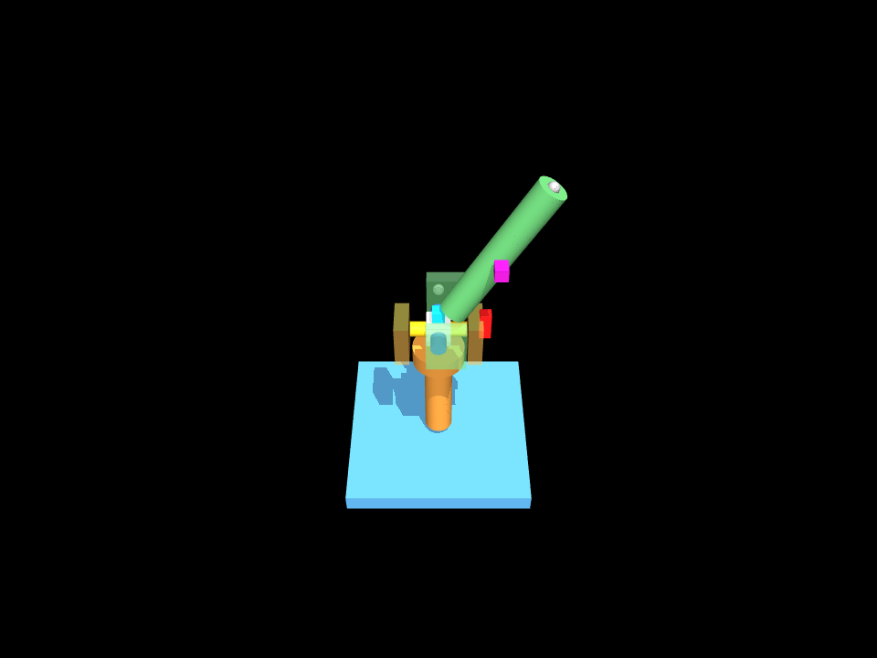
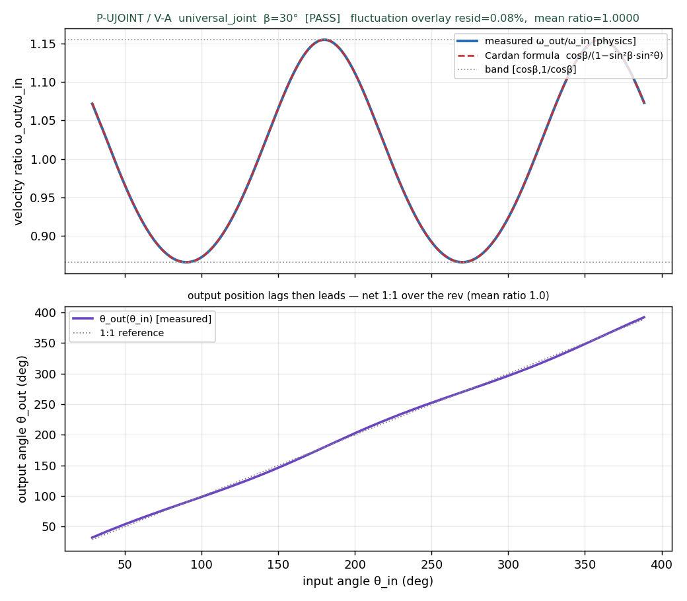

# M21 · universal_joint — REVIEW

**Outcome: the `universal_joint` element is complete through the FULL D-track, and P-UJOINT passes V-A
5/5 with the Cardan velocity fluctuation verified as PHYSICS — the framework's cleanest formula-vs-physics
overlay yet.** A Cardan (Hooke) joint transmits rotation between two shafts intersecting at a bend β,
through a rigid cross; its output speed pulsates twice per revolution (cos β … 1/cos β). That pulsation —
an *emergent* geometric property, not a declared ratio — is measured and shown to overlay the textbook
formula to **0.08%**, with the **phase predicted from geometry** (not fit) and matched to **0.03°**. This
is the first real exercise of the m18 axis-2 field (`axis_relationship="intersecting"`), and it properly
retires the D-M19-0 no-rig deferral for this element's kinematics.



The compiled fixture, side-on (⊥ the bend plane): the blue base, the orange input shaft + yoke (vertical,
+Z), and the green output shaft leaning at **β=30°** — the two axes intersect at the joint centre. The
rotation markers (red input / cyan cross / magenta output) make the sweep legible.

## The card (P&B §8.1 / Shigley — Hooke joint)

A single Cardan joint is **NOT constant-velocity**: for bend β the velocity ratio

> ω_out/ω_in = cos β / (1 − sin²β · sin²θ)   sweeps [cos β, 1/cos β] twice per rev; mean over a rev = 1:1

`axis_relationship = intersecting` (axis-2) is the discriminator vs `coupling` (parallel). Reproduced to a
hand-worked β=15° anchor in [`tests/test_universal_joint.py`](../tests/test_universal_joint.py) — 6/6
(band [0.9659, 1.0353], θ_out(45°)=43.99°, and the **β=0 anchor** where the band collapses to 1).

- **ports** `shaft_in` / `shaft_out` / `cross_pivot`. **param_bounds** yoke_d/bore_d/length/angle_deg;
  `resolve_params` zero-Nones every param (fixes the m18-audit `yoke_d=None`) and enforces yoke_d ≥ 2·bore.
- **imposes** assembly shaft-insertion (V-08); **carve** one solid (the input yoke fused to the input
  shaft — the D-D-1 one-solid fix, same as m20); **collision_hint** source-stamped (notes the trunnion
  contact is pin-in-bore, *not* R2b-curved); **verification** → P-UJOINT with the two criteria
  `transmits_mean_1to1` **and** `cardan_fluctuation_matches_formula` (the discovery criterion).

## P-UJOINT (§6.3) — V-A · [`out/t2_ujoint_verdict.json`](out/t2_ujoint_verdict.json)

| criterion | result | value | gate |
|---|---|---|---|
| reaches drive (input ≥ 3 rev) | ✅ | 3.0 rev | ≥ 3 |
| **transmits_mean_1to1** | ✅ | mean **1.0000** (resid 3e-5) | ≤ 0.1% |
| **cardan_fluctuation_matches** (discovery) | ✅ | overlay **0.08%**, phase err **0.03°** | ≤ 2% |
| converged / all parts retained | ✅ | — | — |
| **V-A overall** | **5/5 PASS** | G-CONV ok, nv=3 | ≥ 4/5 |



**The rig — option (i), the honest one.** The joint IS the mechanism: a serial chain `input(hinge A) →
cross(hinge pin1) → output(hinge pin2)`, the loop closed by **one** connect pinning the output-shaft tip
to a world anchor on axis B. `nv=3`; the connect nets −2 DoF (its radial component is redundant against
the rigid shaft), leaving exactly the **1 Cardan mobility**. There is **NO `polycoef=cos β`** — that
would declare the *average* and erase the very fluctuation we verify. (Option ii, a two-world-branch
closure with connects, over-constrains and locks — nv−constraints ≤ 0; the serial chain + tip-connect is
the stable form, loop residual ~5e-6 m with no drift over 3 rev.)

**The fluctuation is verified, not asserted.** The top plot: measured ω_out/ω_in (blue) sits on the
Cardan formula (red dashed) sweeping the [0.866, 1.155] = [cos 30°, 1/cos 30°] band, to **0.08%** max
residual. The **phase is predicted from geometry** — the input yoke pin lies along X (in the bend plane
at θ_in=0), so the min-speed point (pin ⊥ plane) is at θ_in=90°; measured min at **90.0°**, phase error
**0.03°**. Amplitude AND phase, and φ0 is a geometric constant, not a per-run fit. The bottom plot: θ_out
lags then leads the 1:1 line, netting exactly 1:1 over the rev.

**Discrimination — the pulsation appears with the angle and only with it.** Re-running at **β=0**
(straight) flattens the band to **[0.9993, 1.0]** (0.07% residual fluctuation, numerical floor):
`discrimination_probe.discriminates = true`. Videos: the β=30° drive
[`out/t2_ujoint_VA.mp4`](out/t2_ujoint_VA.mp4) and the β=0 contrast
[`out/t2_ujoint_VA_beta0.mp4`](out/t2_ujoint_VA_beta0.mp4).

This is the framework's **fourth formula-vs-physics cross-validation**: m11 rack_pinion (0.01% ratio),
m19 lead_screw (0.000% travel + 233× self-lock discrimination), m20 coupling (0.06% torque + binary
break), and now m21 (**0.08% fluctuation overlay + 0.03° phase + β=0 flatten**) — the first that validates
an *emergent, shape-of-the-curve* law, not just a scalar.

### Video (standing rule from the m20 REVIEW, applied from the first render)

Both clips: markers on every moving body (red input, cyan cross, magenta output — asymmetric features so
rotation is visible), a **side camera ⊥ the bend plane** so β and the sweeps are legible, the HUD input-rev
counter, and the **full 3-rev criterion window** (584 frames, 4× slow-mo). The β=0 clip is the CV contrast.

## Why emergent_check is DEFERRED here — argued, not copied

Neither m20's "verified" nor lead_screw's R2b "deferred" fits reflexively. The declared angled-pair
**kinematics — including the emergent fluctuation — IS physics-verified** by this rig. What remains
untested is the **cross-trunnion bearing contact** (four pins in bores), which the kinematic rig idealizes
as frictionless revolutes. That contact is **pin-in-bore (pin_hinge-class)** — verifiable in principle
(unlike lead_screw/rack_pinion's R2b-curved flanks), just **not run this milestone**. So `emergent_check`
is `deferred`, but the reason states plainly that the kinematics are verified and the deferred part is a
pin-class V-B, *earnable in a future D-track, not a fundamental contact-formulation limit*.

## Numeric reproduction chain (Stage 5) · [`out/reproduce.txt`](out/reproduce.txt)

```
[1] rule chain: β=30° band [0.8660,1.1547], fluctuation 28.87%, mean 1:1   (vs card)
[2] fluctuation: measured band = formula; overlay 0.080% (≤2%); phase 90° pred vs 90° meas (0.03°)
[3] discrimination: β=30° [0.866,1.155] vs β=0 [0.9993,1.0] (flat)
[4] t1 COMPILE_DRIFT: base 50×50, yoke_top 47, out β-tilt bbox (z=24.485,x=18.409) vs intent — all 0.0000 mm
========== reproduction CLEAN — every number checks out ==========
```

## Stage-by-stage (D-track, no stage skipped)

| stage | done | evidence |
|---|---|---|
| **0** physics prototype (de-risk) | ✅ | serial-chain Cardan: 0.009° over 1 rev, band exact, β=0 flat, no drift |
| **1** card completion (Cardan rule chain, zero-None, P-UJOINT) | ✅ | `knowledge/cards/universal_joint.py`; `tests/test_universal_joint.py` 6/6 (e16c4be) |
| **2** angled fixture templates | ✅ | reused `shaft_carrier_in` (+cross_pivot); new `shaft_carrier_out_angled`; 3/3 (35bc76d) |
| **3** golden IR (intersecting) | ✅ | `tasks/ujoint_fixture.json` CLEAN, compiles 2 parts; expressiveness gap logged (5d3e2fa) |
| **4** P-UJOINT V-A (fluctuation overlay + β=0 discrimination) | ✅ | `p_ujoint_va.py`; 5/5; overlay 0.08%, phase 0.03° (544452a) |
| **5** numeric reproduction | ✅ | `reproduce.py` → `out/reproduce.txt` CLEAN (1fcb6d0) |
| **6** REVIEW + D-M21-1 + STATUS | ✅ | this file; `DECISIONS_LOG.md` D-M21-1/-2/-3; `STATUS.md` M21 row |

## Parked for future milestones (DRAFT, no build)

- **DRAFT D-M21-2** — the **double-Cardan constant-velocity** arrangement: two U-joints in series,
  phase-aligned at equal angles, cancel each other's fluctuation (a CV driveshaft). It is an
  instance↔instance constraint (an AssemblyRule-class relation per the D-E-10 precedent) and a natural
  benchmark-task candidate. Recorded, not built (a new assembly + a phase-alignment rule = its own pass).
- **DRAFT D-M21-3** — an **expressiveness gap**: the schema's `axis_relationship` is *categorical*
  (parallel/intersecting/crossed) and carries no intersection **angle**. β is expressed via the element
  param + the anchor geometry + a `transmission.bend_deg` hint the card reads — but there is no
  first-class scalar "axis angle" field at the behaviour level. A future schema field would express it
  cleanly. Logged, not silently patched.

**Still HELD (user release required):** the lite admission gate (1 billed run) and the m15 Pro/flash
frontier column — untouched this milestone (all m21 work was free/local: geometry, Cardan arithmetic, and
MuJoCo joint physics, no LLM/API calls).
