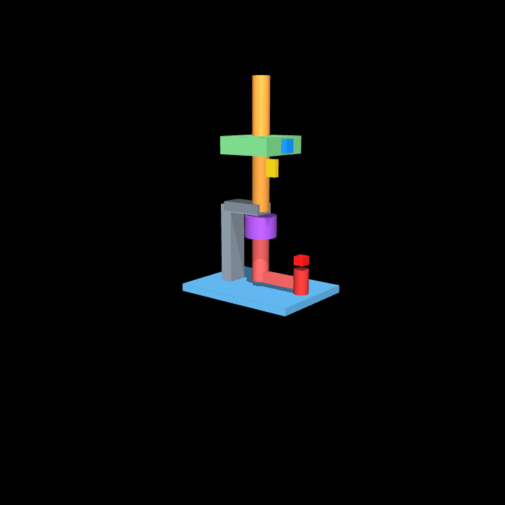
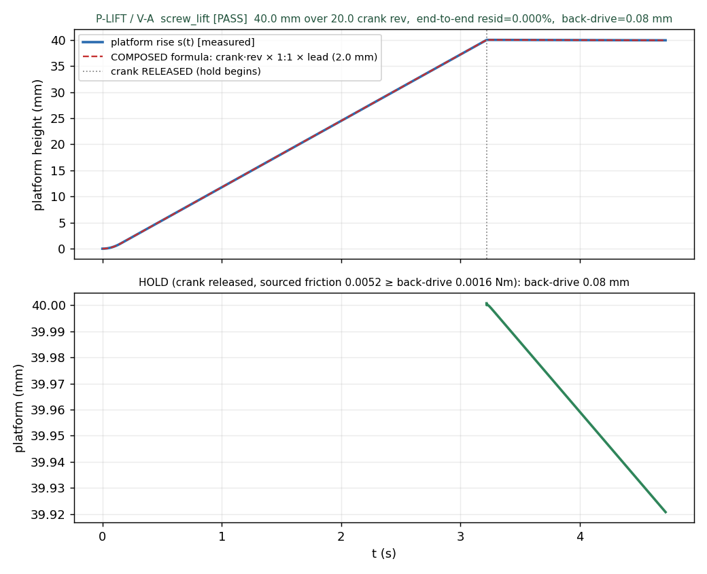

# M22 · composition — REVIEW

**Outcome (Task A verified; Task B in progress): the pipeline composes VERIFIED ELEMENTS into a working
assembly, golden-first, and verifies the COMBINATION as physics.** m22 is a TASK-track milestone (no new
element; the m8/m13 anchor-task precedent, not the §13 D-track). Phase 1 (golden verification) only — the
LLM design-choice evaluation (Phase 2) stays HELD with the lite/frontier column until user release.

This is the milestone where the framework's per-element verification pays off: two independently-verified
declared pairs (m20 coupling, m19 lead_screw) chain into a hand-crank screw jack, and the **assembly-level
non-tautology** — the *composed* formula chain vs the measured end-to-end motion — passes at 0.000%.

---

## Task A — screw_lift (motion-transmission composition)

**Command:** *"A hand-crank jack that raises a small platform and holds it when released. Plastic, 3D
printing."* Chain: crank → **coupling** (1:1) → **lead_screw** (self-locking) → nut platform.



*(Visual addendum, physics-identical — the review: the chain wasn't legible as hardware.) The rig now
reads as a hand-crank jack: a **red crank** (axle + offset arm + handle **knob**) → a **purple coupling
hub** sleeve at the shaft junction → the **orange screw** through a **grey bearing bracket** on a **base
frame** → the **green platform**. The declared joints/equalities still carry all the physics; the P-LIFT
criteria are unchanged within tolerance (reaches 40.00 mm, formula 0.000%, back-drive 0.08 mm, 5/5,
discrimination true), and the hold-phase HUD now reads "HOLD: platform STAYS at 40 mm" so the stillness
reads as the point.*



### The two ontology questions (the point of the task)

**q1 — element chaining: how does the IR state that `coupling.shaft_out` and the lead_screw's screw axis
are the SAME physical axis?** **Answer: a SHARED PIECE bound to the SAME anchor.** The screw shaft is ONE
piece (P1); both `E1.shaft_out` and `E2.screw_axis` bind to `P1.screw_axis`. They are the same physical
axis **by construction** — there is nothing to check and nothing to violate (the strongest form). This
reuses only the existing binding mechanism and is precedented: `anchor_hard`'s `E3.mesh_line` and
`E4.ratchet_line` both bind `P4.rack_line`. An `AssemblyRule` (coaxial) would be needed only for elements
on *different* pieces that must be made collinear — and the current `alignment` kind is *parallel+level*,
**not coaxial**, so that path is a gap → **DRAFT D-M22-1a** (extend alignment to a coaxial relation), not
needed here.

**q2 — protocol composition: per-element or end-to-end?** **Answer: BOTH.** The per-element protocols
(P-COUPLING for E1, P-SCREW for E2) are inherited — those pairs are already verified (m20, m19). The NEW
verification is one **END-TO-END P-LIFT**: crank *N* rev → platform rises *H = N × coupling(1:1) × lead*;
release → holds. The **composed formula chain vs the measured rise is the assembly-level non-tautology**
(the anchor_lift P-HOLD/P-FULL precedent). Declaring the chain and measuring the chain would be
tautological *if* either ratio were trivially 1 — but the lead (2 mm/rev) is real card arithmetic, and the
end-to-end path exercises **both** ratios and the mm→m unit path through two coupled equalities.

### C2 — the compiled-assembly t0 gate (§13 S5, applied to a task)

The compiled screw_lift (P1 base+screw, P2 platform, P3 crank), swept through the 40 mm lift, is CLEAN
per D22: `P1×P2` (nut on the threaded screw) and `P1×P3` (crank at the coupling grip) are intended
clearance pairs; `P2×P3` clear. No unintended penetration over the sweep. (`out/screw_lift_t0.txt`.)

### C3 — P-LIFT V-A · [`out/t2_screw_lift_verdict.json`](out/t2_screw_lift_verdict.json)

| criterion | result | value | gate |
|---|---|---|---|
| platform reaches height | ✅ | 40.0 mm | = stroke |
| **end-to-end composed formula** | ✅ | **0.000%** | ≤ 0.1% |
| **holds released load** (sourced) | ✅ | **0.081 mm** back-drive | ≤ 1 mm |
| converged / all parts retained | ✅ | — | — |
| **V-A overall** | **5/5 PASS** | G-CONV ok | ≥ 4/5 |

**The rig CHAINS the two verified rigs:** the m20 coupling (a 1:1 equality between the crank and screw
hinges) feeds the m19 lead_screw (a lead/2π equality screw→nut, with the SOURCED thread friction on the
screw hinge). Drive the **crank**; the platform rise (top plot, blue) overlays the **composed formula**
(crank·rev × 1:1 × lead, red dashed) to **0.000%**. Release the crank under the load and the sourced
friction `T_f = µ·W·d_mean/2 = 0.00515 N·m ≥ back-drive 0.00156 N·m` holds it to 0.081 mm (bottom plot).

**Both discrimination probes fire at the ASSEMBLY level** (`discrimination_probes.discriminates = true`):
- **coupling BROKEN** (the 1:1 equality inactive): the crank spins 20 rev but the platform rises **0.00 mm**
  — the chain is doing the work, not a solver artifact;
- **friction WEAK** (0.5·T_backdrive): the released platform **SINKS 9.57 mm** (vs 0.081 mm held) — the
  hold is the sourced friction, not the rigid coupling. (The extra crank inertia slows the sink vs m19's
  18 mm, but it is still 118× the held value.)

Video ([`out/t2_screw_lift.mp4`](out/t2_screw_lift.mp4), 1133 frames, 4× slow-mo) with a marker per moving
body (red crank / gold screw / blue platform), the HUD crank-rev + rise counters, and the full drive →
release → hold window.

### V-B disposition — does the COMBINATION create a new gap?

**No.** The two declared pairs are coupled by rigid equalities; the coupling is V-B-verified (m20, no
curved contact), and the only deferred piece is the lead_screw thread contact (R2b/m17), **inherited
unchanged**. The composition adds no new emergent contact surface, and the assembly-level non-tautology
(the end-to-end rise) IS verified. Stated honestly, not assumed.

### C4 — numeric reproduction · [`out/reproduce_screw_lift.txt`](out/reproduce_screw_lift.txt)

```
[1] chain: coupling 1:1, lead=starts×pitch=2.0, self-locks (tanλ=0.091≤µ=0.30)
[2] composed: H = 20 × 1 × 2 = 40.00 mm  vs measured 40.00 mm = 0.0000%
[3] sourced hold: T_f=0.00515 ≥ T_bd=0.00156 Nm (3.30×); back-drive 0.081 mm
[4] discrimination: coupling broken → 0.00 mm rise ; friction weak → 9.57 mm sink
[5] t0 gate CLEAN
========== reproduction CLEAN — every number checks out ==========
```

---

## Task B — latched_drawer (fasten / retention composition)

**Command:** *"A drawer that slides in, clicks shut, and pulls open by hand. Plastic, 3D printing."*
Chain: **slide_rail** (guidance, M10) + **snap_hook** (closed retention, M3). The NEW content is a
**snap engaging on a TRANSLATION path** — anchor_easy verified a snap on a *rotation* endpoint; this is
the fresh axis. The golden validates CLEAN.

**q3 — how does the IR state the snap_event occurs AT A POSITION on the slide's travel (engage at s=0,
the closed end)?** **Answer: reuse the anchor_easy GEOMETRIC-position pattern.** The snap's
`catch_window` binds to the frame at the closed end; the `snap_event` (a static retention behaviour)
fires where the hook meets the catch. The engagement position is *geometric* (where the catch sits), not
a new scalar field — exactly as anchor_easy placed the catch at the rotation-closed position. It fits
with **no gap**; an explicit `snap_at_s` link on the travel axis would be cleaner for coordination but is
not needed → **DRAFT D-M22-2a** (deferred).

**Snap verification — the M3 division of labor (D3).** An elastic cantilever is not expressible in a
rigid-body engine, so the snap's deflection is **BAYER-FORMULA-verified** (engagement geometry is rigid).
From the card's Bayer functions (`out/latched_drawer_verify.txt`):

| quantity | value | check |
|---|---|---|
| solved h / deflection force P | 2.09 mm / 17.7 N | Bayer |
| **W_in** (insertion, α_in=30°) | **18.75 N** | ≤ 60 N ⇒ **clicks shut by hand** |
| **W_out** (separation, α_out=45°) | **32.81 N** | ≥ 15 N ⇒ **holds a hand-open pull** |
| self-lock angle atan(1/µ) | 73.3° | α_out 45° < 73.3° ⇒ **hand-releasable**, not permanent |

**Bidirectional discrimination (the snap force window verified BOTH ways at assembly level):** a pull of
**16.4 N** (< W_out) → the drawer **HOLDS** (stays latched); a pull of **49.2 N** (> W_out) → the drawer
**OPENS**. This is the translation-path analogue of anchor_easy's latch, verified in both directions.

**Slide travel + pull-out limit — RUN on the compiled drawer (P-SLIDE V-A 5/5).** `p_drawer_va.py`
compiles the drawer (slide-guided geometry; the snap stays Bayer-formula-level per D-M22-2c), runs the t0
gate (P1×P2 CLEAN over the 60 mm stroke, in the verdict `t0_gate` field), and drives the drawer OUT: it
reaches the **full 60 mm stroke** and the **finite rail RETAINS it** at the pull-out end (pull past → peak
**60.07 mm** ≤ stroke+0.5), all_parts_retained, 5 seeds, marker video
([`out/t2_latched_drawer.mp4`](out/t2_latched_drawer.mp4)). The pull-out limit is inherent in the finite
rail — no separate stop. *(This is the assembly run the earlier draft was missing — see the correction
block.)*

**V-B disposition:** the slide is V-B-verified (M10); the snap's elastic deflection stays formula-only
(D3, the M3 division). The assembly-level combination gap is stated: the snap engagement under real
assembly is not rigid-physics-verified (it is Bayer-verified), inherited unchanged from M3.

### Two ontology / geometry findings the composition surfaced (recorded, not patched)

- **DRAFT D-M22-2b** — **stop_flange is a ROTATION-limit feature.** Its card imposes a use-phase rotation
  limit (`_imposed_rotation_limit`), so binding it to a drawer's *translation* pull-out fails V-08 (the
  imposed rotation behaviour cannot be the drawer's translation ceiling). stop_flange does **not** compose
  onto a translation drawer; a translation-stop feature (or a generalized stop_flange) is the gap. The
  pull-out limit is instead the finite rail. *(This is exactly the kind of thing a composition task exists
  to surface — a verified element that does not carry to a new motion axis.)*
- **DRAFT D-M22-2c** — **the snap CARVE needs a mating receiver wall.** The rigid engagement geometry
  needs a front wall on the host + growth-aligned anchors; the flat `slide_base` lacks it, so the snap's
  geometry *realization* on a rail base is host-template work. Per M3 the snap is FORMULA-verified, so this
  does not block the verification — but it is a real host-geometry gap for a printable drawer.

## Morphological twins — the Phase-2 benchmark seed

The two tasks seed **TWO morphological pairs** — the Zwicky matrix realized, each intent with two
verified ground-truth solutions:

- **"lift + hold":** rack_pinion + pawl_detent (anchor_lift, m13) **vs** lead_screw + coupling
  (screw_lift, Task A). `kg.candidates()` already offers both for a hold-under-load intent (**D-M22-1**).
- **"retain + release":** pin_hinge + snap (anchor_easy, m3, on a *rotation* path) **vs** slide_rail +
  snap (latched_drawer, Task B, on a *translation* path) (**D-M22-2**).

That is exactly the **design-choice** the Phase-2 LLM evaluation will test — which mechanism the model
picks and whether it can justify it — now seeded with four verified answers across two intents. Phase 2
stays HELD with the lite/frontier column until user release.

## Stage checklist (Task A)

| stage | done | evidence |
|---|---|---|
| C1 golden IR (q1/q2 answered) | ✅ | `tasks/screw_lift.json` CLEAN, 3 parts (commit e1d1ca6) |
| C2 compiled t0 gate | ✅ | `out/screw_lift_t0.txt` CLEAN over the lift sweep (commit 90fb855) |
| C3 P-LIFT V-A | ✅ | 5/5; end-to-end 0.000%; hold 0.081 mm; both discriminations (commit 9804cf2) |
| C4 reproduction + REVIEW + decisions | ✅ | `reproduce_screw_lift.txt` CLEAN; D-M22-1 (+DRAFT D-M22-1a) |

## Stage checklist (Task B)

| stage | done | evidence |
|---|---|---|
| C1 golden IR (q3 answered) | ✅ | `tasks/latched_drawer.json` CLEAN (commit 923e46d) |
| C2 compile + t0 gate | ✅ | drawer COMPILES (slide-guided; snap formula-level per D-M22-2c); t0 gate CLEAN over the 60 mm stroke, in `out/screw_lift_t0.txt`-style + the verdict `t0_gate` field |
| C3 assembly physics + snap Bayer | ✅ | **P-SLIDE V-A 5/5 on the COMPILED drawer** (full stroke + finite-rail retention, marker video `t2_latched_drawer.mp4`); snap force window Bayer-verified bidirectional (`latched_drawer_verify.txt`) |
| C4 REVIEW + decisions | ✅ | this section; D-M22-2 (+DRAFT 2a/2b/2c/**3**) |

### Correction block (Task B honesty-retag — the m19 pattern)

An earlier version of Task B **overclaimed**: it cited "slide inherited (M10)" as the assembly-level
travel evidence and shipped `verify_latched_drawer.py` with **zero physics** and **no t0 table** for the
drawer assembly — i.e. C2 and C3(c) were not actually executed, yet D-M22-2 read "second composition
verified." A reviewer caught it. **Fix (no new machinery, no snap carve):** the drawer is now **compiled**
(slide-guided geometry), the **t0 gate is run** on it (CLEAN, D22-judged, in the verdict's `t0_gate`
field), and **P-SLIDE V-A 5/5** is run on the compiled drawer — the drawer reaches the full stroke and the
**finite rail retains it** at the pull-out end (peak 60.07 mm ≤ stroke+0.5), with a marker video (the
missing artifact). D-M22-2 is amended to its true scope: *verified at IR + t0 + slide-travel physics; snap
window Bayer-verified (D3); latch ENGAGEMENT physics parked pending **D-M22-3*** (receiver-wall template +
stop_flange translation generalization). An element-verdict citation is not an assembly run — corrected.

**Findings that make Task B valuable** (the composition surfaced real gaps): stop_flange is rotation-only
(**D-M22-2b**); the snap carve needs a host wall (**D-M22-2c**); an explicit snap-position link would be
cleaner though not needed (**D-M22-2a**). These are the milestone doing its job — a composition task
exists to surface exactly which verified elements carry to a new motion axis and which do not.

**Still HELD:** the lite admission gate + the m15 Pro/flash frontier column (Phase-2 LLM eval). All m22
work is free/local (golden construction, composed-formula arithmetic, MuJoCo joint physics; no LLM/API).
