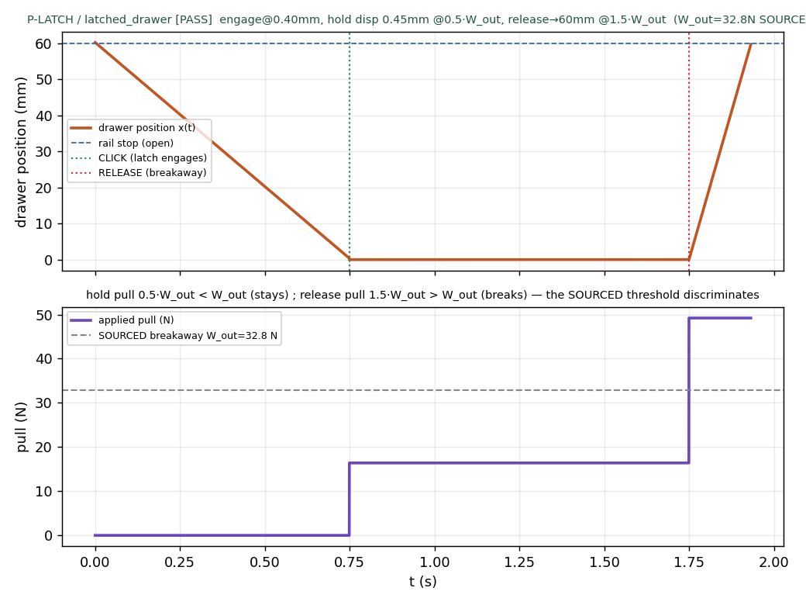
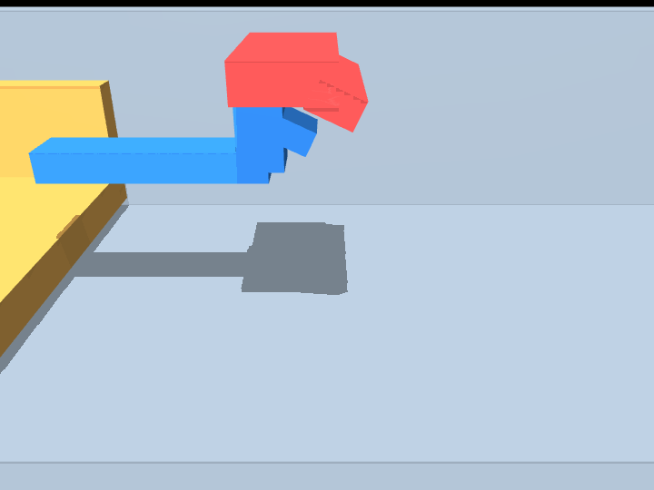

# M23 · latch_physics — REVIEW

**Outcome: the snap latch is delivered honestly — the CLOSE → HOLD → RELEASE sequence is physics-run on
a legible cabinet+drawer, with the breakaway threshold SOURCED from the Bayer formula (the m19 pattern).**
This opens and CONFIRMS the parked **D-M22-3**: the m22 Task-B review was right that travel+stop physics
without the latch does not demonstrate the element the task is about. Here the latch itself is the subject.

## The honest mechanism (declared constraint + SOURCED breakaway)

Modelling the elastic hook catching the frame under real assembly is a compliant-beam / R2b problem (not
rigid-body expressible — D3). So, per the reviewer's instruction and the **m19 sourced-parameter pattern**:

- the snap latch is a **declared constraint** (a rigid equality pinning the drawer at the closed position
  s=0) that **ACTIVATES at engagement** — the *click*, logged as an event;
- its **breakaway force = Bayer W_out**, **SOURCED** from the M3-verified formula (NOT invented — the chain
  is printed in the verdict): `solve_h → 2.09 mm ; P_deflect → 17.67 N ; W_sep(α_out=45°, µ=0.30)×1 =
  **32.81 N**`; self-lock angle atan(1/µ)=73.3° > 45° ⇒ hand-releasable;
- the **elastic deflection itself stays formula-only** (D3); emergent compliant-beam verification is
  **Tier-3 deferred** (the card's `emergent_check`, carried into the verdict).

## P-LATCH V-A · [`out/t2_latch_verdict.json`](out/t2_latch_verdict.json)

| criterion | result | value | gate |
|---|---|---|---|
| CLOSE — engages at the closed position (click) | ✅ | 0.40 mm | ≤ 0.5 |
| HOLD — pull **0.5·W_out (16.4 N)** → stays latched | ✅ | **0.45 mm** creep | ≤ 0.6 |
| RELEASE — pull **1.5·W_out (49.2 N)** → opens to rail | ✅ | **60 mm** | = stroke |
| converged / all_parts_retained | ✅ | — | — |
| **overall** | **5/5 PASS** | G-CONV ok | ≥ 4/5 |

**The full sequence on one film** ([`out/t2_latch.mp4`](out/t2_latch.mp4), 464 frames, 4× slow-mo): the
drawer is driven shut (position 60→0), the latch **ENGAGES** (click), a **16.4 N** pull (below the sourced
W_out) holds it latched (0.45 mm creep), then a **49.2 N** pull (above W_out) **BREAKS** the latch and the
drawer **POPS open** to the rail stop. The bottom plot shows the pull crossing the SOURCED W_out line —
the threshold **discriminates** (holds below, releases above), and it is sourced, not tuned.

**Discrimination (d) is (b)+(c) jointly:** the same SOURCED threshold both holds the 0.5·W_out pull and
yields to the 1.5·W_out pull. If the threshold were invented, one of the two would fail.

## Fixture legibility (reviewer note + reshape addendum)

A **cutaway cabinet** (floor + far wall + back wall; the near wall omitted so the mechanism is visible) +
a **drawer TRAY** (not a bare block). The latch is reshaped into a **recognizable snap profile** (the
review: "no latch-like design visible"): a **blue cantilever ARM** along the drawer front + an angled
**BARB** (up-hook + ramped nose, ~15–20% of the drawer height) that visibly tucks **UNDER** the cabinet's
**red ramped RECEIVER ledge** when closed — the two shapes **interlock**. Every geom has a reason.

Two clips: the wide cutaway [`out/t2_latch.mp4`](out/t2_latch.mp4) and a **ZOOM** framed on the engagement
zone [`out/t2_latch_zoom.mp4`](out/t2_latch_zoom.mp4) — the **click** (barb snaps under the ledge) and the
**pop** (barb pulls free) close enough to read the interlock. The HUD shows drawer position, applied pull,
and latch state (ENGAGED / RELEASED); both motions are visible (damping 150 = a visible ~0.2 s pop).

The reshape is **visual-only** — the declared constraint still carries all the physics, and the P-LATCH
criteria are **byte-identical before/after** (engage 0.399 mm, hold creep 0.449 mm, release 59.73 mm,
5/5). The rig **t0 (D22 split)** is CLEAN: `latch×receiver` = +0.93 mm (the intended interlock, engagement
zone 7.5 mm), every other pair (drawer/latch × cabinet, drawer × receiver) clears the closing path.

## t0 gate + reproduction

The compiled-drawer t0 gate (P1×P2, over the stroke, D22-judged) is **CLEAN**, carried in the verdict
`t0_gate` field. Numeric reproduction ([`out/reproduce_latch.txt`](out/reproduce_latch.txt)) reproduces the
sourced Bayer chain and the criteria — CLEAN.

## Bookkeeping

- **D-M22-3 CONFIRMED** — the latch physics is delivered at sourced-threshold level (close/hold/release,
  5/5). The elastic-beam engagement stays Tier-3 deferred (D3), stated in `emergent_check`.
- **D-M22-2 scope note updated:** latch physics now delivered (sourced threshold); latched_drawer is
  verified at IR + t0 + slide-travel + **latch close/hold/release**.
- **stop_flange translation generalization (D-M22-2b) stays PARKED** — the rail-end stop suffices here.
- Naming: this milestone is `m23_latch_physics`; the planned **static-trio milestone renumbers after (→ m24)**.

**Still HELD:** the lite admission gate + the m15 Pro/flash frontier column (Phase-2 LLM eval). All m23
work was free/local (Bayer arithmetic, MuJoCo joint physics; no LLM/API). **AWAITING REVIEW.**
