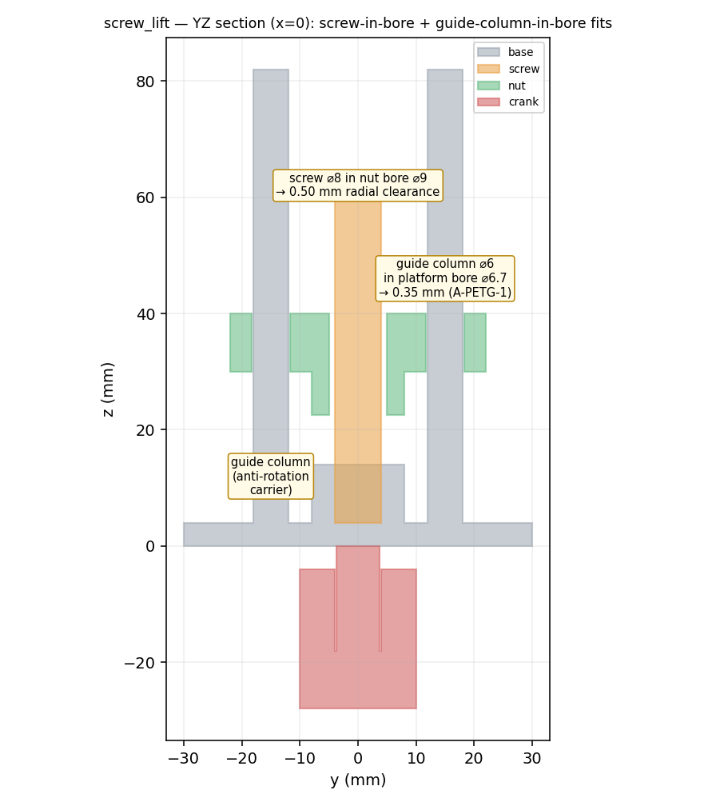
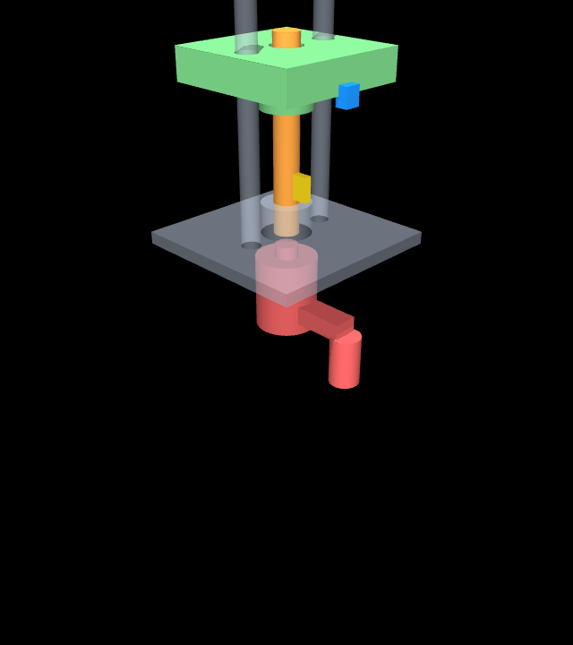
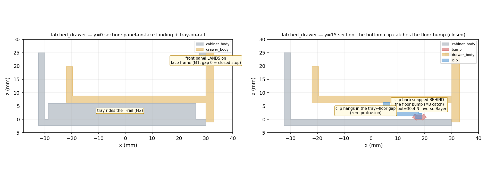

# M24 · design_closure — REVIEW

**Outcome: the two m22/m23 composition tasks are re-delivered to spec §14 (the Task D-track) — DESIGN
COMPLETENESS (parts derive dimensions from their mates, every joint has a physical carrier, fits are
scheduled + verified) and FULL REVIEWER VISUALIZATION (IR diagram, section views from the compiled
solids, transparency/cutaway + zoom, exploded).** The physics is unchanged — the declared joints and
sourced parameters are the same; only the *geometry* becomes design-complete and the *visuals* become
compiled meshes, proven physics-identical. §14 exists so the m22/m23 review's failure chain (missing
assembly physics → missing t0 → missing latch → illegible geometry → missing IR diagrams →
primitive-proxy rendering → FUNCTION WITHOUT DESIGN) cannot recur — each link is now a stage gate
(**D-M24-0**).

The starting inventory is [`DESIGN_AUDIT.md`](DESIGN_AUDIT.md) (task × T1–T7, done/partial/missing).

---

## A · screw_lift — §14 T1–T7 (AWAITING REVIEW)

**The design gap the audit named:** the jack was function-verified (m22 P-LIFT 5/5) but the platform
SLIDE joint had **no physical carrier** — nothing in the geometry stopped the platform co-rotating with
the screw — and the crank/frame were MJCF visual stand-ins, so it "does not read as a hand-crank jack."

### T3 — design closure (in the host templates, LIVE code; m19 byte-identical, gated)
- **`screw_base(frame=True)`** grows the two declared joints' carriers: a central bearing **boss** (the
  screw hinge) + two **guide columns** at ±15 mm spanning the lift travel — the platform slide's
  anti-rotation posts. New anchors `guide_col_L/R`.
- **`nut_carriage`** (platform) widened to 44 mm so both column bores sit inside; a **nut boss** (thread
  engagement length) + two **column bores** ⌀ = col_d + 2·col_clear — the fit DERIVES from the column.
- **`shaft_carrier_out(crank=True)`** — a legible **hand crank**: radial arm + grip knob.
- Golden stays 3 one-solid pieces, validator-CLEAN.

### T3b/T4/T6 — fit schedule + re-measure · [`out/screw_lift_fits.txt`](out/screw_lift_fits.txt)

| interface | inner ⌀ | outer ⌀ | clearance | source |
|---|---|---|---|---|
| screw major ⌀ in nut bore | 8.00 | 9.00 | 0.50 | lead_screw d_major=8; nut gap=1.0 (m19) |
| guide column ⌀ in platform bore | 6.00 | 6.70 | 0.35 | col_d=6; bore=col_d+2·col_clear, col_clear=0.35 A-PETG-1 |
| coupling bore on crank shaft ⌀ | 8.00 | 8.60 | 0.30 | coupling clearance 0.30 (D-M8-4) |
| coupling grip on screw shaft ⌀ | 8.00 | 8.00 | 0.00 | coupling FUSED to input (rigid grip, m20) |

**Re-measured from the compiled solids (TRUE mm):** P1×P2 = **−0.350 mm** (= the 0.35 column fit
exactly) · P1×P3 = 0.000 (fused grip) · P2×P3 = −22.5 mm (clear) → **max intended-fit COMPILE_DRIFT
0.000 mm**. The units caveat on the reused m22 `t0_gate` (metres, not mm) is recorded as **D-M24-1** and
fixed here (mm-correct).

### T5 — physics from the compiled meshes · [`out/t2_screw_lift_mesh_verdict.json`](out/t2_screw_lift_mesh_verdict.json)

The m22 physics is kept EXACTLY (joints, equalities, sourced thread friction, actuator; per-body
mass+inertia **pinned via explicit `<inertial>`** so the physics is independent of the geoms). The
visual geoms become the compiled per-body meshes (world = base+boss+columns; screw = rod; nut =
platform; crank = P3), collision off, density 0.

**PHYSICS-IDENTICAL ASSERT** — a BARE declared-joint rig (no visual geoms) vs the mesh rig:

| criterion | bare | mesh | recorded m22 |
|---|---|---|---|
| platform reaches height | 40.0 | 40.0 | 40.00 |
| end-to-end formula resid | 0.000 % | 0.000 % | 0.000 % |
| back-drive (hold) | 0.08 mm | 0.08 mm | 0.080 mm |
| discrimination — coupling broken | 0.00 mm rise | 0.00 mm | 0.00 |
| discrimination — friction weak | sinks 9.20 mm | 9.20 mm | 9.20 |

**Criteria BYTE-IDENTICAL bare vs mesh, and every number matches the recorded m22 verdict — the T5 STOP
condition (no criterion may shift) HOLDS.** 5/5 seeds.

### T5v — reviewer visualization pack

- [`out/section_screw_lift.png`](out/section_screw_lift.png) — YZ section from the compiled solids: the
  screw-in-bore (0.50) and guide-column-in-bore (0.35) fits, clearance annotated on the geometry.
- [`out/exploded_screw_lift.png`](out/exploded_screw_lift.png) — the four compiled pieces along +Z.
-  [`out/transparency_screw_lift.png`](out/transparency_screw_lift.png)
  — translucent-frame cutaway; it **reads as a hand-crank screw jack with guide columns**.
- [`out/portrait_screw_lift.png`](out/portrait_screw_lift.png) · [`out/zoom_screw_lift.png`](out/zoom_screw_lift.png)
  · [`out/t2_screw_lift_mesh.mp4`](out/t2_screw_lift_mesh.mp4) (real geometry moving) ·
  [`out/ir_screw_lift.svg`](../m22_composition/out/ir_screw_lift.svg) (T1 IR diagram).

### T7 — bookkeeping
- **D-M24-2 CONFIRMED (§14 T1–T6)** — screw_lift design-complete, fits drift 0.000, physics byte-unchanged.
- **D-M24-1 CONFIRMED (finding)** — the t0_gate metres/mm units bug; no false PASS in m22/m23; mm-correct here.
- All m24 work free/local (no LLM/API). **Still HELD:** the lite admission gate + the m15 Pro/flash
  frontier column. **AWAITING REVIEW.**

---

## B · latched_drawer — §14 T1–T7 (BOTTOM-CLIP COMPLETE REDESIGN, Phase A · AWAITING REVIEW)

**Supersedes the receiver-ledge Task B.** Per the approved design plan: a desktop parts-drawer on a
centre T-rail, held shut by a cantilever CLIP snapping over a floor BUMP, entirely hidden under the tray
(**zero protrusion**); pull to release. Archetype committed BEFORE geometry (§14 **T3-ARCH**, D-M24-4):
[`T3_ARCH_latched_drawer.md`](T3_ARCH_latched_drawer.md).

### T3b — DIMENSION CHAIN / fit schedule · [`out/latched_drawer_chain.txt`](out/latched_drawer_chain.txt)
Three free inputs (W_i=60 / D=60 / H=25); everything else DERIVES ([`dim_chain.py`](dim_chain.py)):

| quantity | value | source |
|---|---|---|
| tray W_t / opening W_o / cabinet W_c | 64.8 / 66.8 / 71.6 | +2·wall, +2·side_gap, +2·wall |
| front panel W_p | 74.8 | W_o + 2·proud(4) — lands on the face frame |
| groove width | 8.7 | rail_w 8 + 2·clr 0.35 (A-PETG-1, M10) |
| **CLIP (inverse Bayer)** L=12, b=6, undercut 1.35 | h_root **2.325** | solve_h = C·ε·L²/y |
| CLIP W_out / W_in | **30.38 N** / 17.36 N | P·fig18(0.30,45°) / (30°); W_in ≤ 20 hand-insertable |
| bump height | 1.70 | undercut 1.35 + clr 0.35 |
| front-panel-to-face gap | 0 | the LANDING (closed hard stop, M1) |
| stroke | 50 | D − margin |

### T4/T6 — t0 + reproduction · [`out/latched_drawer_fits.txt`](out/latched_drawer_fits.txt) · [`out/reproduce_latched_drawer.txt`](out/reproduce_latched_drawer.txt)
D22-grouped over the stroke from the 4 compiled sub-solids: **clip×bump +0.744 mm INTENDED catch** (12 mm
zone), **cabinet×drawer 0.000 mm INTENDED landing** (panel on face frame), clip & tray clear the cabinet
→ VERIFIED. Reproduction re-measures the compiled solids vs the chain (cabinet W_c, panel W_p, bump
height) → **max COMPILE_DRIFT 0.000 mm**, and reproduces W_out=30.38 N independently → CLEAN.

### T5 — physics from the compiled meshes · [`out/t2_ld_mesh_verdict.json`](out/t2_ld_mesh_verdict.json)
The m23 sourced-latch pattern with the **DESIGNED breakaway W_out=30.38 N** (fit chain, not the m23
fixture) and the **closed stop = the front-panel-on-face-frame landing** (the slide lower limit at s=0, a
PART not a drive-off). Visuals = the compiled sub-solid meshes (drawer inertia pinned from the mesh).
**PHYSICS-IDENTICAL ASSERT: bare declared-latch rig vs mesh rig → criteria BYTE-IDENTICAL**; 5/5 seeds.

**Criteria OLD (m23 fixture) vs NEW (bottom-clip, designed) — the change is legitimate (W_out designed,
stroke 60→50):**

| criterion | m23 fixture | bottom-clip designed | chain |
|---|---|---|---|
| W_out | 32.81 N | **30.38 N** | inverse Bayer: undercut 1.35 → P 16.36 → ×fig18(0.30,45°) |
| pull hold / release | 16.4 / 49.2 N | **15.19 / 45.57 N** | 0.5·W_out / 1.5·W_out |
| engage | 0.399 mm | 0.399 mm | (limit dynamics — unchanged) |
| hold creep | 0.449 mm | 0.449 mm | (unchanged) |
| release (opens to rail) | 59.73 mm | **49.72 mm** | stroke 50 (was 60) |

### T5v — reviewer visualization pack

- [`out/section_latched_drawer.png`](out/section_latched_drawer.png) — TWO section planes from the
  compiled solids (a furniture maker's drawing): y=0 the panel LANDING on the face frame (M1) + tray on
  the T-rail (M2); y=15 the clip barb snapped behind the floor bump (M3, W_out 30.4 N) in the tray/floor
  gap (zero protrusion). · [`out/exploded_latched_drawer.png`](out/exploded_latched_drawer.png) ·
  [`out/portrait_latched_drawer.png`](out/portrait_latched_drawer.png) (closed drawer, latch hidden) ·
  [`out/t2_ld_mesh.mp4`](out/t2_ld_mesh.mp4) cutaway + [`out/t2_ld_mesh_zoom.mp4`](out/t2_ld_mesh_zoom.mp4)
  · [`ir_latched_drawer.svg`](../m22_composition/out/ir_latched_drawer.svg).

### IR-TRUTH TABLE (§14 T3 / D-IR-EXPR-1) — where each design decision LIVES
| design decision | home | type | debt |
|---|---|---|---|
| cabinet / tray / opening widths | P1·P2 template params (from dim_chain) | template param | — |
| latch force W_out=30.38 N | E2 snap params L/b/y → Bayer | element param + formula | — |
| rail-in-groove fit | E1 slide_rail params + template geometry | element param + template | — |
| **panel-on-face LANDING (closed stop)** | template geometry (panel + ∏-frame) | **hardcode geometry** | no "hard-stop" relation in the IR |
| **bump position** (engagement on travel) | template param `bump_x` (= barb_x) | **hardcode** | no scalar snap-position ([[D-M22-2a]]) |
| **zero-protrusion** rule | clip built in the tray/floor gap | **hardcode geometry** | no "envelope/exclusion" field |
| ride clearance / undercut / bump height | template params | template param | — |

**Most design decisions land in template params or hardcoded geometry, NOT IR fields** — the schema
carries element CHOICE, not assembly DESIGN. Debts collected in the standing DRAFT **D-IR-EXPR-1** (fix
parked as the m25 candidate, gated on a ROUND-TRIP proof).

### T7 — bookkeeping
- **D-M24-5 CONFIRMED (§14 T1–T6)** — latched_drawer rebuilt to the bottom-clip organizer archetype;
  every dimension sourced (fit chain), fits re-measured drift 0.000, physics-identical, designed W_out.
- **D-M24-4** (T3-ARCH) + **D-IR-EXPR-1** (IR-expressiveness standing DRAFT) recorded.
- All Phase-A work free/local (no LLM/API). **Still HELD:** the lite gate + the m15 frontier column.
  **AWAITING REVIEW** (Phase B — the push_latch element — may start while awaiting).
