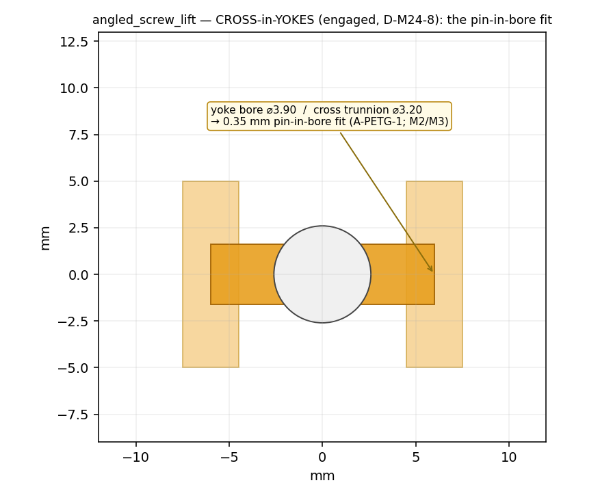

# M27 · angled_screw_lift — REVIEW

**Outcome: the m21 Cardan LAW is promoted to ASSEMBLY level — the SAME "lift + hold" jack, but the crank
comes out at β=30° through a universal joint, and the Cardan velocity fluctuation now appears AT THE
PLATFORM (the output of a three-element chain), measured against the formula band to 0.08%.** A §14
task-track composition of two VERIFIED elements — universal_joint (m21) + lead_screw (m19); no new
element. The command CONSTRAINT ("the crank must come out at an angle") reads onto axis-2 (intersecting) —
the Phase-2 seed where the CONSTRAINT, not the function, selects the element.

## Stages (all committed per stage)
- **T3-ARCH** — [`T3_ARCH_angled_screw_lift.md`](T3_ARCH_angled_screw_lift.md): archetype "angled-drive
  screw jack" (committed before geometry); mating-face map M1–M8; the cross-centre a DERIVED placement.
- **T1/T2** — golden `angled_screw_lift` (crank → universal_joint β=30° → lead_screw → nut); validates
  CLEAN; 3 one-solid compiled pieces; IR diagram `ir_angled_screw_lift.svg`.
- **T3 / T3b** — the screw_lift base frame + columns + top/bottom stop collars + platform/nut boss REUSED;
  a NEW **angled bearing boss** carries the input crank at β (T3c — the m21 world-connect idealization
  gets a designed part; the boss BORE stays a declared hinge, `journal_bearing` parked). Fit chain
  [`out/angled_screw_lift_fit_chain.txt`](out/angled_screw_lift_fit_chain.txt): boss bore ⌀8.70 = crank
  ⌀8 + 2·0.35; yoke bores ⌀3.90 = trunnion ⌀3.2 + 2·0.35; cross-centre = the axis intersection (0,0,−2).
- **T4** — t0 [`out/angled_screw_lift_t0.txt`](out/angled_screw_lift_t0.txt): the compiled assembly swept
  over the lift + the u-joint declared-pair rig swept over a FULL input revolution at **β=30° AND β=0°**
  (the m21 addendum pair set at assembly level) → **CLEAN** (pin-in-bore pairs clear, input×output clears
  −0.50 @β30 / −2.83 @β0).
- **T5** — physics (below).
- **T5v** — engagement-section pack (below).
- **T6** — reproduction [`out/reproduce_angled_screw_lift.txt`](out/reproduce_angled_screw_lift.txt): the
  composed chain reproduced + cross-checked vs the verdict + fit drift 0.000 → CLEAN.

## T5 — physics · [`out/t2_alift_verdict.json`](out/t2_alift_verdict.json)

The u-joint physics is the VERIFIED m21 declared-pair Cardan rig (serial chain crank→cross→screw + a
connect closing the loop; the fluctuation EMERGES, **no `polycoef=cosβ`**). This rig COMPOSES the
lead-screw on top: the screw output rotation θ_out drives the platform by the lead, so platform travel =
θ_out·lead/2π and platform VELOCITY = ω_out·lead/2π.

| # | criterion | result |
|---|---|---|
| (a) | END-TO-END MEAN (H = N·lead, Cardan mean 1:1) | mean_residual **3e-5** ≤ 0.1% ✅ |
| (b) | **FLUCTUATION AT PLATFORM** (overlay vs Cardan band) | fluct **0.08%**, band [0.866, 1.1547] = [cos30°, 1/cos30°], platform vel [2.21, 2.94] mm/s; **phase err 0.03°** (φ0 predicted, not fit) ✅ |
| (c) | HOLD (screw self-locks; u-joint upstream) | backdrive 0.079 mm; DISCRIMINATION per D-M26-1b (weak-friction 18.43 mm ≫ sourced) ✅ |
| (d) | DISCRIMINATION ×2 | β=0 → platform velocity FLAT (band width 0.0007); joint BROKEN (connect off) → screw **0.222 rev** vs crank 3.0 (13× less, no rise) ✅ |
| (e) | END STOPS | INHERITED from the m25 contact layer (class-② top-collar overcrank + bottom landing) |

**5/5 u-joint seeds, G-CONV ok, PASS.** The centrepiece is the platform-velocity overlay
[`out/t2_alift_platform_overlay.png`](out/t2_alift_platform_overlay.png) — measured vs `Cardan formula ×
lead/2π`, the paper figure.

## T5v — engagement-section pack (D-M24-8 fires: the CROSS is hidden in the yokes)

- **STATIC section** [`out/cross_section_angled_screw_lift.png`](out/cross_section_angled_screw_lift.png)
  — the cross-in-yokes at the engaged pose, the yoke-bore pin-in-bore fit (⌀3.90 / ⌀3.20 → 0.35 mm)
  annotated + cited to the fit-chain row (M2/M3).
- **ANIMATED cutaway** [`out/t2_alift_ujoint.mp4`](out/t2_alift_ujoint.mp4) — the m21 rig's TRANSPARENT
  yokes show the cross gimbaling through one revolution (the pulsation visible; HUD ω_out/ω_in).
- [`out/t2_alift_platform_overlay.png`](out/t2_alift_platform_overlay.png) (the plot) ·
  [`out/section_angled_screw_lift.png`](out/section_angled_screw_lift.png) (the angled jack, y=0) ·
  [`out/exploded_angled_screw_lift.png`](out/exploded_angled_screw_lift.png) ·
  [`out/portrait_ujoint_cutaway.png`](out/portrait_ujoint_cutaway.png) · `ir_angled_screw_lift.svg`.

## IR-TRUTH TABLE + how β is carried (D-M21-3, strained again)
β is carried THREE ways (no first-class scalar axis-angle field): the element param `angle_deg`, the
anchor geometry (P1.in_axis at β vs P1.screw_axis +Z), and B0.transmission `bend_deg`. This SECOND real
use — now at **ASSEMBLY level** (β also sets the cross-centre placement + the angled-boss geometry) —
strains D-M21-3 further: the categorical `axis_relationship` says intersecting but not the ANGLE, and the
angle now propagates into the fit chain. **Recorded, not patched** — the D-M21-3 DRAFT gains the
assembly-level requirement. Other decisions (cross-centre, boss geometry, fits) live in template params /
hardcode, folding into the standing **D-IR-EXPR-1** schema-debt theme.

## T7 — bookkeeping
- **D-M27-1 CONFIRMED (§14 T1–T6)** — angled_screw_lift verified; the Cardan law at assembly level.
- Morphological: **"lift + hold" now has THREE verified solutions** — rack_pinion+pawl (anchor_lift) /
  lead_screw+coupling (screw_lift) / lead_screw+ujoint@30° (this) — and the third is selected by a COMMAND
  CONSTRAINT on axis-2. The double-ujoint CV path (D-M21-2) is the natural successor.
- D-M21-3 extended (assembly-level axis-angle); D-IR-EXPR-1 gains the boss/cross rows.
- Free/local (no LLM/API). **Still HELD:** the lite gate + the m15 frontier column. **AWAITING REVIEW.**
