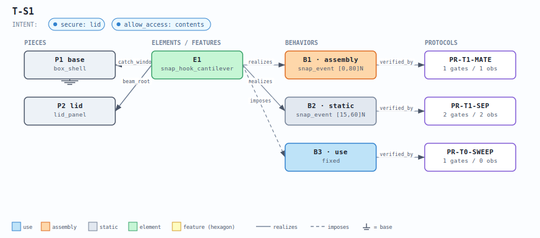
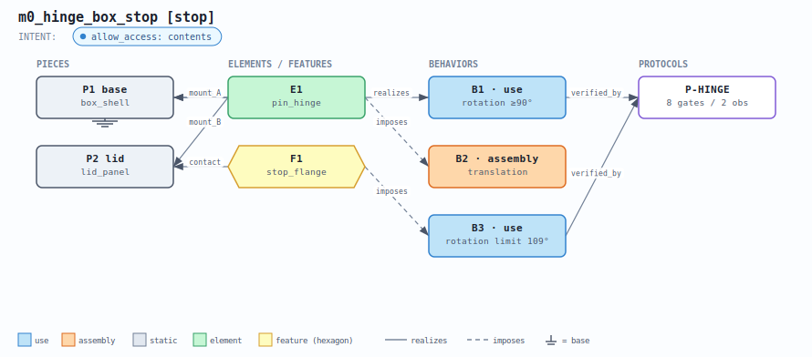
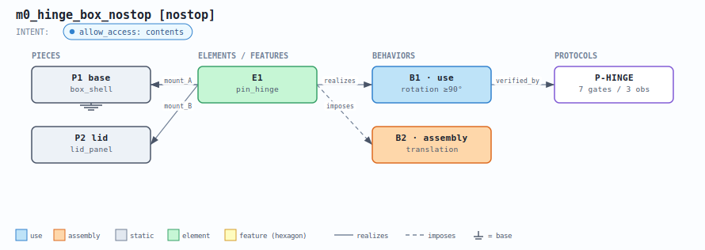
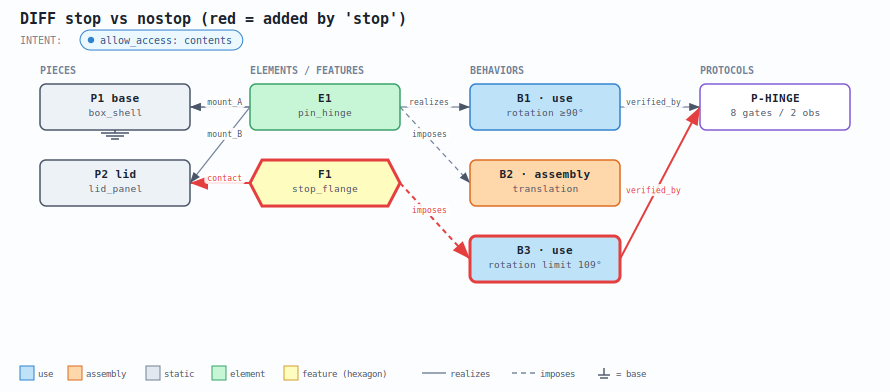
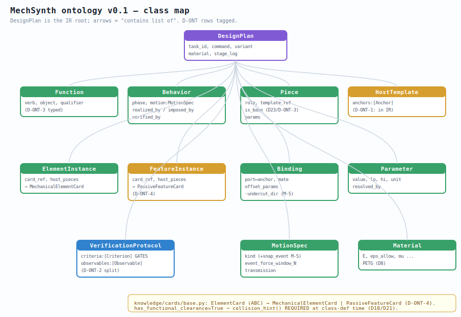
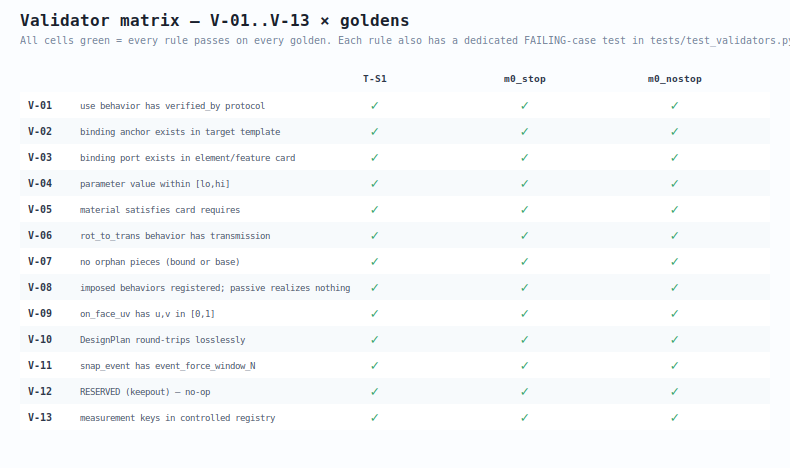

# M2 — Ontology · G-H Review · ✅ APPROVED

**Single review entry point for the ontology milestone (D-ONT-7 convention).** Everything you
need to approve M2 is on this page: the artifacts, what "correct" looks like for each, and an
approval checklist at the bottom. Code and living data stay in the unnumbered dirs
(`ontology/`, `knowledge/`, `tasks/`, `viz/`); this folder holds the reviewable snapshot.

> **Why this gate exists — earned, not assumed.** This review caught **two genuine IR bugs**
> that the 14/14 validator suite could not see (the goldens validated **CLEAN**): B3's *bound
> ambiguity* (a rotation LIMIT indistinguishable from a range-of-motion → D-ONT-9) and B2's
> *realized+imposed double-tagging*. Both were invisible to the tests and surfaced only by a
> human reading the rendered graphs. A green suite certifies the IR is *well-formed*, not that
> it is *right*; the visualization gate is load-bearing.

Regenerate everything: `./bin/py m2_ontology/build_review.py` · Tests:
`./bin/py tests/test_validators.py` (14/14) · `./bin/py tests/test_roundtrip.py` (4/4).

> SVGs render inline in VS Code's markdown preview and any browser. The `.mmd` files render in
> the VS Code **Mermaid** preview — they are the primary graph artifact (spec §7.2); the SVGs
> are a no-dependency fallback (no `dot`/mermaid-CLI on this box, per the pure-python constraint).

---

## What M2 delivered

| Piece | Where | State |
|---|---|---|
| Pydantic v0.1 schema (§2.4 + M-S ext + M0 lessons) | `ontology/schema.py` | done |
| Validators V-01..V-13 | `ontology/validators.py` | done |
| Measurement registry (D-ONT-6) | `ontology/measurements.py` | done |
| ElementCard ABC + card split (D-ONT-4) | `knowledge/cards/base.py` | shells (no formulas) |
| Goldens: T-S1, m0 stop, m0 nostop | `tasks/*.json` | all validate CLEAN |
| Tests: 1 failing case / rule + round-trip | `tests/` | 14/14 + 4/4 |

---

## 1. IR graphs — one per golden

Node key: 🎯 Function · phase-coloured Behavior (**use = blue, assembly = orange, static =
gray**) · green Element · **yellow hexagon = PassiveFeature** · gray Piece (**⏚ = is_base**,
D23) · 🔬 Protocol. Solid `—realizes→`, **dashed `- -imposes- ->`**, `—verified_by→`.

### 1a. T-S1 — snap-on lid box (authoritative, SNAPFIT §1.3)

**What correct looks like:** two functions (`secure: lid`, `allow_access: contents`). Exactly
one element, `snap_hook_cantilever` (E1) — **no hinge** (this is a push-on/pull-off lid, not a
hinged box; my earlier inference was wrong and is replaced). E1 **realizes B1** (assembly ·
snap_event, mating) and **B2** (static · snap_event, retention), and **imposes B3** (use ·
fixed, the "hook must not defect-interfere" sweep clearance) via a **dashed** edge. Three
protocols: `PR-T1-MATE` (1 gate), `PR-T1-SEP` (2 gates: retention floor ≥15 N and hand-open
≤60 N), `PR-T0-SWEEP` (1 gate). P1 carries the **⏚** ground mark. Four bindings: two `beam_root`
on the lid rim, two `catch_window` on the box side walls.

### 1b. m0 hinge box — stop variant

**What correct looks like:** E1 `pin_hinge` (green) **realizes B1** (use · **rotation ≥90°** — a
range-of-motion floor) and **imposes B2** (assembly · translation, the pin-insertion path) via a
single **dashed** edge — B2 is a constraint the hinge imposes (§3.3), not a DoF it realizes.
**F1 `stop_flange` is a yellow hexagon** (PassiveFeature) that **imposes B3** (use · **rotation
limit 109°**) via a **dashed** edge, and **realizes nothing** (no solid edge into it). The
`P-HINGE` protocol reads **8 gates / 2 obs**.

> **G-H fixes applied (D-ONT-9):** B3 now carries `bound="max"` in the IR and reads *rotation
> **limit** 109°* — distinct from B1's *rotation ≥90°* (`bound="min"`); the two are no longer
> ambiguous. B2 is now `imposed_by` only (was double-tagged realized+imposed → the illegible
> overlapping edge); `pin_hinge.imposes` declares it so V-08 verifies it. SVG glyphs/overlaps
> fixed (INTENT dot, white label pills, drawn legend swatches).

### 1c. m0 hinge box — nostop variant

**What correct looks like:** identical to 1b **except there is no F1 hexagon and no B3**, and
`P-HINGE` reads **7 gates / 3 obs** — one fewer gate (no `angle_limited`) and one more
observable (`overtravel`, un-promoted). This is the D-ONT-4 acceptance contrast.

---

## 2. Stop-vs-nostop diff — the PassiveFeature must BE the delta

**What correct looks like:** red marks exactly what the stop adds and nothing else —
**F1 `stop_flange` (the hexagon), B3 (`rotation limit 109°`), and their three edges**
(F1 - -imposes- -> B3, F1 —binds— P2, B3 —verified_by— P-HINGE). Everything shared (E1, B1, B2,
P1, P2) is drawn normally. The other half of the delta is **inside** P-HINGE and not a red node:
its gate count goes 7 → 8 (the `overtravel` observable **promoted** to the `angle_limited`
criterion). That promotion — a gate exists *because a feature is present* — is the whole point
of D-ONT-4, and it is why the stop passes V-B while the nostop is left free to fold flat.

---

## 3. Schema map — the class model

**What correct looks like:** `DesignPlan` at the root contains lists of Function, Behavior,
Piece, HostTemplate (D-ONT-1: carried *in* the IR so V-02 is self-contained), ElementInstance,
FeatureInstance (D-ONT-4), Binding, Parameter, VerificationProtocol, MotionSpec, Material. The
protocol box shows the **criteria (GATES) vs observables split** (D-ONT-2). The amber footer
states the card rule: `has_functional_clearance=True ⇒ collision_hint() REQUIRED at
class-definition time` (D18/D21).

---

## 4. Validator matrix — V-01..V-13 × goldens

**What correct looks like:** **every cell green** — all 13 rules pass on all three goldens.
Green here means "the goldens are clean"; the rules' teeth are proven separately by a dedicated
**failing-case test per rule** in [`tests/test_validators.py`](../tests/test_validators.py)
(e.g. `test_v11_snap_event_needs_force_window` feeds a snap_event with no window and asserts
V-11 fires). Green matrix + passing failing-case tests together = the rules are both satisfied
and load-bearing.

---

## Reconciliation notes (read before approving)

- **T-S1 was rebuilt to the doc.** My inferred `snap_starter.json` (a hinged box + secondary
  latch) was structurally wrong; SNAPFIT §1.3 is a snap-**only** lid. Conformed. `command` is
  now the doc's English string; `task_id` is `T-S1`.
- **Card name conflict (flagged, D-ONT-8, DRAFT):** MECHSYNTH §3.4 says `snap_latch`
  (ports `catch_face`, no functional clearance); SNAPFIT (authoritative, §12 A1) says
  `snap_hook_cantilever` (ports `catch_window`, **has_functional_clearance=True**). I conformed
  to the doc and registered `snap_latch` as a **deprecated alias** so §3.4/§8.1 references still
  resolve — but this means `snap_latch` now resolves to the clearance-bearing interface, so the
  **MECHSYNTH body should be reconciled**. Not silently changed across both specs — your call.
- **One thing I do NOT disagree with but flag for awareness:** SNAPFIT gives the snap hook a
  *functional clearance* even though its engagement is formula-checked, not physics-checked. I
  read this as "the catch-window geometry must survive any downstream conversion (D18/D21),
  independent of which tier scores the event" — consistent, not contradictory. Noted so you can
  overrule if you meant otherwise.

---

## Approval checklist (G-H)

- [ ] **T-S1 graph** reads as: 2 functions → 1 `snap_hook_cantilever` realizing B1(assembly)
      + B2(static) and imposing B3(use), 3 PR-* protocols, no hinge. (§1a)
- [ ] **stop vs nostop diff**: red = exactly F1 `stop_flange` + B3 + their edges; nothing else. (§2)
- [ ] **Promotion visible**: P-HINGE gate count 7 (nostop) → 8 (stop); overtravel moves from
      observable to the `angle_limited` gate. (§1b/1c/§2)
- [ ] **PassiveFeature drawn distinctly** (yellow hexagon) and has **no realizes edge**. (§1b)
- [ ] **is_base** pieces carry the ⏚ ground mark on all graphs. (§1)
- [ ] **Validator matrix all green** and the per-rule failing-case tests pass (14/14). (§4)
- [ ] **Card-name conflict (D-ONT-8)** acknowledged — approve the alias, or direct a MECHSYNTH
      body reconciliation. (Reconciliation notes)
- [ ] Ontology decisions **D-ONT-1..7** ruled (see `DECISIONS_LOG.md`); **D-ONT-5 deferred to
      M6**; **D-ONT-8** dispositioned.

_Approved by: ____________  ·  Date: ___________
