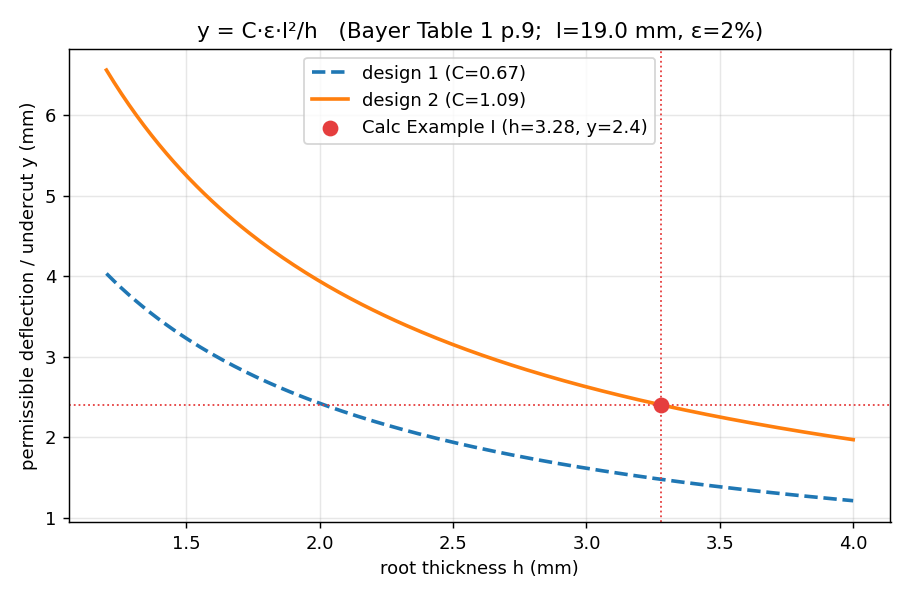
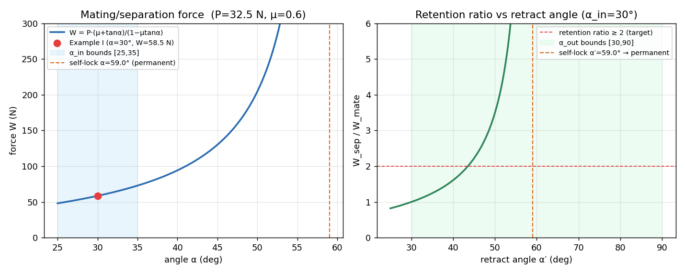

# M3 — Cards (snap_hook_cantilever formulas) · G-H Review

**Single review entry point for the card-formulas milestone (D-ONT-7).** Scope this session:
the Bayer cantilever formulas + the golden that anchors them. **No** carve(), templates, or
Tier0. Source of truth is the PDF (`knowledge/refs/Plastic_Snap_fit_design.pdf`), read directly
and verified page-by-page; SNAPFIT §2.1's mapping table was a guide, and the PDF confirmed every
constant.

Regenerate: `./bin/py m3_cards/build_review.py` · Golden:
`./bin/py tests/test_golden_bayer.py` (7/7) · Suite: validators 14/14 · roundtrip 4/4.

---

## 1. Golden G-S1 — computed vs Bayer Calc Example I (PDF p.16)

Inputs (p.16): Makrolon PC · l=19 · b=9.5 · y=2.4 · α=30° · ε=2% · Es=1815 · μ=0.6 · **design 2**.

| Quantity | Unit | Formula | Computed | Book (p.16) | Δ | Tol | Pass |
|---|---|---|---:|---:|---:|---|:--:|
| h (root thickness) | mm | `solve_h, design 2` | 3.279 | 3.28 | −0.03% | ±1% | ✓ |
| P (deflection force) | N | `P_deflect` | 32.526 | 32.5 | +0.08% | ±2% | ✓ |
| Fig.18 factor | – | `fig18_factor` | 1.801 | 1.8 | +0.08% | ±2% | ✓ |
| W (mating force) | N | `W_mate` | 58.591 | 58.5 | +0.16% | ±2% | ✓ |

**What correct looks like:** every row **✓**, all within a fraction of a percent — the code
reproduces the book. The whole chain (`solve_h → P_deflect → W_mate`) is also checked with no
book-rounded intermediates (`test_end_to_end_chain`). *If this table ever fails, the code is
wrong, not the book.*

Formulas (each docstring cites its page/table), all shape A (rectangle):
- `y_perm = C·ε·l²/h`, C = 0.67 (design 1) / 1.09 (design 2) / 0.86 (design 3) — **Table 1, p.9**
- `solve_h = C·ε·l²/y` — the p.16 inversion
- `P_deflect = (b·h²/6)·(Es·ε/l)` — **Table 1 bottom row, p.9**
- `W = P·(μ+tanα)/(1−μ·tanα)`; separation uses the return angle α′ — **p.14**, factor from **Fig.18**

---

## 2. Strain curve — permissible deflection vs root thickness

**What correct looks like:** two hyperbolae `y = C·ε·l²/h`; **design 2 (1.09) sits above design 1
(0.67)** — the ">60% more deflection" the book claims (p.12). The **red Example I point
(h=3.28, y=2.4) sits exactly on the design-2 curve** — the golden, drawn. Swept over the
`h_mm` param_bounds [1.2, 4.0].

---

## 3. Force curve — mating/separation force & retention over the angle bounds

**What correct looks like:**
- **Left:** mating force `W(α)` rising with angle; the **red Example I point (30°, 58.5 N) lies on
  the curve**; the **self-locking asymptote at α=59.0°** (μ·tanα→1) is marked — beyond it the
  joint is permanent and the formula correctly refuses (`ValueError`, not a silent ∞).
- **Right:** the retention ratio `W_sep(α′)/W_mate(30°)` crosses the **≥2 target at ≈43°** and
  runs to the self-lock at 59° (α′=90° ⇒ permanent, per p.16 note). Swept over the `α_out`
  bounds [30, 90].

That the formula *raises* on self-locking geometry rather than returning a bogus huge force is
the honest behaviour: μ·tanα ≥ 1 is not a large force, it is a different joint (permanent).

---

## Assumptions & flags (DRAFT — see DECISIONS_LOG D-BAYER-1..5)

- **PETG constants are ASSUMPTIONS** (the PDF has no PETG): `Es≈0.75·E`, `EPS_PERM=0.04`
  (borrowed from PC's 4%), `MU=0.35`. **The golden is independent of these** — it uses PC values
  directly, so it validates the *formulas*, not the assumptions. Gate G-S4: replace with data.
- **`eps=1.5·t·y/L²` (MECHSYNTH §3.4) was the design-1 approximation** (1/0.67≈1.49); the card
  uses the exact Table 1 per-design coefficients. PDF wins (D-BAYER-3).
- **T-S1 gained B4** (assembly insertion-path, imposed_by the hook) so V-08 covers the card's
  second imposition (D-BAYER-4).
- **No PDF-vs-doc disagreements** (D-BAYER-5): SNAPFIT §2 matched the PDF on every constant.

---

## Approval checklist (G-H)

- [ ] **Golden table** all ✓ (h/P/W/factor within tol of the p.16 book values). (§1)
- [ ] **Strain curve**: design 2 above design 1; Example I point on the design-2 curve. (§2)
- [ ] **Force curve**: Example I mating point on the curve; self-lock at 59° marked; retention
      ratio crosses ≥2. (§3)
- [ ] **collision_hint() refuses** citing D18 (functional clearance; geometry deferred). (code)
- [ ] **Every formula docstring cites its Bayer page/table**; source of truth was the PDF. (code)
- [ ] **Assumptions flagged** (PETG values), golden independent of them; **G-S4** gate on record.
- [ ] Bayer extraction decisions **D-BAYER-1..5** reviewed (see `DECISIONS_LOG.md`).

_Approved by: ____________  ·  Date: ___________
