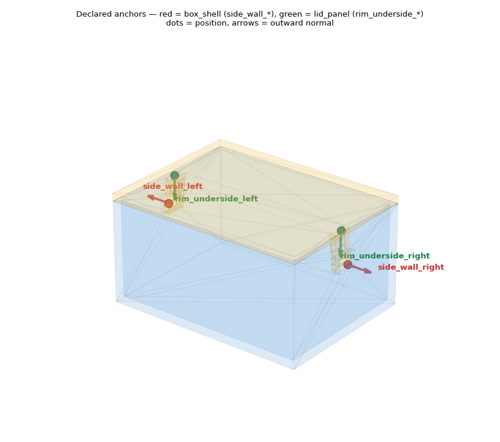
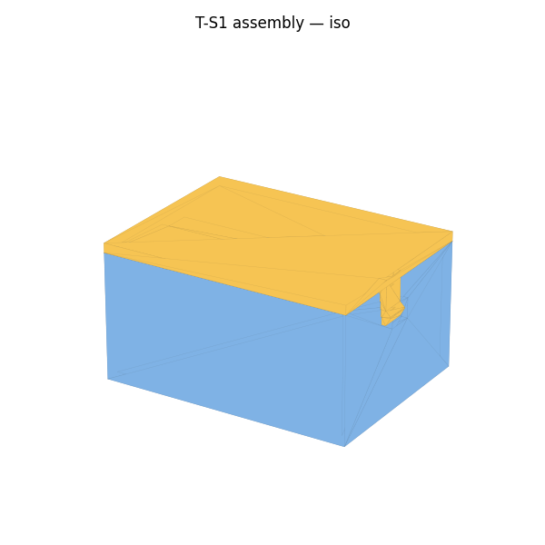
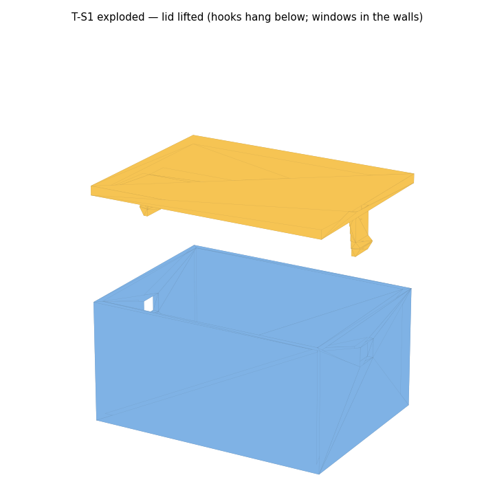
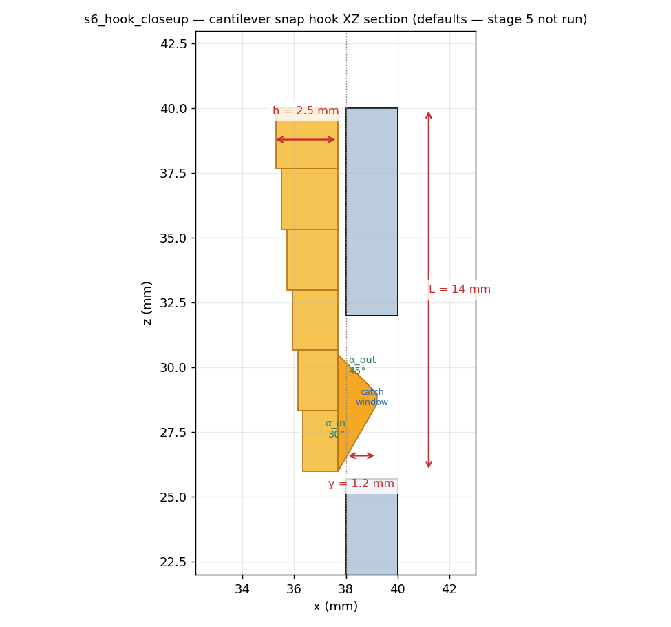

# M4 — Templates + Carve (snap box compile) · G-H Review

**Single review entry point for the templates/carve milestone (D-ONT-7).** Scope this session:
`box_shell` + `lid_panel` templates with declared anchors, `snap_hook_cantilever.carve()`
(hooks + windows, tagged sub-solids), `collision_hint()` primitives, and G6-d determinism. **No**
stage-⑤ resolution and **no** Tier0 checks (they consume the tagged solids next session).

Regenerate: `./bin/py m4_templates/build_review.py` · Suites: validators 14/14 · roundtrip 4/4 ·
bayer 7/7 (all still green).

> Geometry params (L, h, b, y) are **defaults** — stage 5 is not run this session, so the
> compile stands on placeholder dimensions (flagged `from_defaults=True` on every artifact).
> When stage 5 lands, the same carve runs on resolved values; the structure does not change.

---

## 1. Templates + declared anchors


**What correct looks like:** the two templates emit exactly the anchors T-S1's bindings
reference (V-02): **`side_wall_left/right`** (red, on the box ±X walls, normals pointing outward)
and **`rim_underside_left/right`** (green, on the lid underside, normals pointing down). Anchors
are **metadata alongside geometry** (`AnchorGeom`: name/kind/position/normal) — the hook roots
and window sites are located from these, not from magic coordinates.

## 2. Assembly — four views + exploded



**What correct looks like:** a closed snap box (blue `box_shell`, yellow `lid_panel`). The
exploded view (lid lifted) shows **two hooks hanging from the lid underside** and **two catch
windows cut in the box side walls** — the lid pushes straight down and the hooks snap into the
windows. Also `views_{front,top,right}.png` in `out/`.

## 3. `s6_hook_closeup` — the §6 dimensioned section


**What correct looks like:** an XZ section of one hook + wall + window with **y, h, L, α_in,
α_out** dimension overlays (§6 requires ⑥ to emit this dimension metadata alongside geometry —
`carve` returns it as `HookDims`). Read it as: a **design-2 tapered beam** (root h=2.5 mm →
tip h/2, the visible box stack), length L=14 mm, ending in a **nose that protrudes y=1.2 mm into
the catch window**, with a shallow **α_in=30° lead-in** (deflects the hook on insertion) and a
steeper **α_out=45° undercut** (the retention catch). The beam being a box *stack* is deliberate:
it is **identical to the collision primitive** (§4), so there is no approximation gap at the
functional feature.

## 4. Tagged sub-solids (for §5.2's three-way interference check)

`carve()` returns **separable tagged solids** so a later Tier0 can classify interference sites
as hook / non-hook (SNAPFIT §5.2, the technical heart of the starter):

```
tags: hook_left, hook_right, window_cut_left, window_cut_right
assembled lid ∩ box overlap = 0.000 mm³   (§5.2a: hook returns stress-free, no penetration)
```

The hooks are kept as their own solids even after being fused into the lid, so §5.2(b)'s
"undercut = interference band [0.9y, 1.1y] in the hook region only" is checkable next session.

## 5. Collision primitives (D18/D21)

`collision_hint()` no longer refuses — it returns **14 convex primitives** (6 beam-stack boxes +
1 nose box per side). The clearance **self-check** confirms the functional gap survives:

```
window width (b+2·clearance) − nose width (b) = 0.30 mm each side  →  retained = True
```

i.e. the snap gap does **not** get swallowed into the collision model (the M0 bore lesson, D18).

## 6. Determinism (G6-d)
```
compile 1: {'P1': 68aaa427e56f2784, 'P2': 189d35a9af924f41}
compile 2: {'P1': 68aaa427e56f2784, 'P2': 189d35a9af924f41}   IDENTICAL: True
```
Same IR → identical STEP hashes (normalized for the volatile STEP-header timestamp). See
`out/determinism.txt`.

---

## Flags
- **`from_defaults=True`** everywhere — L/h/b/y are placeholders until stage 5. The *structure*
  (anchors, hooks, windows, tags, clearance) is what this milestone certifies, not the numbers.
- **A-PETG-1 (ASSUMPTIONS.md)** still governs the material inputs; unaffected here (geometry).
- Mesh renders show internal triangulation edges (pure-matplotlib, no `dot`/EGL) — cosmetic.

## Approval checklist (G-H)

- [ ] **Anchors** = exactly `side_wall_*` (box) + `rim_underside_*` (lid), normals correct. (§1)
- [ ] **Exploded** shows hooks on the lid + windows in the box walls; lid pushes down. (§2)
- [ ] **s6_hook_closeup** carries y/h/L/α overlays; tapered beam; nose in the window. (§3)
- [ ] **Tagged sub-solids** present (hook_*/window_cut_*); assembled overlap = 0. (§4)
- [ ] **collision_hint** returns primitives; clearance self-check retained = True. (§5)
- [ ] **G6-d determinism**: identical STEP hashes on recompile. (§6)
- [ ] Understood: **L/h/b/y are defaults** (stage 5 not run); structure certified, not numbers.

_Approved by: ____________  ·  Date: ___________
