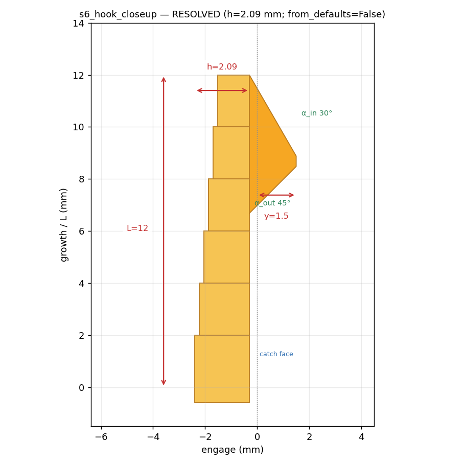
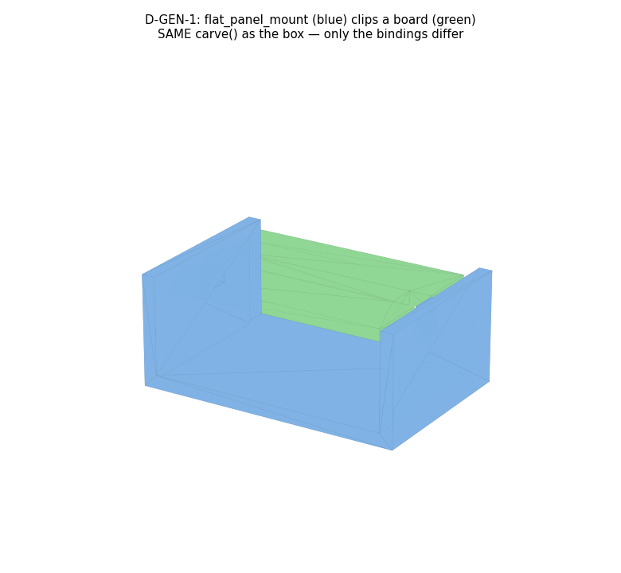
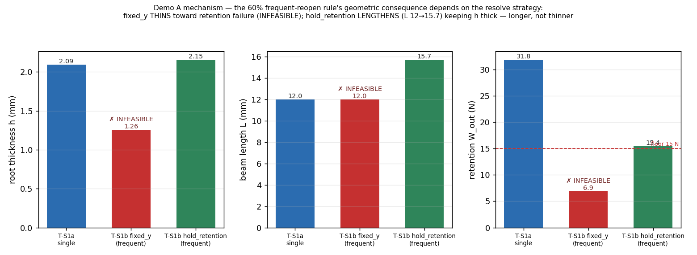

# M5 — Stage-⑤ Resolution + Tier0/Tier1 · G-H Review

**Single review entry point (D-ONT-7).** Scope: the card's `resolve_params` chain (SNAPFIT §2.4),
the Tier0 three-way stratified interference check (§5.2), Tier1 re-measurement (§5.3), the D-GEN-1
generality proof, and the T-S1a/T-S1b variant diff. Regenerate:
`./bin/py m5_resolve_t0/build_review.py`. Suites: validators 14/14 · roundtrip 4/4 · bayer 7/7.

---

## 1. Stage ⑤ — resolution (T-S1a) → real dimensions
[s5_params.md](out/s5_params.md)

**What correct looks like:** the resolve chain runs the golden formulas — working strain
ε = ε_pm × (0.6 if frequent) × 0.5 → h (design-2 inversion) → P → W_in/W_out — and every resolved
`Parameter` carries **`resolved_by` + a Bayer citation**. The four force-window inequalities
(from the B1 [0,80] mating and B2 [15,60] separation windows in the IR) all pass:

```
ε=0.020  h=2.093 mm  P=15.3 N  n·W_in=35.6 N (≤80 ✓)  W_out=31.8 N (15–60 ✓)   FEASIBLE
```

Infeasible designs raise `StageFailure(INFEASIBLE)` listing the violated inequalities + margins
(rollback to ④). The resolved h is injected back, so the compile is **real** — `from_defaults`
is gone from every downstream artifact.

## 2. `s6_hook_closeup` — now with RESOLVED dimensions


**What correct looks like:** the same section as m4, but the numbers are now **resolved by the
formulas, not defaults** — h=2.09 mm (from ε and y), L=12, y=1.5, α_in=30°, α_out=45°, title says
`from_defaults=False`. The tapered beam (root h → tip h/2) and the nose protruding y past the
catch face read directly.

## 3. Tier0 — three-way stratified interference (§5.2 / D22)
[t0_report.md](out/t0_report.md)

**What correct looks like — the technical heart of the starter.** Interference during insertion
is NOT failure; it is stratified by intent:

| Check | Result |
|---|---|
| (a) assembled penetration = 0 | ✓ 0.000 mm |
| **(b) hook-region max penetration ∈ [0.9y, 1.1y]** | ✓ **measured 1.500 mm = designed y 1.500** |
| (c) elsewhere penetration = 0 | ✓ 0.000 mm |
| watertight/manifold, window↔hook clearance = 0.30 mm | ✓ |

(b) is the payoff: the undercut is a **measurement** — the compiled geometry's deflection equals
the IR's designed y to the micron. Off-band → `StageFailure(UNDERCUT_MISMATCH)`; stray
interference → `SWEEP_HIT`; assembled overlap → `INTERFERENCE`. The tagged hook sub-solids (from
carve) are what let the check classify hook vs non-hook sites.

## 4. Tier1 — re-measurement from the STEP (§5.3)
[t1_report.md](out/t1_report.md)

**What correct looks like:** L/h/b/y are re-measured from the **tagged hook geometry's own axes**
(not the IR) and compared; drift = 0.000 mm on all four → the compiler reproduced the IR. This
check earned its keep mid-build: it caught a real **0.087 mm** drift (the segmented taper was
sampling thickness at segment midpoints, so the root was 2.006 not 2.093) — exactly the
compiler-vs-IR discrepancy §5.3 exists to catch. Fixed; now 0.

## 5. D-GEN-1 — cards are host-agnostic


**What correct looks like:** the **same** `snap_hook_cantilever.carve()` / `collision_hint()` —
**zero card-code changes** — attach to a completely different host, `flat_panel_mount` (a
board-clip, Bayer p.5 Fig.1). Only the bindings differ (hooks on the rails, catches on the board
edges). The card consumes hosts **only through the anchor/binding contract** (root position +
growth normal + catch position); there is no `box_l`/`wall` and no `if host == box` anywhere in
the card. **D-GEN-1 recorded (CONFIRMED):** *cards are host-agnostic; hosts are consumed only
through the anchor/binding contract.*

## 6. Variant — Demo A's mechanism, one session early (D-GEN-2, resolved)


**Your ruling is implemented.** The 60% rule's geometric consequence **depends on the resolve
strategy** (an input to ⑤; default `fixed_y`), and the system now knows both:

| Case | strategy | L | h | α_out | W_out | verdict |
|---|---|---:|---:|---:|---:|---|
| T-S1a single | fixed_y | 12.0 | 2.09 | 45° | 31.8 N | FEASIBLE |
| T-S1b frequent | **fixed_y** | 12.0 | **1.26** (thin) | 45° | **6.9 N** | **✗ INFEASIBLE** |
| T-S1b frequent | **hold_retention** | **15.7** (long) | **2.15** (thick) | 45° | 15.5 N | FEASIBLE |

**What correct looks like:**
- **`fixed_y` for frequent is now honestly INFEASIBLE** — the lower working strain thins h to
  1.26 mm and the thin beam fails the retention floor (W_out 6.9 < 15 N). My earlier α_out
  *escalation* **masked** this by pushing toward the self-locking cliff; it is removed. The
  INFEASIBLE is the **correct diagnosis**.
- **`hold_retention` LENGTHENS the beam** (L 12 → 15.7 mm, within bounds) and keeps h thick
  (2.15 mm) — *longer, not thinner*. This is what a practising designer does for a
  frequent-cycling part, and it is **Demo A's mechanism**.
- **New placement rule (in the card, `placement_rules`):** `α_out ≤ self_locking_angle(μ) − 10°`
  (Bayer p.14 / Fig.18 asymptote). For μ=0.35 (A-PETG-1) self-lock = 70.7°, cap = 60.7°. A design
  at the cliff is one μ-assumption from a permanent lock — the margin is a hard rule.

**D-GEN-2 CONFIRMED** — recorded in `DECISIONS_LOG.md`: *the 60% rule's geometric consequence
depends on the resolve strategy; fixed_y thins toward the self-locking cliff, hold_retention
lengthens — the system must know both and pick by requirement.*

---

## Flags & notes
- **Parameter.citation** added to the schema (D-ONT-10) so resolved params carry provenance.
- **A-PETG-1 (ASSUMPTIONS.md)** still governs ε_pm/Es/μ; the resolve uses those assumed values,
  and the placement rule exists precisely because μ is assumed.
- **Panel mount renders as 3 solids** (the small clip hooks don't fully fuse to the thin rails) —
  cosmetic; D-GEN-1 (carve runs, geometry produced, only bindings differ) is unaffected.
- Stage-4 dimension choices (L, y, b) are still placeholders (no LLM stage) — feasible values.

## Approval checklist (G-H)

- [ ] **s5**: force-window inequalities + the α_out self-lock rule enforced; every resolved
      Parameter has resolved_by + citation; INFEASIBLE path raises StageFailure. (§1)
- [ ] **Closeup** shows RESOLVED dims (h=2.09, from_defaults=False). (§2)
- [ ] **Tier0 (b)**: undercut measured = designed y (1.500); (a)/(c) = 0. (§3)
- [ ] **Tier1**: 0 drift on L/h/b/y (and note it caught a real 0.087 mm drift mid-build). (§4)
- [ ] **D-GEN-1**: same carve on `flat_panel_mount`, zero card changes. (§5)
- [ ] **D-GEN-2**: three-way figure reads as Demo A — fixed_y frequent INFEASIBLE (thin, retention
      fails); hold_retention lengthens (longer, not thinner). (§6)

_Approved by: ____________  ·  Date: ___________
