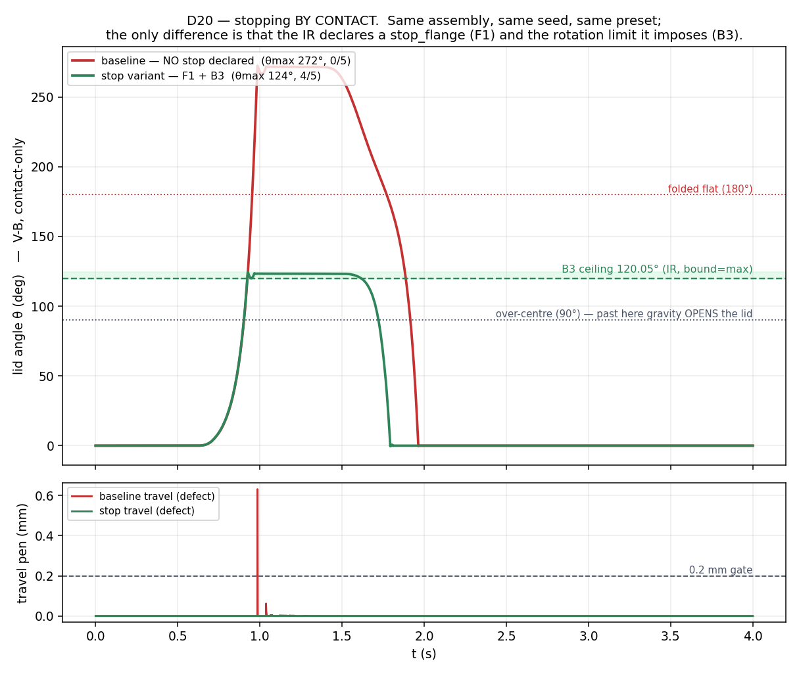
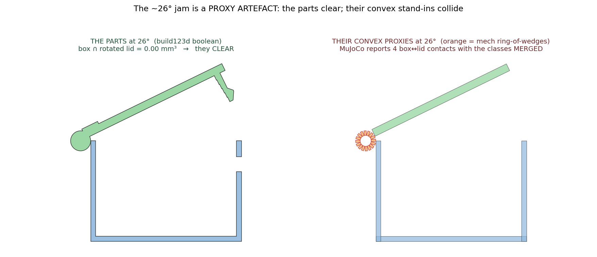

# M8 · pin_hinge Easy anchor — REVIEW (G-H entry point)

> ## ⚠ RETRACTION (D-M8-4) — read this first
>
> **The V-B PASS in the previous version of this REVIEW was void, and is withdrawn.** It was
> produced by an **open-stop I invented**: a collision primitive in the physics driver with **no
> solid in the compiled STEP and no entity in the IR** — not "a stop that exists only in geometry"
> but one that existed only in the *contact model*.
>
> The baseline result I had treated as a failure — **θmax 272°, travel 0.63 mm** — **was the correct
> answer.** It reproduces M0's own finding, which M0 states plainly:
> *"no stop: the lid is free to fold flat. **That is the finding**."* `anchor_easy` declares no
> stop_flange, so it **has** no stop; past 90° the over-centre lid folds right over. I engineered a
> fake stop until the criteria went green — defeating the exact thing V-B exists to expose. M0 had
> already named the trap: *"V-A hid this — MuJoCo's joint `range` acted as a stop the part does not
> physically have."*
>
> This was caught at G-H by the question **"where does the stop live in the IR?"** — which an
> invented stop cannot answer. The fix is not a patch: the backstop is deleted, the stop angle is now
> **read from the IR** (no B3 ⇒ `inf` ⇒ the fold-over stands), and the legitimate stop is built and
> demonstrated below.
>
> **Standing rule now in the log:** a physics-layer collision prim may only ever be a proxy for
> **real carved geometry the IR declares**. A prim with no solid and no IR entity behind it is a
> fabrication, and any verdict resting on one is void.

## Corrected outcome

| | baseline (`anchor_easy`) | stop variant (`anchor_easy(variant="stop")`) |
|---|---|---|
| IR | no stop_flange, no B3 | **+F1** (`stop_flange`) **+B3** (`bound=max`, ≤120.05°) — *zero other changes* |
| **V-B** (contact-only) | **0/5 — θmax 272°**, travel 0.63 mm | **4/5 PASS — θmax 124°**, travel 0.0 mm |
| reading | **the lid folds over. That is the finding**, reported, not fixed | **the flange bottoms out on the box's own rear wall — the lid stops BY CONTACT** |
| V-A (declared joint) | 5/5 (θmax 112°) | 5/5 (θmax 112°) |

**V-A passes both — V-B separates them.** That is [D20](../DECISIONS_LOG.md) demonstrated end-to-end
on *compiled* output: a declared joint's `range` silently supplies a stop the part may not have, so
contact-only V-B is **required, not optional**, for card-realized joints.



The curves are identical until the flange engages (~0.9 s). Red blows through over-centre, through
folded-flat, to 272°, with the 0.63 mm travel spike as it sweeps through the box. Green arrests at
the B3 ceiling and holds until the reverse pulls it shut.
Videos: [baseline V-B](out/t2_easy_V-B.mp4) · [stop V-B](out/t2_easy_stop_V-B.mp4) ·
data [`stop_pair.json`](out/stop_pair.json)

### Q1 — where the stop lives in the IR, now

`stop_flange` was a **shell** (ports + `imposes`, no geometry — deferred). It is now real:

- **F1** — a `stop_flange` PassiveFeature on the lid (D-ONT-4): it CONSTRAINS, it realizes nothing.
- **B3** — the use-phase rotation **LIMIT** F1 imposes (`bound="max"`, a *ceiling*, not B1's floor),
  registered per **V-08**, so the constraint cannot exist only in geometry.
- **Real geometry** — F1 compiles to a rearward flange solid (M0's) that bottoms out on the box's
  own rear wall. No added part. `compile_assembly` now **carves PassiveFeatures at all** — it
  previously iterated only `plan.elements`, so features were never carved.
- **The collision prim is now legitimate**: an *exact* (box) proxy of a solid that exists, declared
  by an IR entity — the opposite of what was retracted.

**Sub-finding — B3's ceiling was a copied number.** I first typed M0's **108.85°**. M0's scan
hardcodes `dz = −lid_t/2`, which silently encodes *M0's* axis at the lid mid-plane; `anchor_easy`'s
axis sits at `z=box_h`, giving **120.05°**. The sim's 124.4° arrest = 120.05 + ~4° contact
compliance, and had disagreed with 108.85 by 15.5° — **the pair run caught the copied number.**
Now: `stop_angle_deg` takes the real `axis_z`; B3's `range_value` is **derived by calling the card's
formula**; and the carve **re-solves and refuses on disagreement (>0.5°)** — V-08's geometric teeth.

### Q2 — the ~26° suppression: artefact, measured



Two independent authorities at the jam angle ([`proxy_artifact.json`](out/proxy_artifact.json)):

| authority | tool | result |
|---|---|---|
| **the PARTS** | build123d boolean on compiled solids | box ∩ lid-rotated-26° = **0.00 mm³** — they clear |
| **the PROXIES** | MuJoCo contact detection, classes **merged** | **4** box↔lid contacts — all `P1_c1↔P2_c16` (box rear **wall** vs a lid ring-**wedge**), 0.008–0.019 mm |

The parts clear where their convex stand-ins collide ⇒ **artefact confirmed**.

**The guard — verified, not asserted.** Suppression is scoped to cross-class pairs between the two
*named* intended-contact classes (`mech` = pin/bore ring-of-wedges; `seat` = lid-on-box seating +
floor + flange). **The travel class is never suppressed:** travel is read from base↔mover
**seat↔seat** contacts, live at every angle. Instrumenting the baseline fold-over confirms it — the
peak travel contact is `P1_c1↔P2_c0` (rear wall vs lid panel), **both seat-class**, firing **0.99 mm
at θ=272.9°**.

**LIMITATION (named, not hidden):** a genuine *mech↔seat* interference — a lid knuckle truly
crashing a wall — would be **invisible to the physics travel gate**. That case is covered at the
PARTS level instead (t0's AR1 exclusion sweep + the real-geometry boolean), which is exactly why the
26° number above is measured on solids rather than proxies.

## The assembly

2 elements — **E1 `pin_hinge`**, **E2 `snap_hook_cantilever`** · 3 pieces — **P1 box [base]**,
**P2 lid [mover]**, **P3 pin [hardware ← E1]** · 2 AssemblyRules — **AR1 exclusion**, **AR2 resource**
(+ **F1** stop_flange in the stop variant). Compiled **motion → fasteners → features**.

| view | file | what to look for |
|---|---|---|
| 4-view | [`out/anchor_4view.png`](out/anchor_4view.png) | hinge knuckles + protruding pin at the rear; latch at the front |
| exploded | [`out/anchor_exploded.png`](out/anchor_exploded.png) | the **pin is a separate hardware body** (D-ONT-11) |
| **SECTION** | [`out/anchor_section.png`](out/anchor_section.png) | one x=0 cut — hinge knuckle wraps the pin/bore (rear) **and** latch teeth in the catch window (front) |
| IR graph | [`out/ir_easy.svg`](out/ir_easy.svg) · [stop variant](out/ir_easy_stop.svg) | AR1/AR2 rhombus nodes + subject edges + provenance; **B5→AR1 `checkable form`**; stop variant adds **F1 ⇢ B3** |

- **B3 is absent from the baseline by design** — it is the reserved stop-variant slot, and the stop
  variant now populates it for real.
- **Renderer parity guard** ([`tests/test_ir_graph_parity.py`](../tests/test_ir_graph_parity.py)):
  `to_mermaid ≡ to_svg` over the IR-entity node set and the edge set. This is the regression that
  let AR1/AR2 ship missing from a signed-off SVG. It immediately found a **second** drift: mermaid
  emitted AR→subject only for `plan.instance()` (so AR2→P2, a *piece* referent, was missing) and had
  no B5→AR1 link. Both renderers now derive these from **one shared helper**, so parity is
  structural, not merely tested.

## Gates

**t0 — AssemblyRules** (both PASS, [`out/t0_assembly_rules.json`](out/t0_assembly_rules.json)):
AR1 exclusion is D22-aware — the rigid hook's undercut interferes only through the **0–10° release
band** (intended); the free sweep beyond is clean (0.00 mm³). AR2 resource: Σ(12 + 27.7) = **39.7 ≤ 80**.

**t1 — re-measure** (both elements, **0.0000 mm** drift, [`out/t1_easy_verdict.json`](out/t1_easy_verdict.json)).

**t2 — G-CONV + P-HINGE** (5 seeds/mode, ≥4/5 → PASS): the table at the top.
Seed-0 of the stop variant is a lone outlier on pin drift (0.625 mm vs ~0.26 for the other four);
4/5 is the §6.4 rule, and the pin/bore fit stays flagged **marginal** in the per-seed record.

Suite **41/41**. Guard trio on every verdict JSON.

## Reproduce

```
./bin/py tasks/run_m8_t2.py verify/t2_physics/out_easy         # baseline V-A+V-B  (fold-over)
./bin/py tasks/run_m8_t2.py verify/t2_physics/out_easy stop    # stop variant      (contact arrest)
./bin/py tasks/run_m8_t1.py verify/t2_physics/out_easy         # t1 re-measure
./bin/py m8_pin_hinge_easy/build_review.py                     # renders + IR + t0 ARs
./bin/py m8_pin_hinge_easy/build_stop_pair.py                  # the D20 pair figure
./bin/py m8_pin_hinge_easy/build_proxy_overlay.py              # the 26° artefact evidence
./bin/py m8_pin_hinge_easy/build_report.py                     # report.html
```

Decisions: **D-M8-1** (harness rulings) · **D-M8-2** (stop_flange + the D20 pair) · **D-M8-3**
(class separation, artefact evidence + limitation) · **D-M8-4** (the retraction) · **D-ONT-11/-12** ·
**D-M1-8** (R2b deferred option 3). See `DECISIONS_LOG.md`.
